

  
  <h2 style="margin: 5px 0;">Universidad Peruana de Ciencias Aplicadas</h2>
  <h3 style="margin: 5px 0;">Ingeniería de Software</h3>
  
Periodo: <strong>202520</strong>

  

    <strong>1ACC0238</strong> | <strong>Aplicaciones para Dispositivos Móviles</strong>
  

  
NRC: <strong>14650</strong>

  
Docente: <strong>Eduardo Martin Reyes Rodríguez</strong>

  

  <h2 style="margin-bottom: 10px;"><strong>Informe del Trabajo Final</strong></h2>
  
Startup: <strong>VERSS</strong>

  
Producto: <strong>LookUp</strong>

  
<code>U202311207</code> - Santiago Iván Cárdenas Concha

  
<code>U202311334</code> - Luis Piero Rodríguez Rodríguez

  
<code>U202123373</code> - Luis Gustavo Román Pajuelo

  
<code>U20231C784</code> - Elvia Marcela Rodríguez Villa

  
<code>U202311532</code> - Santiago Manuel Suárez Romero

  
<em>Diciembre, 2025</em>

**REGISTRO DE VERSIONES DEL INFORME**

| Versión  | Fecha  | Autores | Descripción de Modificación      |
| :---: | :---: | ----- | ----- |
| 1 (TB1) | 18/09/2025 | Santiago Iván Cárdenas Concha, Luis Piero Rodríguez Rodríguez, Luis Gustavo Román Pajuelo, Elvia Marcela Rodríguez Villa, Santiago Manuel Suárez Romero | Desarrollo de capitulos 1 y 2 |
| 2 (TP1) | 9/10/2025 | Santiago Iván Cárdenas Concha, Luis Piero Rodríguez Rodríguez, Luis Gustavo Román Pajuelo, Elvia Marcela Rodríguez Villa, Santiago Manuel Suárez Romero | Desarrollo de capitulos 3, 4 y sprint 1 |
| 3 (TB2) | 13/11/2025 | Santiago Iván Cárdenas Concha, Luis Piero Rodríguez Rodríguez, Luis Gustavo Román Pajuelo, Elvia Marcela Rodríguez Villa, Santiago Manuel Suárez Romero | Desarrollo de sprint 2 |
| 4 (TF1) |  | Santiago Iván Cárdenas Concha, Luis Piero Rodríguez Rodríguez, Luis Gustavo Román Pajuelo, Elvia Marcela Rodríguez Villa, Santiago Manuel Suárez Romero | Desarrollo de sprint 3 |

**OBJETIVOS SMART**
- Santiago Cárdenas:
En los próximos 12 meses, me propongo aprobar la certificación MongoDB Certified Developer Associate. Este objetivo se alinea con mi interés por dominar NoSQL, clave para gestionar grandes volúmenes de datos no estructurados en aplicaciones modernas. Al lograrla, podré diseñar esquemas flexibles y escalables, fortaleciendo mi perfil profesional.
A mediano plazo, esta meta funcionará como base para avanzar hacia la AWS Certified Database – Specialty. Mi plan es apalancar lo aprendido en MongoDB para comprender mejor los distintos paradigmas de bases de datos en la nube de AWS. Con ambas certificaciones, apuntaré a evolucionar de desarrollador a arquitecto de software, con la credibilidad necesaria para diseñar soluciones de datos a gran escala y liderar equipos en entornos cloud.

- Luis Rodríguez:
Mi objetivo de corto plazo es obtener, dentro de los próximos 12 meses, la Google Cloud Professional Machine Learning Engineer. Esta certificación es estratégica para mi crecimiento, porque consolidará mis fundamentos de IA y su despliegue en la nube. Con ello podré construir modelos y operativizarlos en sistemas escalables y eficientes. En paralelo, usaré GitHub como vitrina de mis avances: documentaré proyectos, explicaré algoritmos y publicaré los modelos desarrollados.
A largo plazo, aprovecharé esta credencial y el portafolio público como un trampolín hacia roles de mayor impacto. La experiencia ganada en ingeniería de ML me permitirá liderar el desarrollo de productos impulsados por IA, orientando equipos para entregar soluciones sólidas y con valor real para las personas. Mi presencia en GitHub facilitará el networking profesional y el fortalecimiento de mi marca personal en el ámbito de la IA aplicada.

- Elvia Rodríguez:
Mi meta principal para los próximos 12 meses es certificarme como Certified UX Professional (UXC) por Nielsen Norman Group. Es un paso crucial para afianzar principios de UX y llevarlos a la práctica con rigor. Busco no solo crear interfaces atractivas y coherentes, sino también sustentar decisiones de diseño con evidencia y buenas prácticas. Al mismo tiempo, utilizaré Instagram para compartir logros y progresos: publicaré hitos de la certificación, aprendizajes sobre metodologías y muestras de proyectos en los que participo.
A futuro, esta certificación y mi presencia digital serán la base para roles con mayor responsabilidad. La credibilidad ganada en UI/UX me habilitará para liderar la creación de productos digitales, guiando equipos que entreguen experiencias que resuelvan problemas reales y generen valor. Mi portafolio visual en Instagram me ayudará a conectar con otros profesionales y a consolidar una marca personal consistente en diseño de interfaces.

- Gustavo Román:
En el plazo de un año, me propongo conseguir la certificación Professional Scrum Master. Este objetivo es clave para mi desarrollo, pues me permitirá dominar Scrum, un marco esencial en el desarrollo de software actual. Con ese conocimiento podré aplicar prácticas ágiles de forma correcta y actuar como facilitador del equipo, asegurando procesos fluidos y foco en el valor.
A más largo plazo, usaré esta certificación como escalón hacia posiciones de mayor liderazgo. La experiencia y credibilidad como Scrum Master me ayudarán a evolucionar hacia un líder técnico capaz de guiar equipos tanto desde la técnica como desde la gestión, impulsando entregas constantes, eficientes y alineadas con los objetivos del negocio.

- Santiago Suárez:
Mi objetivo de corto plazo es obtener en los próximos 12 meses la Google Cloud Professional Cloud Security Engineer. Esta decisión es fundamental para mi carrera, ya que me permitirá dominar los principios de seguridad en la nube, especialmente relevantes en el sector financiero, donde la protección de datos sensibles y el cumplimiento regulatorio son críticos. Con esta base, podré diseñar sistemas seguros y comprender las transacciones y datos financieros desde la óptica de la integridad, convirtiéndome en un profesional confiable y de alto valor.
A largo plazo, esta especialización en seguridad cloud me permitirá asumir un papel central en la creación de productos financieros robustos y confiables, ganando la credibilidad necesaria para orientar equipos y contribuir directamente al impacto del negocio.

**CONTENT** 

[Capítulo I: Presentación](#capítulo-i-presentación)  
[1.1 Startup Profile](#11-startup-profile)  
[1.1.1 Descripción de la startup](#111-descripción-de-la-startup)  
[1.1.2 Perfiles de integrantes de grupo](#112-perfiles-de-integrantes-de-grupo)  
[1.2 Solution Profile](#12-solution-profile)  
[1.2.1 Antecedentes y problemática](#121-antecedentes-y-problemática)  
[5 "W" s](#5-"w"-s)  
[What](#what)  
[When](#when)  
[Where](#where)  
[Who](#who)  
[Why](#why)  
[2 "H" s](#2-"h"-s)  
[How](#how)  
[How much](#how-much)  
[1.2.2 Lean UX Process](#122-lean-ux-process)  
[1.2.2.1 Lean UX Problem Statements](#1221-lean-ux-problem-statements)  
[1.2.2.2 Lean UX Assumptions](#1222-lean-ux-assumptions)  
[1.2.2.2.1 Resultados del usuario](#12221-resultados-del-usuario)  
[1.2.2.2.2 Features](#12222-features)  
[1.2.2.2.3 Business Outcomes](#12223-business-outcomes)  
[1.2.2.2.4 User Benefits](#12224-user-benefits)  
[1.2.2.2.5 ¿Quién es el usuario?](#12225-¿quién-es-el-usuario)  
[1.2.2.2.6 ¿Dónde encaja nuestro producto en su trabajo o vida?](#12226-¿dónde-encaja-nuestro-producto-en-su-trabajo-o-vida)  
[1.2.2.2.7 ¿Qué problemas tiene nuestro producto y cómo se pueden resolver?](#12227-¿qué-problemas-tiene-nuestro-producto-y-cómo-se-pueden-resolver)  
[1.2.2.2.8 ¿Cuándo y cómo es usado nuestro producto?](#12228-¿cuándo-y-cómo-es-usado-nuestro-producto)  
[1.2.2.2.9 ¿Qué características son importantes?](#12229-¿qué-características-son-importantes)  
[1.2.2.2.10 ¿Cómo debe verse nuestro producto y cómo debe comportarse?](#122210-¿cómo-debe-verse-nuestro-producto-y-cómo-debe-comportarse)  
[1.2.2.3 Lean UX Hypothesis Statements](#1223-lean-ux-hypothesis-statements)  
[1.2.2.4 Lean UX Canvas](#1224-lean-ux-canvas)  
[1.3 Segmentos objetivo](#13-segmentos-objetivo)  

[Capítulo II: Requirements Development and Software Solution Design](#capítulo-ii-requirements-development-and-software-solution-design)  
[2.1 Competidores](#21-competidores)  
[2.1.1 Análisis competitivo](#211-análisis-competitivo)  
[2.1.2 Estrategias y tácticas frente a competidores](#212-estrategias-y-tácticas-frente-a-competidores)  
[2.2 Entrevistas](#22-entrevistas)  
[2.2.1 Diseño de entrevistas](#221-diseño-de-entrevistas)  
[2.2.2 Registro de entrevistas](#222-registro-de-entrevistas)  
[2.2.3 Análisis de entrevistas](#223-análisis-de-entrevistas)  
[2.3 Needfinding](#23-needfinding)  
[2.3.1 User Personas](#231-user-personas)  
[2.3.2 User Task Matrix](#232-user-task-matrix)  
[2.3.3 User Journey Mapping](#233-user-journey-mapping)  
[2.3.4 Empathy Mapping](#234-empathy-mapping)  
[2.3.5 As-Is Scenario Mapping](#235-as-is-scenario-mapping)  
[2.3.6 Ubiquitous Language](#236-ubiquitous-language)  
[2.4 Requirements specification](#24-requirements-specification)  
[2.4.1 To-Be Scenario Mapping](#241-to-be-scenario-mapping)  
[2.4.2 User Stories](#242-user-stories)  
[2.4.3 Impact Mapping](#243-impact-mapping)  
[2.4.4 Product Backlog](#244-product-backlog)  
[2.5 Strategic-Level Domain-Driven Design](#25-strategic-level-domain-driven-design)  
[2.5.1 EventStorming](#251-eventstorming)  
[2.5.1.1 Candidate Context Discover](#2511-candidate-context-discover)  
[2.5.1.2 Domain Message Flows Modeling](#2512-domain-message-flows-modeling)  
[2.5.1.3 Bounded Context Canvases](#2513-bounded-context-canvases)  
[2.5.2 Context Mapping](#252-context-mapping)  
[2.5.3 Software Architecture](#253-software-architecture)  
[2.5.3.1 Software Architecture Context Level Diagrams](#2531-software-architecture-context-level-diagrams)  
[2.5.3.2 Software Architecture Container Level Diagrams](#2532-software-architecture-container-level-diagrams)  
[2.5.3.3 Software Architecture Deployment Diagrams](#2533-software-architecture-deployment-diagrams)  
[2.6 Tactical-Level Domain-Driven Design](#26-tactical-level-domain-driven-design)  
[2.6.1 Bounded Context: Gestión de Postulación](#261-bounded-context-gestión-de-postulación)  
[2.6.1.1 Domain Layer](#2611-domain-layer)  
[2.6.1.2 Interface Layer](#2612-interface-layer)  
[2.6.1.3 Application Layer](#2613-application-layer)  
[2.6.1.4 Infrastructure Layer](#2614-infrastructure-layer)  
[2.6.1.5 Bounded Context Software Architecture Component Level Diagrams](#2615-bounded-context-software-architecture-component-level-diagrams)  
[2.6.1.6 Bounded Context Software Architecture Code Level Diagrams](#2616-bounded-context-software-architecture-code-level-diagrams)  
[2.6.1.6.1 Bounded Context Domain Layer Class Diagrams](#26161-bounded-context-domain-layer-class-diagrams)  
[2.6.1.6.2 Bounded Context Database Design Diagram](#26162-bounded-context-database-design-diagram)  
[2.6.2 Bounded Context: Gestión de Contacto de Postulación](#262-bounded-context-gestión-de-contacto-de-postulación)  
[2.6.2.1 Domain Layer](#2621-domain-layer)  
[2.6.2.2 Interface Layer](#2622-interface-layer)  
[2.6.2.3 Application Layer](#2623-application-layer)  
[2.6.2.4 Infrastructure Layer](#2624-infrastructure-layer)  
[2.6.2.5 Bounded Context Software Architecture Component Level Diagrams](#2625-bounded-context-software-architecture-component-level-diagrams)  
[2.6.2.6 Bounded Context Software Architecture Code Level Diagrams](#2626-bounded-context-software-architecture-code-level-diagrams)  
[2.6.2.6.1 Bounded Context Domain Layer Class Diagrams](#26261-bounded-context-domain-layer-class-diagrams)  
[2.6.2.6.2 Bounded Context Database Design Diagram](#26262-bounded-context-database-design-diagram)  
[2.6.3 Bounded Context: Gestión de Métricas](#263-bounded-context-gestión-de-métricas)  
[2.6.3.1 Domain Layer](#2631-domain-layer)  
[2.6.3.2 Interface Layer](#2632-interface-layer)  
[2.6.3.3 Application Layer](#2633-application-layer)  
[2.6.3.4 Infrastructure Layer](#2634-infrastructure-layer)  
[2.6.3.5 Bounded Context Software Architecture Component Level Diagrams](#2635-bounded-context-software-architecture-component-level-diagrams)  
[2.6.3.6 Bounded Context Software Architecture Code Level Diagrams](#2636-bounded-context-software-architecture-code-level-diagrams)  
[2.6.3.6.1 Bounded Context Domain Layer Class Diagrams](#26361-bounded-context-domain-layer-class-diagrams)  
[2.6.3.6.2 Bounded Context Database Design Diagram](#26362-bounded-context-database-design-diagram)  
[2.6.4 Bounded Context: Gestión del Perfil](#264-bounded-context-gestión-del-perfil)  
[2.6.4.1 Domain Layer](#2641-domain-layer)  
[2.6.4.2 Interface Layer](#2642-interface-layer)  
[2.6.4.3 Application Layer](#2643-application-layer)  
[2.6.4.4 Infrastructure Layer](#2644-infrastructure-layer)  
[2.6.4.5 Bounded Context Software Architecture Component Level Diagrams](#2645-bounded-context-software-architecture-component-level-diagrams)  
[2.6.4.6 Bounded Context Software Architecture Code Level Diagrams](#2646-bounded-context-software-architecture-code-level-diagrams)  
[2.6.4.6.1 Bounded Context Domain Layer Class Diagrams](#26461-bounded-context-domain-layer-class-diagrams)  
[2.6.4.6.2 Bounded Context Database Design Diagram](#26462-bounded-context-database-design-diagram)  

[Capítulo III: Solution UI/UX Design](#capítulo-iii-solution-uiux-design)  
[3.1 Product Design](#31-product-design)  
[3.1.1 Style Guidelines](#311-style-guidelines)  
[3.1.1.1 General Style Guidelines](#3111-general-style-guidelines)  
[3.1.2 Information Architecture](#312-information-architecture)  
[3.1.2.1 Organization Systems](#3121-organization-systems)  
[3.1.2.2 Labelling Systems](#3122-labelling-systems)  
[3.1.2.3 SEO Tags and Meta Tags](#3123-seo-tags-and-meta-tags)  
[3.1.2.4 Searching Systems](#3124-searching-systems)  
[3.1.2.5 Navigation Systems](#3125-navigation-systems)  
[3.1.3 Landing Page UI Design](#313-landing-page-ui-design)  
[3.1.3.1 Landing Page Wireframe](#3131-landing-page-wireframe)  
[3.1.3.2 Landing Page Mock-up](#3132-landing-page-mock-up)  
[3.1.4 Mobile Applications UX/UI Design](#314-mobile-applications-uxui-design)  
[3.1.4.1 Mobile Applications Wireframes](#3141-mobile-applications-wireframes)  
[3.1.4.2 Mobile Applications Wireflow Diagrams](#3142-mobile-applications-wireflow-diagrams)  
[3.1.4.3 Mobile Applications Mock-ups](#3143-mobile-applications-mock-ups)  
[3.1.4.4 Mobile Applications User Flow Diagrams](#3144-mobile-applications-user-flow-diagrams)  
[3.1.4.5 Mobile Applications Prototyping](#3145-mobile-applications-prototyping)  

[Capítulo IV: Product Implementation & Validation](#capítulo-iv-product-implementation--validation)  
[4.1 Software Configuration Management](#41-software-configuration-management)  
[4.1.1 Software Development Environment Configuration](#411-software-development-environment-configuration)  
[4.1.2 Source Code Management](#412-source-code-management)  
[4.1.3 Source Code Style Guide & Conventions](#413-source-code-style-guide--conventions)  
[4.1.4 Software Deployment Configuration](#414-software-deployment-configuration)  
[4.2 Landing Page & Mobile Application Implementation](#42-landing-page--mobile-application-implementation)  
[4.2.1 Sprint 1](#421-sprint-1)  
[4.2.1.1 Sprint Planning 1](#4211-sprint-planning-1)  
[4.2.1.2 Sprint Backlog 1](#4212-sprint-backlog-1)  
[4.2.1.3 Development Evidence for Sprint Review](#4213-development-evidence-for-sprint-review)  
[4.2.1.4 Testing Suite Evidence for Sprint Review](#4214-testing-suite-evidence-for-sprint-review)  
[4.2.1.5 Execution Evidence for Sprint Review](#4215-execution-evidence-for-sprint-review)  
[4.2.1.6 Services Documentation Evidence for Sprint Review](#4216-services-documentation-evidence-for-sprint-review)  
[4.2.1.7 Software Deployment Evidence for Sprint Review](#4217-software-deployment-evidence-for-sprint-review)  
[4.2.1.8 Team Collaboration Insights during Sprint](#4218-team-collaboration-insights-during-sprint)  
[4.2.2 Sprint 2](#422-sprint-2)  
[4.2.2.1 Sprint Planning 2](#4221-sprint-planning-2)  
[4.2.2.2 Sprint Backlog 2](#4222-sprint-backlog-2)  
[4.2.2.3 Development Evidence for Sprint Review](#4223-development-evidence-for-sprint-review)  
[4.2.2.4 Testing Suite Evidence for Sprint Review](#4224-testing-suite-evidence-for-sprint-review)  
[4.2.2.5 Execution Evidence for Sprint Review](#4225-execution-evidence-for-sprint-review)  
[4.2.2.6 Services Documentation Evidence for Sprint Review](#4226-services-documentation-evidence-for-sprint-review)  
[4.2.2.7 Software Deployment Evidence for Sprint Review](#4227-software-deployment-evidence-for-sprint-review)  
[4.2.2.8 Team Collaboration Insights during Sprint](#4228-team-collaboration-insights-during-sprint)  
[4.2.3 Sprint 3](#423-sprint-3)  
[4.2.3.1 Sprint Planning 3](#4231-sprint-planning-3)  
[4.2.3.2 Sprint Backlog 3](#4232-sprint-backlog-3)  
[4.2.3.3 Development Evidence for Sprint Review](#4233-development-evidence-for-sprint-review)  
[4.2.3.4 Testing Suite Evidence for Sprint Review](#4234-testing-suite-evidence-for-sprint-review)  
[4.2.3.5 Execution Evidence for Sprint Review](#4235-execution-evidence-for-sprint-review)  
[4.2.3.6 Services Documentation Evidence for Sprint Review](#4236-services-documentation-evidence-for-sprint-review)  
[4.2.3.7 Software Deployment Evidence for Sprint Review](#4237-software-deployment-evidence-for-sprint-review)  
[4.2.3.8 Team Collaboration Insights during Sprint](#4238-team-collaboration-insights-during-sprint)  
[4.3. Validation Interviews](#43-validation-interviews)  
[4.3.1. Diseño de Entrevistas](#431-diseño-de-entrevistas)  
[4.3.2. Registro de Entrevistas](#432-registro-de-entrevistas)

[CONCLUSIONES Y RECOMENDACIONES](#conclusiones-y-recomendaciones)  
[Conclusiones](#conclusiones)
[Recomendaciones](#recomendaciones)
[Video App Validation](#video-app-validation)
[Video About the product](#video-about-the-product)
[Video About the team](#video-about-the-team)
[BIBLIOGRAFÍA](#bibliografía)

# **STUDENT OUTCOME**

| Criterio Específico | Acciones realizadas | Conclusiones |
| ----- | ----- | ----- |
| Diseñar soluciones en ingeniería de software (productos, procesos y/o servicios) que satisfagan necesidades específicas considerando el impacto en salud pública, seguridad, bienestar, así como factores globales, culturales, sociales, ambientales y económicos | Cárdenas Concha, Santiago Iván Suárez Romero, Santiago Suárez Rodríguez Rodríguez, Luis Piero Roman Pajuelo, Luis Gustavo Rodríguez Villa, Elvia Marcela  Avance TB1 | Avance: En conclusión,  es esencial comprender exhaustivamente las necesidades de nuestros usuarios para definir estrategias precisas en el diseño de LookUp. Este análisis e identificación nos ha permitido implementar ideas innovadoras. Durante la presentación, la respuesta positiva de los usuarios confirma que la combinación de planificación y diseño contribuye significativamente. |
| Diseñar soluciones en ingeniería de software (productos, procesos y/o servicios) que satisfagan necesidades específicas considerando el impacto en salud pública, seguridad, bienestar, así como factores globales, culturales, sociales, ambientales y económicos | Cárdenas Concha, Santiago Iván Suárez Romero, Santiago Suárez Rodríguez Rodríguez, Luis Piero Roman Pajuelo, Luis Gustavo Rodríguez Villa, Elvia Marcela  Avance TP | Avance: En conclusión,  es esencial comprender exhaustivamente las necesidades de nuestros usuarios para definir estrategias precisas en el diseño de LookUp. Este análisis e identificación nos ha permitido implementar ideas innovadoras. Durante la presentación, la respuesta positiva de los usuarios confirma que la combinación de planificación y diseño contribuye significativamente. |

# Capítulo I: Presentación 

## 1.1. 	Startup Profile

### **1.1.1. Descripción de la startup** 

VERSS es una startup fundada por estudiantes apasionados por la tecnología, la innovación y el desarrollo profesional, convencidos de que la búsqueda de empleo no solo es un proceso de postulación, sino un camino de aprendizaje, autoconocimiento y crecimiento.

Nuestro equipo multidisciplinario integra conocimientos en desarrollo de software, análisis de datos, diseño de experiencia de usuario y gestión empresarial, con el propósito de construir soluciones digitales que permitan a estudiantes y profesionales monitorear, organizar y optimizar su trayectoria en el mercado laboral.

Inspirados en la necesidad de hacer de la búsqueda de empleo una experiencia más clara, estructurada y menos frustrante, en VERSS diseñamos herramientas que combinan tecnología, datos y empatía, ayudando a cada persona a visualizar su camino, identificar oportunidades de mejora y mantener la motivación en cada etapa del proceso.

En VERSS, creemos que cada postulación cuenta, que cada experiencia suma, y que el éxito profesional se construye paso a paso cuando se cuenta con las herramientas adecuadas para entender y aprender del trayecto.

Misión

Desarrollar soluciones digitales accesibles e innovadoras que permitan a estudiantes y profesionales gestionar, medir y potenciar su proceso de búsqueda de empleo y prácticas, facilitando la organización, el análisis de feedback y el crecimiento personal y profesional.

Visión

Ser la startup referente en Latinoamérica en el desarrollo de soluciones tecnológicas que transformen la manera en que las personas enfrentan la búsqueda de empleo, ofreciendo herramientas centradas en el usuario que promuevan la transparencia, el aprendizaje continuo y el bienestar profesional.

### **1.1.2. Perfiles de integrantes de grupo**

|  | Cárdenas Concha, Santiago Iván U202311207 | Ingeniería de Software |
| :---- | ----- | :---: |
|  | Mi nombre es Santiago Cárdenas tengo 19 años y soy estudiante de la carrera de ingeniería de software. Soy responsable, amigable, trato de caer bien a la gente que me rodea, y siempre trato de sorprender a las personas. |  |

|  | Rodríguez Rodríguez, Luis Piero U202311334 | Ingeniería de Software |
| :---: | :---: | :---: |
|  | Mi nombre es Luis Rodríguez, tengo 19 años y estoy en el sexto ciclo de la carrera de ingeniería de software en la UPC. Me considero una persona sociable y empática, en mis ratos libres me gusta escuchar música y salir a pasear. |  |

|  | Román Pajuelo, Luis Gustavo U202123373 | Ingeniería de Software |
| :---- | ----- | :---: |
|  | Mi nombre es Luis Gustavo Román, soy estudiante de Ingeniería de Software de la UPC. Me caracterizo por ser una persona persistente en cumplir sus objetivos. |  |

|  | Rodríguez Villa, Elvia Marcela U20231C784 | Ingeniería de Software |
| :---- | ----- | :---: |
|  | Soy estudiante de Ingeniería de Software en Perú, con formación sólida en el desarrollo de proyectos centrados en datos, inteligencia artificial y aprendizaje automático. Mi enfoque combina excelencia académica con la aplicación práctica de nuevas tecnologías en data y desarrollo. |  |

|  | Suárez Romero, Santiago Manuel U202311532 | Ingeniería de Software |
| :---: | :---: | :---: |
|  | Soy de la carrera de ingeniería de software. Mis cualidades son ser creativo, trabajar en grupo, me adapto a diferentes entornos. Además, siempre trato de apoyar con los conocimientos que he aprendido a lo largo de mi vida y siempre trato de aprender algo nuevo. |  |

## 1.2. Solution Profile 

LookUp es una aplicación móvil que acompaña a estudiantes y profesionales en su búsqueda de empleo, ofreciendo un espacio centralizado donde organizar y dar seguimiento a cada postulación realizada.

La aplicación permite registrar todas las aplicaciones enviadas, asociar documentos relevantes como CV o cartas de presentación, y actualizar el estado de cada proceso (pendiente, en revisión, contactado, oferta o rechazo). Además, centraliza el feedback recibido, facilitando que el usuario tenga en un solo lugar la información clave para su aprendizaje y mejora mm.

Los usuarios pueden consultar métricas como el número de aplicaciones realizadas, entrevistas obtenidas, rechazos acumulados y ofertas alcanzadas.

La aplicación está dirigida a estudiantes, egresados y profesionales en transición, quienes muchas veces enfrentan el desafío de organizar su proceso y dar sentido a cada paso.

### **1.2.1. Antecedentes y problemática** 

Con el fin de entender con claridad las necesidades de los usuarios, resulta esencial examinar los antecedentes y las problemáticas mediante la técnica de las 5W's & 2H's. Según Alvarez (2020), citado por Lean Construction México, esta herramienta es crucial para definir y estructurar un plan de acción o estrategia. La información presentada a continuación ha sido obtenida aplicando dicha metodología.

Las dos preguntas "H" de la técnica “5W+2H” se refieren a "¿Cómo?" y "¿Cuánto?". La pregunta "¿Cómo?" se enfoca en la manera en que se realizan las acciones, lo cual es crucial para entender y explicar una situación. En el contexto de LookUp, esta pregunta se utilizará para examinar cómo lograremos que los estudiantes, egresados y profesionales en transición adopten la aplicación como su principal herramienta de organización y seguimiento de postulaciones. Esto incluye estrategias de difusión en universidades, alianzas con bolsas de trabajo, tutoriales prácticos dentro de la app y la integración de una interfaz intuitiva que facilite el registro de aplicaciones, la carga de documentos y la actualización de estados en pocos pasos.

Por otro lado, la pregunta "¿Cuánto?" se centra en cuantificar el problema en cuestión y, a menudo, en evaluar su magnitud. En este caso, los datos recopilados nos permitirán obtener una comprensión más profunda de la situación actual en cuanto al desorden y la falta de seguimiento en los procesos de búsqueda de empleo. Esto implica considerar cuántas postulaciones suelen realizar los usuarios en un periodo determinado, el porcentaje de procesos en los que no reciben respuesta, el tiempo invertido en organizar la información de forma manual, así como el impacto positivo que puede tener centralizar todo el proceso en una sola aplicación como LookUp.

| 5 “W” s |  |  |
| :---- | :---- | :---- |
| **What** ¿Qué? | ¿Cuál es el problema? | LookUp surge como respuesta a una problemática clara en el proceso de búsqueda de empleo: la carencia de herramientas móviles que permitan a los candidatos registrar, organizar y dar seguimiento de manera estructurada a sus postulaciones. Actualmente, muchos estudiantes, egresados y profesionales en transición dependen de hojas de cálculo, correos electrónicos dispersos o simples notas, lo que genera desorden, falta de control y, en consecuencia, la pérdida de oportunidades laborales. Este problema se acentúa al considerar que la mayoría de postulaciones laborales ya se realizan desde dispositivos móviles. Por ejemplo, en sectores como la economía gig, cerca del 86 % de las aplicaciones se efectúan desde smartphones (Eckhardt, 2024). Esta tendencia confirma que los entornos móviles son el espacio principal donde los usuarios gestionan sus oportunidades, lo que demanda soluciones diseñadas nativamente para este tipo de dispositivos. Asimismo, la experiencia del postulante suele verse afectada por procesos engorrosos: al menos un 60 % de los candidatos abandona una solicitud en línea cuando el trámite es largo o supera los 20 minutos (Brothwell, 2023). Este dato revela que la experiencia de usuario debe ser directa, intuitiva y rápida. Frente a ello, LookUp se plantea como una aplicación que centraliza en un solo lugar todas las postulaciones, documentos y estados, ofreciendo una experiencia organizada, clara y eficiente. |
|  | ¿Cuál es la relación con la persona en cuestión? | Para estudiantes, egresados o profesionales en transición que buscan organizar de manera eficiente su proceso de postulación laboral, LookUp se presenta como una aplicación móvil diseñada para centralizar y simplificar este camino. La plataforma permite registrar todas las postulaciones enviadas, asociar documentos relevantes como currículums o cartas de presentación y actualizar el estado de cada proceso (pendiente, en revisión, contactado, oferta o rechazo). De esta manera, el usuario accede de forma rápida y ordenada a la información clave de su búsqueda, evitando la dispersión en correos o anotaciones manuales. Con una interfaz intuitiva y práctica, LookUp responde a las necesidades actuales de quienes enfrentan el desafío de postular a múltiples oportunidades, ofreciendo una experiencia enfocada en la organización, la claridad y el control de cada avance en su trayectoria laboral. |
|   **When** ¿Cuándo? | ¿Cuándo ocurre el problema? | El problema se presenta cuando un estudiante, egresado o profesional en transición necesita llevar un control ordenado de sus postulaciones laborales y no cuenta con una herramienta adecuada que le permita centralizar y dar seguimiento a esta información. Los métodos tradicionales (como hojas de cálculo, anotaciones en papel o correos dispersos) resultan poco prácticos, difíciles de mantener actualizados y propensos a generar confusión. Esta falta de organización con frecuencia ocasiona pérdida de oportunidades y dificulta tener una visión clara del proceso. Además, realizar este seguimiento de manera manual suele ser lento, tedioso e ineficiente, lo que limita la capacidad del usuario para analizar su progreso y tomar decisiones informadas. Frente a ello, LookUp ofrece una solución ágil, intuitiva y centralizada: una aplicación móvil que facilita el registro de cada postulación, la actualización de su estado y la consulta de métricas clave sobre el avance en la búsqueda de empleo. |
|  | ¿Cuándo utiliza el cliente el producto? | El usuario recurrirá a LookUp cuando necesite acceder de forma rápida y organizada a la información vinculada con sus postulaciones laborales. La aplicación le permitirá registrar nuevas aplicaciones, adjuntar documentos importantes como currículums o cartas de presentación, y actualizar el estado de cada proceso (pendiente, en revisión, contactado, oferta o rechazo). De este modo, tendrá a su disposición un historial claro de todas sus postulaciones y acceso instantáneo a métricas clave sobre su desempeño. Con esta centralización, el usuario obtiene una visión estructurada y práctica de su avance, lo que facilita una gestión más eficiente y estratégica de su búsqueda de empleo, evitando la dispersión y el desorden de métodos tradicionales. |
| **Where** ¿Dónde? | ¿Dónde está el cliente cuando usa el producto? | Al ser una aplicación móvil, LookUp ofrece a los usuarios la posibilidad de acceder a la plataforma en cualquier momento y desde cualquier lugar. Su diseño está pensado para funcionar directamente en dispositivos móviles con conexión a internet, lo que facilita que estudiantes, egresados y profesionales en transición puedan registrar postulaciones, adjuntar documentos, actualizar estados y revisar métricas de su proceso sin limitaciones geográficas. De esta forma, el usuario puede integrar el uso de la aplicación en su rutina diaria (ya sea mientras se traslada, asiste a clases, trabaja o incluso antes y después de una entrevista), asegurando un acompañamiento constante y accesible a lo largo de toda su búsqueda de empleo. |
|  | ¿A dónde se dirige? | Con el uso de LookUp, el usuario logra encaminar su búsqueda de empleo hacia un proceso más organizado, claro y eficiente. La aplicación reduce el tiempo que normalmente se pierde en métodos manuales o dispersos, permitiendo un seguimiento más ágil y preciso de cada postulación. Asimismo, facilita la gestión personal del proceso laboral al centralizar toda la información en un solo lugar. De esta manera, el usuario puede visualizar con mayor claridad su avance, identificar tendencias en sus resultados y tomar decisiones más informadas para futuras aplicaciones. Con ello, LookUp impulsa prácticas de búsqueda más ordenadas y efectivas, contribuyendo a que los estudiantes, egresados y profesionales en transición incrementen sus oportunidades y avancen con mayor seguridad hacia sus metas profesionales. |
|  | ¿Dónde surge el problema? | La problemática se presenta en el contexto de estudiantes, egresados y profesionales en transición que buscan empleo en el Perú y en otros países de la región. Estos usuarios enfrentan procesos de postulación fragmentados, donde la información se dispersa entre correos electrónicos, hojas de cálculo, portales laborales y notas personales. Esta dispersión, unida a la ausencia de herramientas digitales especializadas, provoca desorganización, pérdida de oportunidades y dificultades para tener una visión clara del propio avance. En consecuencia, la falta de un sistema práctico y accesible limita la capacidad de los candidatos para gestionar de manera eficiente sus postulaciones y aprovechar cada experiencia como parte de su aprendizaje en la búsqueda de empleo. LookUp surge precisamente como respuesta a esta necesidad, ofreciendo un espacio centralizado y fácil de usar que organiza el proceso y facilita la toma de decisiones. |
| **Who** ¿Quién? | ¿Quiénes están involucrados? | Los principales involucrados en LookUp son, en primer lugar, los estudiantes, egresados y profesionales en transición laboral, quienes requieren una herramienta práctica y accesible para organizar y dar seguimiento a sus postulaciones. Asimismo, las instituciones educativas y las bolsas de trabajo pueden recomendar su uso como un recurso que fortalezca los procesos de empleabilidad de sus egresados, facilitando una búsqueda más estructurada y efectiva. De manera indirecta, también se benefician las empresas reclutadoras, ya que los candidatos que emplean LookUp suelen presentarse a los procesos de selección con mayor preparación y claridad, lo que contribuye a postulaciones más completas, ordenadas y profesionales. |
|  | ¿A quiénes les sucede el problema? | El problema impacta directamente en estudiantes, egresados y profesionales en transición laboral, quienes enfrentan dificultades para llevar un control claro y ordenado de sus postulaciones debido a la ausencia de herramientas digitales especializadas. Muchos de ellos dependen de métodos manuales o dispersos, como hojas de cálculo o correos electrónicos, lo que ocasiona pérdida de tiempo, desorganización y errores en el seguimiento de cada proceso. De manera indirecta, también se ven afectados los orientadores de empleabilidad, las instituciones educativas y las bolsas de trabajo, ya que carecen de una forma estructurada de acompañar a sus usuarios en la organización de sus postulaciones. Esta situación limita la capacidad de los candidatos para gestionar su búsqueda de manera estratégica y disminuye sus oportunidades de inserción laboral exitosa. |
|  | ¿Quién lo utilizará? | LookUp será utilizado por distintos perfiles de usuarios, cada uno con necesidades específicas en su proceso de búsqueda laboral. Por un lado, los estudiantes y recién egresados emplearán la aplicación como una herramienta práctica y sencilla para registrar sus postulaciones, adjuntar documentos como currículums o cartas de presentación y dar seguimiento al estado de cada proceso. Para ellos, la facilidad de uso y la organización visual serán aspectos clave, ya que requieren un sistema que se adapte a la inmediatez y dinámica de su día a día. Por otro lado, los profesionales en transición laboral utilizarán LookUp para tener una visión más completa y estratégica de sus postulaciones. Este grupo valorará especialmente la posibilidad de centralizar toda la información en un solo lugar, acceder rápidamente a métricas que reflejen su avance y mantener un control estructurado que les permita identificar oportunidades de mejora, optimizar su tiempo y tomar decisiones más informadas durante el proceso de búsqueda de empleo. |
| **Why** ¿Por qué? | ¿Cuál es la causa del problema? | ​La dificultad que enfrentan estudiantes, egresados y profesionales en transición para organizar y dar seguimiento eficiente a sus postulaciones laborales se origina principalmente en tres causas estructurales: Una parte significativa de la población ocupada forma parte del sector informal. Según el Instituto Nacional de Estadística e Informática (INEI), la tasa de empleo informal alcanzó el 70.5 % en el primer trimestre de 2023\. Esta alta informalidad limita el acceso de muchos candidatos a plataformas digitales profesionales estandarizadas para gestionar sus postulaciones. Muchos postulantes desisten de completar una solicitud si esta es demasiado extensa o compleja. El 57 % de los candidatos abandona la aplicación en curso por estos motivos (bambooHR, 2025). Otros estudios reportan cifras similares, como el 60 % que abandona debido a requisitos rígidos o procesos tediosos (Ubio, 2024\) . Existe una creciente frustración por la poca claridad y transparencia en la experiencia de postulación. El mismo informe de bambooHR señala que muchos candidatos renuncian porque sienten que sus solicitudes no son vistas por un reclutador real. |

| 2 “H” s |  |  |
| :---- | :---- | :---- |
| **How** ¿Cómo? | ¿En qué condiciones nuestros clientes usan el producto? | Los clientes utilizan LookUp en condiciones diversas, pero principalmente dentro de su rutina diaria de búsqueda de empleo. Al ser una aplicación móvil, acceden a ella desde sus smartphones en cualquier momento y lugar, ya sea en casa, en la universidad, en el trabajo o mientras se trasladan. Estas condiciones permiten que los usuarios registren nuevas postulaciones apenas las encuentran, actualicen el estado de procesos en curso o adjunten documentos importantes de manera inmediata. Además, dado que la aplicación está disponible en todo momento, puede ser utilizada en situaciones clave como después de enviar un CV, al salir de una entrevista o al recibir una respuesta de un empleador, garantizando así un acompañamiento constante y accesible durante todo el proceso de búsqueda laboral. |
|  | ¿Cómo nos conocieron los compradores? | Los clientes conocen LookUp principalmente a través de estrategias de marketing digital enfocadas en los espacios que frecuentan estudiantes, egresados y profesionales en transición. La aplicación puede ser difundida en redes sociales como LinkedIn, Instagram y Facebook, mediante la publicación de contenido relacionado con empleabilidad, organización en la búsqueda de trabajo y consejos prácticos para postulantes. Además, LookUp puede ser descubierto a través de campañas publicitarias en portales de empleo y bolsas laborales, así como mediante recomendaciones directas de universidades, institutos y centros de empleabilidad, que promuevan la herramienta como apoyo a sus alumnos y egresados. Finalmente, la aplicación también puede darse a conocer en ferias laborales, talleres de empleabilidad y conferencias profesionales, donde los usuarios buscan recursos que fortalezcan sus oportunidades de inserción laboral. |
|  | ¿Cómo prefieren los lectores acceder a nuestro contenido? | Los usuarios de LookUp prefieren acceder a la aplicación de forma rápida, sencilla e intuitiva, directamente desde sus dispositivos móviles. Esto les permite registrar postulaciones, adjuntar documentos, actualizar estados y consultar métricas clave en cualquier momento y lugar, sin necesidad de depender de métodos manuales o dispersos. Además, valoran que el acceso sea flexible y dinámico, alineado con sus hábitos digitales cotidianos. De esta manera, LookUp se integra naturalmente en su día a día (ya sea mientras estudian, trabajan o se trasladan), convirtiéndose en una herramienta práctica, accesible y sin complicaciones para gestionar su búsqueda de empleo de manera eficiente. |
|  | ¿Qué llevó a la persona a llegar a esta situación? | La necesidad de utilizar LookUp surge de una serie de factores que, acumulados en la experiencia de los estudiantes, egresados y profesionales en transición, han generado dificultades en la gestión de sus postulaciones laborales. En muchos casos, los candidatos han llevado un control disperso y poco estructurado mediante hojas de cálculo, correos electrónicos o notas personales, lo que complica la organización y el seguimiento de cada proceso. La falta de una herramienta especializada impide centralizar la información, tener un panorama claro de los avances y aprender de cada experiencia, lo que termina por generar desorden, pérdida de tiempo y oportunidades desaprovechadas. Con el tiempo, esta situación se traduce en frustración, falta de motivación y en la percepción de que el esfuerzo invertido en postular no rinde frutos claros. En este contexto, la adopción de una aplicación como LookUp se vuelve esencial, ya que centraliza las postulaciones, facilita la actualización de estados y el acceso a métricas clave, permitiendo a los usuarios gestionar su búsqueda laboral de manera más eficiente, ordenada y estratégica. |
| **How much** ¿Cuánto? | Estadísticas que sustentan la problemática | Según el estudio "Reclutamiento y postulación digital 2024" de Bumeran, el 84 % de los talentos peruanos considera que las plataformas digitales brindan más posibilidades de conseguir empleo, mientras que el 91 % de los postulantes elige portales web de empleo sobre otros métodos. Esto resalta la creciente apuesta por lo digital y la necesidad de herramientas especializadas como LookUp para gestionar postulaciones efectivamente (Bumeran, 2024). El proceso digital presenta sus desafíos: el 69 % de los candidatos prefiere que el proceso de selección sea totalmente digital, lo que implica que cualquier herramienta debe ser rápida y sencilla para no desincentivar su uso (Bumeran, 2024\)  Además, un informe de la Encuesta Permanente de Empleo Nacional (INEI) señala que entre los jóvenes de 14 a 24 años, la tasa de desempleo aumentó del 10,9 % al 11,5 % entre 2023 y 2024\. Este incremento pone en evidencia los retos que enfrentan los postulantes más jóvenes para insertarse laboralmente y la urgencia de brindarles herramientas que les permitan organizar y potenciar sus procesos de búsqueda (Comexperu, 2025\)  |

### **1.2.2. Lean UX Process** 

El enfoque de Lean UX se basa en la colaboración y en la creación de productos que respondan a altos estándares de calidad. En lugar de centrarse en alcanzar un diseño perfecto desde las primeras etapas, esta metodología pone el acento en el aprendizaje continuo, la optimización progresiva de la experiencia del usuario y la adaptación a las necesidades reales del cliente. Gracias a ello, se obtienen resultados más efectivos, ya que promueve una comprensión integral de la visión del negocio y, al mismo tiempo, brinda la flexibilidad necesaria para incorporar nuevas ideas y generar entregables más prácticos y eficientes (Lean UX y Lean Startup: potencia experiencia y diseño de producto, 2023).

#### **1.2.2.1. Lean UX Problem Statements**

LookUp es una aplicación móvil que acompaña a estudiantes, egresados y profesionales en transición en su búsqueda de empleo, ofreciendo un espacio centralizado para organizar, dar seguimiento y aprender de cada postulación realizada. Más que un simple registro de procesos, busca convertirse en una guía que ordene el camino hacia la empleabilidad, proporcionando claridad, motivación y retroalimentación en un proceso que suele ser incierto y desgastante.

Se ha identificado que la búsqueda de empleo enfrenta múltiples desafíos. Muchas personas gestionan sus aplicaciones en planillas dispersas, documentos sueltos o incluso recordatorios personales, lo que genera desorganización, pérdida de información y dificultad para tener una visión integral de su progreso. La ausencia de métricas claras y la falta de retroalimentación centralizada hacen que los candidatos experimenten frustración, desmotivación y menor capacidad de aprendizaje durante el proceso.

#### **1.2.2.2. Lean UX Assumptions** 

##### **1.2.2.2.1. Resultados del usuario**

Los usuarios de LookUp esperan una solución que les permita organizar, dar seguimiento y aprender de sus postulaciones laborales de manera rápida, clara y accesible. Buscan una aplicación móvil intuitiva que enfoque toda la información relevante (postulaciones, estados, documentos y feedback) en un solo lugar. También desean contar con métricas que reflejen su avance (entrevistas, rechazos, ofertas) para poder analizar y mejorar su desempeño en el proceso de búsqueda de empleo.

El resultado esperado es reducir la desorganización, ahorrar tiempo, aumentar la motivación y lograr un proceso de postulación más estructurado y eficiente.

##### **1.2.2.2.2. Features** 

* Registro de postulaciones con detalles (empresa, puesto, fecha, portal de aplicación).

* Carga y gestión de documentos relevantes (CV, cartas de presentación, certificados).

* Actualización del estado de cada postulación (pendiente, en revisión, contactado, oferta o rechazo).

* Historial centralizado de todas las postulaciones.

* Métricas y estadísticas sobre el proceso de búsqueda (número de aplicaciones, entrevistas, rechazos, ofertas).

* Notificaciones para recordatorios y actualizaciones de estado.

* Interfaz móvil intuitiva, optimizada para uso frecuente y rápido.

* Opciones de feedback centralizado para aprender de los procesos previos.

##### **1.2.2.2.3. Business Outcomes** 

* Optimización de la búsqueda de empleo: LookUp busca mejorar la forma en que estudiantes, egresados y profesionales en transición gestionan y dan seguimiento a sus postulaciones. Al centralizar información y métricas, se facilita una búsqueda más organizada y estratégica.

* Generación de ingresos: LookUp generará ingresos mediante las empresas que usen la aplicación para ofrecer puestos.

* Diferenciación en el mercado: La propuesta de LookUp se centra en ofrecer una herramienta especializada que combina organización, seguimiento y aprendizaje del proceso de búsqueda, diferenciándose de simples bolsas de empleo o gestores genéricos.

* Toma de decisiones basada en datos: Los usuarios podrán analizar su progresos, lo que les permitirá identificar patrones, ajustar sus estrategias y tomar decisiones más informadas para mejorar sus resultados en la búsqueda laboral.

  ##### **1.2.2.2.4. User Benefits**

* Acceso rápido y centralizado a todas sus postulaciones y documentos.

* Ahorro de tiempo al evitar métodos manuales y dispersos como hojas de cálculo o correos.

* Claridad en el proceso de búsqueda mediante métricas.

* Mayor motivación y confianza al contar con feedback organizado y avances visibles.

* Gestión ordenada de estados y etapas de cada postulación.

* Incremento en las oportunidades de conseguir empleo al tener un proceso más estructurado.

* Reducción de errores y olvidos gracias a recordatorios y notificaciones.

* Flexibilidad y portabilidad al usar la aplicación en cualquier momento y lugar desde el smartphone.

  ##### **1.2.2.2.5. ¿Quién es el usuario?**

El usuario de LookUp es un estudiante, egresado o profesional en transición que busca empleo y necesita una herramienta práctica para organizar y seguir sus postulaciones. Este perfil valora la rapidez, la facilidad de uso y la posibilidad de aprender de cada experiencia. Son personas que enfrentan procesos múltiples de postulación y requieren centralizar la información para no perder oportunidades, también puede servir para personas desempleadas.

##### **1.2.2.2.6. ¿Dónde encaja nuestro producto en su trabajo o vida?** 

LookUp encaja en la rutina diaria del usuario como un asistente digital accesible desde el smartphone. Acompaña al postulante en cada paso: después de enviar un CV, al recibir una respuesta de un empleador, tras una entrevista o al analizar los resultados de sus postulaciones. Se convierte en un recurso clave dentro de la vida profesional y académica del usuario, ayudándole a mantener claridad y control en un proceso que suele ser incierto y demandante.

##### **1.2.2.2.7. ¿Qué problemas tiene nuestro producto y cómo se pueden resolver?** 

Un desafío que podría enfrentar LookUp sería la aceptación del público, debido a que muchos usuarios están acostumbrados a usar métodos tradicionales, como, apuntar notas, correos u hojas de excel. Esto se puede resolver utilizando una interfaz intuitiva y opciones que permitan explorar el valor de la aplicación sin problemas. Otro problema podría ser la competencia con otras aplicaciones de gestión de postulaciones. LookUp se diferenciará al resto gracias a su enfoque en la experiencia completa del postulante.

##### **1.2.2.2.8. ¿Cuándo y cómo es usado nuestro producto?** 

LookUp podrá ser usado diariamente, en momentos después de haber postulado a un empleo serían clave, porque la aplicación será de gran ayuda para recibir la respuesta de alguna empresa tras una entrevista o para revisar los puestos existentes para postular. La aplicación será fácil de usar debido a que la mayoría suele usar un smartphone.

##### **1.2.2.2.9. ¿Qué características son importantes?** 

* **Interfaz móvil clara, moderna e intuitiva:** Diseñada para funcionar perfectamente en smartphones y tablets, con un diseño limpio y responsivo que garantiza una experiencia de uso cómoda en cualquier dispositivo.

* **Registro fácil y rápido de postulaciones:** Permite ingresar las aplicaciones con unos pocos clics, evitando procesos tediosos. El usuario puede crear una nueva postulación en segundos, completando solo los campos esenciales y guardando la información para futuras referencias.

* **Asociación de documentos relevantes a cada aplicación:** Cada postulación puede tener adjuntos como CV, cartas de presentación, certificados u otros documentos. Esto evita confusiones y garantiza que toda la información relacionada esté centralizada en un solo lugar.

* **Historial completo de postulaciones y feedback:** Se guarda un registro detallado de todas las postulaciones realizadas, junto con comentarios, evaluaciones y resultados obtenidos en cada etapa. Esto permite hacer un seguimiento ordenado y tener una visión clara del desempeño.

##### **1.2.2.2.10. ¿Cómo debe verse nuestro producto y cómo debe comportarse?**

* **Visualmente:** La aplicación debe contar con un diseño moderno que refleje organización y confianza. Los colores deben ser consistentes y transmitir calma. Las tipografías deben ser legibles y equilibradas, evitando saturación visual. Cada sección debe estar bien delimitada para que el usuario identifique rápidamente dónde registrar, consultar o actualizar información.

* **Comportamiento:** El sistema debe responder en cuestión de segundos a cada interacción, evitando demoras innecesarias. La estabilidad es clave: la aplicación no debe fallar durante el registro de postulaciones ni en la carga de documentos. Esto genera confianza en los usuarios, quienes podrán utilizar la plataforma de manera continua sin interrupciones.

* **Seguridad:** La aplicación debe implementar cifrado en la transmisión y almacenamiento de datos, junto con autenticación segura para proteger el acceso. Los documentos cargados (CV, certificados, métricas personales) deben mantenerse en servidores confiables con respaldo automático. Además, se deben aplicar roles y permisos para controlar quién accede a cada información.

* **Intuitiva:** El diseño debe ser simple y autoexplicativo, de modo que incluso usuarios sin experiencia en aplicaciones de gestión puedan comprender su funcionamiento. Botones con nombres claros, iconos representativos y flujos de navegación lógicos facilitarán que cualquier persona aprenda a usar la plataforma en pocos minutos, sin necesidad de un manual complejo.

#### **1.2.2.3. Lean UX Hypothesis Statements** 

1. Creemos que, al ofrecer filtros avanzados y un buscador inteligente, los usuarios encontrarán oportunidades laborales más relevantes y acordes a su perfil.  
   Sabremos que esto es cierto cuando el 70% de los usuarios apliquen a una oferta laboral dentro de la primera semana de uso y al menos el 50% guarden empleos en su lista de favoritos.

2. Creemos que, al permitir a los usuarios crear perfiles profesionales detallados con experiencia, habilidades y certificaciones, aumentaremos la visibilidad de los candidatos frente a los reclutadores.  
   Sabremos que esto es cierto cuando el 80% de los usuarios completen al menos el 70% de su perfil durante el primer mes y el 40% reciba contacto de empresas en ese periodo.

3. Creemos que, al enviar notificaciones y alertas personalizadas sobre nuevas vacantes, mejoraremos la conexión entre usuarios y oportunidades laborales en tiempo real.  
   Sabremos que esto es cierto cuando el 60% de los usuarios active alertas de empleo y el 40% postule directamente desde una notificación en el primer trimestre.

4. Creemos que, al implementar un sistema de postulación rápida con un solo tap y CV cargado, reduciremos la fricción en el proceso de aplicar a trabajos.  
   Sabremos que esto es cierto cuando el 70% de las postulaciones se realicen mediante el sistema rápido y los usuarios reporten un 30% de disminución en el tiempo invertido en aplicar.

5. Creemos que, al ofrecer una aplicación intuitiva, accesible y optimizada para móviles, aumentaremos la adopción y el uso constante de LookUp en la rutina de búsqueda laboral.  
   Sabremos que esto es cierto cuando el 75% de los usuarios utilicen la app al menos 3 veces por semana durante el primer mes y el 50% exprese mayor satisfacción en comparación con otras plataformas similares.

#### **1.2.2.4. Lean UX Canvas** 

  

Link del Lean UX Canvas: [https://docs.google.com/presentation/d/1ZuQGHHF-bz5lqgT6a14uyj3nKRctpDh4E8dbKhN6guM/edit?usp=sharing](https://docs.google.com/presentation/d/1ZuQGHHF-bz5lqgT6a14uyj3nKRctpDh4E8dbKhN6guM/edit?usp=sharing)

## 1.3. Segmentos objetivo 

Con el objetivo de llegar a usuarios de manera eficiente y asegurar que LookUp responda a sus verdaderas necesidades, hemos identificado los siguientes dos segmentos principales:

**Segmento objetivo \#1: Estudiantes y recién egresados en búsqueda de prácticas**

Jóvenes que están iniciando su trayectoria profesional y enfrentan por primera vez el reto de postular a convocatorias de prácticas preprofesionales o profesionales. Buscan una herramienta sencilla y confiable para organizar sus postulaciones, hacer seguimiento a las respuestas que reciben y mantener la motivación en un proceso que suele ser confuso y desgastante.

**Aspectos demográficos:**

* Sexo: Masculino y femenino

* Rango de edad: 18 a 25 años

* Nivel socioeconómico: Clases B y C (media y media-alta)

**Aspectos geográficos:**

* Nacionalidad: Perú (con posibilidad de expansión a otros países de Latinoamérica)

* Zona geográfica: Principalmente urbana (ciudades con universidades e institutos)

**Aspectos psicográficos:**

* Intereses: Crecimiento profesional, empleabilidad, primeras experiencias laborales, organización personal.

* Estilo de vida: Jóvenes activos, multitarea, usuarios frecuentes de apps móviles para estudiar, trabajar y socializar.

* Actitudes: Valoran la simplicidad, la accesibilidad gratuita y la posibilidad de ver avances de manera clara. Tienen baja tolerancia a procesos burocráticos y esperan inmediatez en la información.

**Segmento objetivo \#2: Profesionales en transición laboral**

Personas que ya cuentan con experiencia previa, pero están en proceso de cambiar de empleo, buscar nuevas oportunidades o reinsertarse en el mercado laboral. Necesitan organizar y visualizar sus postulaciones para evitar perder oportunidades y dar un seguimiento estructurado a su proceso.

**Aspectos demográficos:**

* Sexo: Masculino y femenino

* Rango de edad: 25 a 40 años

* Nivel socioeconómico: Clases B y C (media y media-alta)

**Aspectos geográficos:**

* Nacionalidad: Perú (con proyección a expansión regional)

* Zona geográfica: Urbana (zonas con mayor oferta laboral)

**Aspectos psicográficos:**

* Intereses: Desarrollo de carrera, crecimiento económico, estabilidad laboral, planificación profesional.

* Estilo de vida: Profesionales activos, acostumbrados a la multitarea, que necesitan mantener el orden en un proceso que puede extenderse por semanas o meses.

* Actitudes: Valoran la organización, la claridad en la información y el control sobre su avance. Buscan herramientas que les brinden motivación y acompañamiento sin costos adicionales.

**Segmento objetivo \#3: Personas sin estudios completos que buscan empleo**

Personas que están en búsqueda de empleo mientras aún estudian, se capacitan o no han culminado sus estudios superiores. Buscan oportunidades para ganar experiencia laboral, generar ingresos y avanzar en su desarrollo profesional. Su reto principal es organizar sus postulaciones mientras compaginan sus estudios u otras actividades.

Aspectos demográficos:

* **Sexo:** Masculino y femenino

* **Rango de edad:** 18 a 27 años

* **Nivel socioeconómico:** Clases B, C y D (media, media-baja y en algunos casos baja)

Aspectos geográficos:

* **Nacionalidad:** Perú (con potencial expansión regional)

* **Zona geográfica:** Urbana y semiurbana (zonas con demanda de empleos para estudiantes o sin título)

Aspectos psicográficos:

* **Intereses:** Conseguir su primer empleo, independencia económica, desarrollo personal, adquirir experiencia práctica.

* **Estilo de vida:** Jóvenes multitarea, que deben equilibrar estudio, trabajo y vida personal; suelen usar mucho el celular y buscan soluciones rápidas.

* **Actitudes:** Valoran la simplicidad, la accesibilidad y la inmediatez. Prefieren herramientas fáciles de usar que les ayuden a no perder oportunidades y a visualizar sus avances, incluso en procesos de corto plazo.

# Capítulo II: Requirements Development and Software Solution Design 

## 2.1. Competidores 

En el ámbito de la gestión del desempeño laboral y recursos humanos, existen varias plataformas que ofrecen servicios similares a LookUp. A continuación, se presentan los principales competidores directos reconocidos:

* **Linkedln:** Red profesional global que incluye funciones de búsqueda de empleo: filtros, perfiles profesionales, alertas y seguimiento de postulaciones. Muy valorada por su enfoque profesional y networking.  
* **Computrabajo:** Portal ampliamente usado en Perú que permite a los usuarios buscar y filtrar ofertas por ubicación, salario y tipo de contrato, y realizar postulaciones directamente desde la plataforma. Ofrece también una app móvil para facilitar el acceso desde cualquier lugar. Ideal para búsquedas rápidas y múltiples, aunque algunos usuarios reportan falta de seguimiento o portales con vacantes caducadas.  
* **Universia:** Enfocado en estudiantes y recién egresados, ideal para buscar prácticas o primeros empleos. Pertenece a una red de universidades y ofrece vacantes dirigidas a este grupo específico.

### **2.1.1. Análisis competitivo** 

| Competitive Analysis Landscape |  |  |  |  |  |
| ----- | :---- | ----- | ----- | ----- | ----- |
| ¿Por qué realizar este análisis? |  | Llevar a cabo este análisis resulta fundamental, ya que nos brinda una comprensión profunda del panorama competitivo al que se enfrenta LookUp. Nos permite identificar tanto los riesgos como las posibilidades de crecimiento dentro del mercado, y reconocer en qué aspectos podemos diferenciarnos de otras propuestas similares. Asimismo, facilita el reconocimiento de nuestras ventajas y limitaciones frente a la competencia, lo que contribuye a una toma de decisiones estratégicas más informada y enfocada. |  |  |  |
| Nombre |  | LookUp | LinkedIn | Universia | Computrabajo |
| Logo |  |  |  |  |  |
| Perfil | Overview | Aplicación móvil y web para organizar, dar seguimiento y medir postulaciones laborales, con enfoque en estudiantes, recién egresados y profesionales en transición laboral. | Red social profesional global que integra búsqueda de empleo, networking y marca personal. | Plataforma dirigida a estudiantes y recién egresados que conecta universidades con empresas para prácticas y primeros empleos. | Portal de empleo masivo en Perú con amplia base de vacantes en múltiples sectores. |
|  | Ventaja competitiva ¿Qué valor ofrece a los clientes? | Gestión integral de postulaciones con historial y documentos centralizados en una interfaz intuitiva. | Networking profesional, visibilidad de marca personal y gran alcance de empresas a nivel global. | Especialización en el segmento joven (universitarios), con oportunidades adaptadas a sus primeras experiencias. | Alto volumen de ofertas laborales locales y facilidad de postulación directa desde la web o app. |
| Plan de marketing | Mercado objetivo | Estudiantes, recién egresados y profesionales en transición laboral en Perú. | Profesionales y empresas de todos los niveles y sectores a nivel global. | Universitarios y recién egresados, especialmente en búsqueda de prácticas preprofesionales. | Postulantes en general, desde puestos operativos hasta mandos medios, en el mercado peruano. |
|  | Estrategias de marketing | Estrategia digital en redes sociales y testimonios de usuarios; app gratuita para generar adopción rápida. | Marketing de contenido, presencia activa en redes profesionales, integraciones con reclutadores y empresas. | Alianzas con universidades, difusión en campus, convenios con empresas que buscan practicantes.   | Publicidad digital masiva, SEO, anuncios en medios y presencia en ferias de empleo. |
| Plan de producto | Productos y servicios | Registro rápido de postulaciones, asociación de documentos, métricas, notificaciones, historial y seguridad en la nube. | Perfiles profesionales, búsqueda de empleo, networking, alertas personalizadas, cursos y certificaciones.  | Se ofrece una plataforma web y app móvil con módulos para gestión de empleados, incorporación, ausencias, evaluaciones, reportes y firma electrónica.  | Software en la nube para gestión de recursos humanos con módulos especializados. |
|  | Precios y costos | Acceso gratuito con funciones básicas y planes premium con métricas avanzadas y personalización. | Acceso gratuito con opción premium (LinkedIn Premium) que amplía visibilidad y funciones avanzadas. | Generalmente gratuito para estudiantes; costos pueden ser asumidos por universidades y empresas aliadas. | Gratuito para postulantes; modelo de negocio basado en cobro a empresas por publicar ofertas. |
|  | Canales de distribución (Web y/o Móvil) | Aplicación móvil (Android/iOS) y plataforma web responsiva. | Web y aplicación móvil en todas las plataformas. | Web y convenios institucionales, accesible desde móviles mediante navegador. | Web y aplicación móvil disponible en Android/iOS. |
| Análisis FODA (SWOT) | Fortalezas | Interfaz intuitiva, enfoque en organización personal, métricas y seguridad de datos. | Gran base de usuarios global, reconocimiento de marca, networking profesional. | Enfoque en universitarios, respaldo institucional, especialización en prácticas. | Volumen masivo de ofertas locales, fuerte posicionamiento en Perú. |
|  | Oportunidades | Crecimiento en digitalización de procesos laborales en jóvenes, alianzas con universidades y empresas. | Integrar más IA y analítica predictiva, expandir herramientas de capacitación. | Ampliar alcance regional y alianzas con más universidades. | Expandir servicios premium y mejorar experiencia de usuario. |
|  | Debilidades | Menor reconocimiento inicial, requiere captación de usuarios para generar red. | Menos enfocado en seguimiento personalizado de postulaciones. | Segmento muy limitado (solo jóvenes y prácticas). | Percepción negativa por falta de respuesta de empleadores y vacantes no actualizadas. |
|  | Amenazas | Competencia con portales masivos y redes profesionales consolidadas. | Aparición de nuevas redes de nicho y apps de empleabilidad más ágiles. | Baja adopción si los estudiantes prefieren otras plataformas globales. | Pérdida de confianza de usuarios por calidad irregular de ofertas. |

### **2.1.2. Estrategias y tácticas frente a competidores** 

Innovación Continua en la Experiencia del Usuario

* Fortaleza Utilizada: Interfaz limpia, intuitiva y moderna.

* Oportunidad Aprovechada: Profesionales y reclutadores demandan plataformas fáciles de usar y rápidas.

* Estrategia: Priorizar mejoras constantes en usabilidad y accesibilidad para diferenciarse de plataformas más complejas.

* Táctica: Realizar actualizaciones mensuales con pequeños cambios en diseño y experiencia.

  Modelo de Negocio Asequible y Cercano

* Fortaleza Utilizada: Enfoque directo en el mercado peruano y latinoamericano, con conocimiento de sus necesidades.

* Oportunidad Aprovechada: Empresas buscan alternativas locales frente a plataformas internacionales con precios elevados.

* Estrategia: Ofrecer planes de bajo costo y flexibles, adaptados a startups, pymes y empresas medianas.

* Táctica: Diseñar un plan con funcionalidades básicas gratuitas y planes premium con módulos avanzados.

  Pruebas Piloto y Testimonios

* Fortaleza Utilizada: Adaptación a la realidad peruana/latinoamericana.

* Estrategia: Posicionar la marca a través de casos de éxito locales que inspiren confianza.

* Táctica: Publicar en la web y redes sociales testimonios de empresas peruanas y jóvenes talentos que hayan conseguido empleo mediante LookUp.

## 2.2. Entrevistas

Luego de realizar un análisis de los usuarios, se decidió formar dos segmentos para realizar las entrevistas.

### **2.2.1. Diseño de entrevistas** 

| Estudiantes y recién egresados en búsqueda de prácticas |  |
| :---: | ----- |
| **Pregunta 1** | ¿Cómo sueles realizar prácticas o empleos? |
| **Pregunta 2** | ¿Qué tan difícil es para ti hacer seguimiento de las respuestas que recibes después de postularte? |
| **Pregunta 3** | ¿Qué aspectos del proceso de postulación te parecen más frustrantes o confusos? |
| **Pregunta 4** | ¿Qué tan útil te parecería una aplicación que te ayude a organizar todas tus postulaciones, almacenar documentos importantes y hacer un seguimiento claro de cada proceso? |
| **Pregunta 5** | ¿Qué funcionalidades específicas te gustaría que tuviera una herramienta como Luca/Look up? |
| **Pregunta 6** | ¿Qué tan valiosa te parece la idea de contar con estadísticas sobre tu desempeño en las postulaciones, como número de entrevistas, rechazos, ofertas recibidas, y cómo crees que podría ayudarte en tu proceso de búsqueda? |

| Profesionales en transición laboral |  |
| :---: | :---: |
| **Pregunta 1** | Cuando decides postular a varios empleos al mismo tiempo, ¿cómo sueles organizar el registro de cada aplicación (documentos enviados, fechas, respuestas, etc.)? |
| **Pregunta 2** | ¿Qué tan seguido revisas el estado de tus postulaciones y qué tan fácil o difícil te resulta darles seguimiento a todas? |
| **Pregunta 3** | ¿Cuál es el mayor reto que enfrentas en tu búsqueda de empleo cuando ya tienes experiencia previa (ejemplo: manejar el volumen de procesos abiertos, actualizar documentos, no perder comunicación con las empresas)? |
| **Pregunta 4** | ¿Qué tipo de información te resulta más valiosa para evaluar tu avance en la transición laboral (ejemplo: cantidad de entrevistas, feedback recibido, número de rechazos, empresas interesadas)? |
| **Pregunta 5** | ¿Qué tanto valor le darías a tener un panel visual que te muestre de manera clara cómo avanzas en tu proceso de cambio de empleo? |
| **Pregunta 6** | ¿Usarías una aplicación como LookUp si te permite centralizar en un solo lugar todas tus postulaciones, documentos y feedback, y ayudarte a organizar tu búsqueda de manera más práctica? |

| Personas sin estudios completos que buscan empleo |  |
| :---: | :---: |
| **Pregunta 1** | Actualmente, ¿cómo organizas las postulaciones a los trabajos a los que aplicas? |
| **Pregunta 2** | ¿Qué tan difícil es para ti mantener un seguimiento claro de tus postulaciones cuando al mismo tiempo estudias o haces cursos? |
| **Pregunta 3** | ¿Qué parte te resulta más complicada al buscar empleo sin contar todavía con un título (preparar tu CV, falta de experiencia, no saber dar seguimiento, perder fechas importantes, etc.)? |
| **Pregunta 4** | ¿Qué información te gustaría ver organizada de manera visual y clara en la aplicación para no perder el control de tus procesos? |
| **Pregunta 5** | ¿Te motivaría ver estadísticas como la cantidad de postulaciones enviadas, entrevistas conseguidas o rechazos acumulados para medir tus avances? |
| **Pregunta 6** | ¿Usarías una aplicación como LookUp si te permite centralizar tus postulaciones, guardar tu CV y documentos, y tener todo en un solo lugar con una interfaz fácil de usar? |

### **2.2.2. Registro de entrevistas** 

**Segmento objetivo \#1: Estudiantes y recién egresados en búsqueda de prácticas**

  

Nombre: Matthew Roca

**Ocupación:** Estudiante de Comunicación 

**Edad:19**

**Distrito:** Breña

**Link: [Entrevistas 1.mp4](https://upcedupe-my.sharepoint.com/:v:/g/personal/u202311207_upc_edu_pe/EabtHFnODKJMrkQ6OJN7vcYBD75CKvRzkmKxlxL3zclFCw?e=D8flLn&nav=eyJyZWZlcnJhbEluZm8iOnsicmVmZXJyYWxBcHAiOiJTdHJlYW1XZWJBcHAiLCJyZWZlcnJhbFZpZXciOiJTaGFyZURpYWxvZy1MaW5rIiwicmVmZXJyYWxBcHBQbGF0Zm9ybSI6IldlYiIsInJlZmVycmFsTW9kZSI6InZpZXcifX0%3D)**

Resumen: En la entrevista, Santiago Suárez presenta a Matthew Roca, estudiante de la carrera de comunicación, y le explica que LookUp es una aplicación movil para facilitar y mejorar la interactividad del proceso de postulación a un trabajo tanto para las empresas como para los usuarios en búsqueda de trabajo. La plataforma permite ver estadísticas importantes, recibir feedback y  realizar postulacion de manera rápida, sencilla e interactiva.

Durante la conversación,  se le preguntó a Matthew sobre su experiencia tratando de postular para  algún empleo, ya sea de manera física a través de una aplicación. Matthew menciono ya haber utilizado paginas como Linkedin o computrabajo, además de comentar acerca de funcionalidades que desearía que tuviera relacionadas al seguimiento del proceso de postulación y estadísticas.

Matthew opina que LookUp sería muy útil, ya que mejoraría el proceso de búsqueda y postulación a diferentes trabajos de empresas, ahorrando tiempo, almacenando información clave con estadísticas y recibiendo feedback de lo que puede mejorar para así asegurarse poder  tener más oportunidad de encontrar trabajo.

  

Nombre: Paula Luyo  
**Ocupación:** Estudiante de Derecho  
**Edad:** 20  
**Distrito:** Cercado de Lima, Lima   
Link: [Entrevistas 1.mp4](https://upcedupe-my.sharepoint.com/:v:/g/personal/u202311207_upc_edu_pe/EabtHFnODKJMrkQ6OJN7vcYBD75CKvRzkmKxlxL3zclFCw?e=D8flLn&nav=eyJyZWZlcnJhbEluZm8iOnsicmVmZXJyYWxBcHAiOiJTdHJlYW1XZWJBcHAiLCJyZWZlcnJhbFZpZXciOiJTaGFyZURpYWxvZy1MaW5rIiwicmVmZXJyYWxBcHBQbGF0Zm9ybSI6IldlYiIsInJlZmVycmFsTW9kZSI6InZpZXcifX0%3D)

Resumen: En la entrevista, Santiago Suárez conversa con Paula Luyo, estudiante de Derecho de 20 años residente en el Cercado de Lima. Paula comenta que normalmente accede a prácticas profesionales a través de recomendaciones de familiares y amigos, sin recurrir a aplicaciones digitales. Explica que cuando postula a una empresa debe revisar constantemente si hay novedades sobre su solicitud, ya que muchas veces no recibe respuesta, lo que genera incertidumbre y tiempo perdido.

Paula considera que una aplicación como LookUp sería de gran ayuda, ya que le permitiría tener sus CVs listos para enviar en cualquier momento y acceder a recomendaciones de empresas que se ajusten a sus intereses. Además, destaca que le gustaría que la aplicación ofrezca notificaciones frecuentes sobre el estado de sus postulaciones, con etapas claras como “recibido”, “en proceso”, “visto” o “rechazado”, lo cual le daría mayor seguridad y transparencia en el seguimiento de cada oportunidad laboral.

  

Nombre: Maylhy Gutierrez   
**Ocupación:** Estudiante de Ingeniería Industrial  
**Edad:** 20  
**Distrito:** San Isidro  
Link: [Entrevistas 1.mp4](https://upcedupe-my.sharepoint.com/:v:/g/personal/u202311207_upc_edu_pe/EabtHFnODKJMrkQ6OJN7vcYBD75CKvRzkmKxlxL3zclFCw?e=D8flLn&nav=eyJyZWZlcnJhbEluZm8iOnsicmVmZXJyYWxBcHAiOiJTdHJlYW1XZWJBcHAiLCJyZWZlcnJhbFZpZXciOiJTaGFyZURpYWxvZy1MaW5rIiwicmVmZXJyYWxBcHBQbGF0Zm9ybSI6IldlYiIsInJlZmVycmFsTW9kZSI6InZpZXcifX0%3D)  
Resumen: En la entrevista, Santiago Suárez presenta a Maylhy Gutiérrez, estudiante de Ingeniería Industrial de 20 años que vive en San Isidro. Ella comenta que suele postular a empleos a través de aplicaciones como LinkedIn o Universia, aunque señala que el principal problema es el seguimiento de sus postulaciones, ya que las respuestas tardan demasiado en llegar y no siempre hay actualizaciones claras, lo que le resulta muy frustrante.

Maylhy considera que una aplicación como LookUp sería muy útil porque le permitiría tener sus CVs listos para enviar en cualquier momento y subirlos de forma rápida. Lo que más valora es la posibilidad de contar con un sistema de mejor seguimiento del estado de las postulaciones, ya que esto le ahorraría tiempo y reduciría la incertidumbre durante el proceso de búsqueda laboral.

**Segmento objetivo \#2: Profesionales en transición laboral**

  

**Nombre:** Ernesto Rodas

**Ocupación:** Colaborador en una Empresa Familiar

**Edad:** 22

**Distrito:** Jesus María, Lima 

**Link: [Entrevistas 1.mp4](https://upcedupe-my.sharepoint.com/:v:/g/personal/u202311207_upc_edu_pe/EabtHFnODKJMrkQ6OJN7vcYBb-AhUcwBKBU7MnR3rJkFIQ?e=OpG35V&nav=eyJyZWZlcnJhbEluZm8iOnsicmVmZXJyYWxBcHAiOiJTdHJlYW1XZWJBcHAiLCJyZWZlcnJhbFZpZXciOiJTaGFyZURpYWxvZy1MaW5rIiwicmVmZXJyYWxBcHBQbGF0Zm9ybSI6IldlYiIsInJlZmVycmFsTW9kZSI6InZpZXcifX0%3D)**

En la entrevista, Santiago Cárdenas conversa con Ernesto Rodas, egresado de Marketing en la Universidad de Lima. Actualmente trabaja en una empresa pequeña del rubro administrativo, pero busca nuevas oportunidades laborales porque no se siente del todo satisfecho con su puesto actual. Vive en Jesús María, Lima.

Ernesto cuenta que, al egresar, postula enviando su currículum a muchas empresas y usando contactos familiares. Usó plataformas como Computrabajo y LinkedIn, pero encontraba difícil organizar sus postulaciones y hacer seguimiento a las respuestas.

Entre sus principales retos menciona el manejo de documentos y la poca retroalimentación de las empresas. Aunque la digitalización ayuda, todavía percibe mucha dispersión de información y procesos poco claros.

Finalmente, señala que una herramienta como LookUp le sería muy útil para centralizar postulaciones y feedback, dándole mayor organización y confianza en su transición laboral.

  

**Nombre:** Sebastian Rodriguez

**Ocupación:** Colaborador de Tottus

**Edad:** 21

**Distrito:** La Molina, Lima 

**Link:** [Entrevistas 1.mp4](https://upcedupe-my.sharepoint.com/:v:/g/personal/u202311207_upc_edu_pe/EabtHFnODKJMrkQ6OJN7vcYBb-AhUcwBKBU7MnR3rJkFIQ?e=OpG35V&nav=eyJyZWZlcnJhbEluZm8iOnsicmVmZXJyYWxBcHAiOiJTdHJlYW1XZWJBcHAiLCJyZWZlcnJhbFZpZXciOiJTaGFyZURpYWxvZy1MaW5rIiwicmVmZXJyYWxBcHBQbGF0Zm9ybSI6IldlYiIsInJlZmVycmFsTW9kZSI6InZpZXcifX0%3D)

En la entrevista, Sebastián Rodríguez, de 25 años, administrador de empresas con experiencia en marketing y actualmente en Totus, comenta que busca un nuevo empleo porque siente estar mejor capacitado para asumir mayores retos. Vive en el distrito de San Martín de Porres.

Para organizar sus postulaciones utiliza un Excel, donde registra fechas, contactos y tiempos de respuesta de cada empresa. Revisa sus aplicaciones entre 2 a 4 veces por semana, aunque reconoce que la falta de respuesta de algunas compañías le hace perder tiempo y dificulta el seguimiento.

El mayor reto que enfrenta es manejar el volumen de procesos abiertos, mantener actualizados los documentos y no perder comunicación con las empresas. Valora mucho saber si revisaron su CV y recibir feedback, especialmente cuando se trata de rechazos, ya que le permitiría mejorar en futuras postulaciones.

Sebastián considera muy valioso contar con un panel visual que muestre su progreso y le dé claridad en su transición laboral. Afirma que sí usaría una aplicación como LookUp, ya que le ahorraría tiempo, le daría organización y reduciría el estrés en su búsqueda de empleo.

  

**Nombre:** Valieri Colan

**Ocupación:** Trabajadora en una Empresa

**Edad:** 24

**Distrito:** Jesus María, Lima 

**Link: [Entrevistas 1.mp4](https://upcedupe-my.sharepoint.com/:v:/g/personal/u202311207_upc_edu_pe/EabtHFnODKJMrkQ6OJN7vcYBb-AhUcwBKBU7MnR3rJkFIQ?e=OpG35V&nav=eyJyZWZlcnJhbEluZm8iOnsicmVmZXJyYWxBcHAiOiJTdHJlYW1XZWJBcHAiLCJyZWZlcnJhbFZpZXciOiJTaGFyZURpYWxvZy1MaW5rIiwicmVmZXJyYWxBcHBQbGF0Zm9ybSI6IldlYiIsInJlZmVycmFsTW9kZSI6InZpZXcifX0%3D)**

Valier Colan, de 23 años, estudió Administración en un instituto y actualmente convalida cursos en Administración y Negocios en la UPC, donde va en sexto ciclo. Además, trabaja a tiempo completo, pero busca una mejor oportunidad laboral que se alinee con sus estudios y le permita aplicar lo aprendido en su carrera.

Para organizar sus postulaciones utiliza Excel o notas digitales, donde registra las empresas, fechas de postulación y envío de CV. Revisa sus aplicaciones de 2 a 3 veces por semana, aunque comenta que el seguimiento se complica por la poca claridad en las respuestas de las empresas, lo que le genera desorganización.

El mayor reto que enfrenta es mantener la comunicación con las empresas, ya que muchas veces las respuestas se demoran o se pierde el vínculo, dificultando dar continuidad a sus procesos. Valora especialmente poder medir el número de entrevistas conseguidas y recibir feedback sobre su perfil.

Finalmente, considera que un panel visual sería muy útil para evaluar en qué etapa del proceso está y tomar mejores decisiones sobre sus postulaciones. Afirma que sí usaría una aplicación como LookUp, pues le parece interesante y práctica para ordenar documentos, entrevistas y su progreso en la búsqueda laboral.

**Segmento objetivo \#3: Personas sin estudios completos que buscan empleo**

  

**Nombre:** Abel Rojas

**Ocupación:** Colaborador en una Empresa Familiar

**Edad:** 18

**Distrito:** San Martin de Porres, Lima 

**Link: [Entrevistas 1.mp4](https://upcedupe-my.sharepoint.com/:v:/g/personal/u202311207_upc_edu_pe/EabtHFnODKJMrkQ6OJN7vcYBb-AhUcwBKBU7MnR3rJkFIQ?e=OpG35V&nav=eyJyZWZlcnJhbEluZm8iOnsicmVmZXJyYWxBcHAiOiJTdHJlYW1XZWJBcHAiLCJyZWZlcnJhbFZpZXciOiJTaGFyZURpYWxvZy1MaW5rIiwicmVmZXJyYWxBcHBQbGF0Zm9ybSI6IldlYiIsInJlZmVycmFsTW9kZSI6InZpZXcifX0%3D)**

Abel Rojas, estudiante de Desarrollo de Sistemas en el tercer ciclo y residente de San Martín de Porres, comentó que actualmente no tiene un método definido para organizar sus postulaciones. Principalmente revisa los correos que recibe de las empresas, lo cual le dificulta llevar un control claro de sus procesos.

Explicó que compaginar estudios con la búsqueda de empleo le resulta complejo, ya que no siempre tiene tiempo para revisar cada postulación. Su mayor reto es la falta de experiencia y la correcta preparación del CV, lo que siente que le resta oportunidades frente a otros postulantes.

Abel señaló que le gustaría poder visualizar de forma organizada las empresas a las que postuló y el tiempo transcurrido desde cada aplicación. También considera valioso contar con estadísticas sobre postulaciones, entrevistas y rechazos, ya que eso le ayudaría a medir su avance.

Finalmente, indicó que sí usaría una aplicación como LookUp, ya que centralizaría su información, le daría orden y le permitiría mejorar su rendimiento en la búsqueda laboral.

  

**Nombre:** Samarah Troya

**Ocupación:** Estudiante de Psicología

**Edad:** 19

**Distrito:** Pueblo Libre, Lima 

**Link: [Entrevistas 1.mp4](https://upcedupe-my.sharepoint.com/:v:/g/personal/u202311207_upc_edu_pe/EabtHFnODKJMrkQ6OJN7vcYBb-AhUcwBKBU7MnR3rJkFIQ?e=OpG35V&nav=eyJyZWZlcnJhbEluZm8iOnsicmVmZXJyYWxBcHAiOiJTdHJlYW1XZWJBcHAiLCJyZWZlcnJhbFZpZXciOiJTaGFyZURpYWxvZy1MaW5rIiwicmVmZXJyYWxBcHBQbGF0Zm9ybSI6IldlYiIsInJlZmVycmFsTW9kZSI6InZpZXcifX0%3D)**

Samara Troya, de 19 años, estudia Psicología en el cuarto ciclo y vive en Pueblo Libre. Señaló que busca empleos de medio tiempo cercanos a su hogar, pero no lleva una organización formal para sus postulaciones, ya que las realiza según su disponibilidad y necesidades.

Comentó que usa plataformas como Google Jobs, LinkedIn, Computrabajo e Indeed, aunque a veces olvida dar seguimiento a sus aplicaciones, lo que le ha hecho perder oportunidades laborales. Su mayor dificultad es manejar los filtros de búsqueda, coordinar entrevistas con sus clases y recordar fechas importantes.

Samara destacó que sería útil contar con un calendario integrado que organice postulaciones y entrevistas, además de un sistema que muestre gráficamente el estado de los CV y las características que buscan las empresas. También valoraría recibir feedback claro para mejorar su perfil.

Concluyó afirmando que sí usaría LookUp, ya que le permitiría centralizar postulaciones, documentos y feedback en un solo lugar. Considera que una herramienta de este tipo facilitaría su búsqueda laboral y reduciría el riesgo de perder oportunidades por desorganización.

  

**Nombre:** Fabrizio Huamaní

**Ocupación:** Estudiante de Psicología

**Edad:** 21

**Distrito:** Cercado de Lima, Lima 

**Link: [Entrevistas 1.mp4](https://upcedupe-my.sharepoint.com/:v:/g/personal/u202311207_upc_edu_pe/EabtHFnODKJMrkQ6OJN7vcYBb-AhUcwBKBU7MnR3rJkFIQ?e=OpG35V&nav=eyJyZWZlcnJhbEluZm8iOnsicmVmZXJyYWxBcHAiOiJTdHJlYW1XZWJBcHAiLCJyZWZlcnJhbFZpZXciOiJTaGFyZURpYWxvZy1MaW5rIiwicmVmZXJyYWxBcHBQbGF0Zm9ybSI6IldlYiIsInJlZmVycmFsTW9kZSI6InZpZXcifX0%3D)**

Fabrizio Gomani, estudiante de Psicología en sexto ciclo y con 21 años, vive en Lima. Explicó que organiza sus postulaciones en una hoja de Excel donde anota las ofertas, fechas, empresas y estado de las solicitudes, pero reconoció que mantenerlo actualizado resulta difícil debido a la carga de estudios y otros compromisos.

Comentó que lo más complicado es dar seguimiento a las postulaciones, ya que suele priorizar tareas y exámenes, lo que ocasiona que pierda fechas o no recuerde en qué lugares aplicó. Además, considera que la falta de experiencia laboral y la dificultad para preparar un CV atractivo son grandes limitantes, pues no siempre sabe cómo mostrar sus proyectos universitarios de forma convincente.

Sobre la información que quisiera ver en una aplicación, mencionó que sería muy útil tener todo organizado de manera visual y centralizada, incluyendo fechas de postulaciones, entrevistas y estados de los procesos. También resaltó la importancia de contar con estadísticas claras sobre postulaciones enviadas, entrevistas conseguidas y rechazos acumulados, ya que eso le permitiría medir sus avances y mantenerse motivado.

Finalmente, afirmó que sí usaría una aplicación como LookUp, siempre que sea intuitiva y práctica, porque le ayudaría a ahorrar tiempo y evitar distracciones al tener todo en un solo lugar. Destacó que centralizar postulaciones, CV y documentos con feedback sobre su progreso sería de gran apoyo en su etapa de búsqueda laboral.

### **2.2.3. Análisis de entrevistas**

**Segmento objetivo \#1: Estudiantes y recién egresados en búsqueda de prácticas**

**Hallazgos:**

* **Canales de búsqueda principales:** Utiliza plataformas digitales como Computrabajo y LinkedIn para encontrar oportunidades de prácticas, lo que refleja confianza en herramientas tecnológicas para la búsqueda de empleo.

* **Dificultad en el seguimiento:** Encuentra complicado revisar constantemente el estado de sus postulaciones, ya que no recibe notificaciones frecuentes y debe ingresar manualmente a las plataformas.

* **Frustraciones clave:** La falta de retroalimentación y respuesta por parte de las empresas genera incertidumbre y desmotivación durante el proceso.

* **Interés en una solución centralizada:** Ve gran valor en una aplicación que organice postulaciones, almacene documentos y brinde notificaciones sobre el estado de los procesos.

* **Valor de estadísticas:** Considera que las métricas de desempeño (postulaciones, entrevistas, rechazos, éxitos) le permitirían identificar fortalezas y áreas de mejora en su búsqueda laboral.

**Conclusiones:**  
Los estudiantes en búsqueda inicial de prácticas valoran fuertemente la organización centralizada y la retroalimentación en tiempo real. Su principal frustración es la falta de visibilidad sobre sus procesos, lo que abre la oportunidad para que LookUp se posicione como una herramienta clave para centralizar postulaciones, enviar recordatorios de fechas límite y ofrecer estadísticas de progreso que aumenten la confianza y el aprendizaje en el proceso de búsqueda laboral.

**Segmento objetivo \#2: Profesionales en transición laboral**

**Hallazgos:**

* **Contexto laboral más definido:** Busca específicamente prácticas en bufetes de abogados, lo que muestra una necesidad de ofertas filtradas y relevantes según perfil y especialidad.

* **Canales mixtos:** Combina postulaciones por recomendaciones personales con plataformas digitales (LinkedIn, Indeed), aunque en ambos casos debe revisar constantemente correos o aplicaciones para enterarse de avances.

* **Frustración principal:** La incertidumbre y demora en recibir respuestas es lo más desmotivador del proceso de postulación.

* **Valor en centralización y accesibilidad:** Considera que una app que organice postulaciones y permita enviar documentos (CV, cartas de presentación) desde la misma plataforma sería una gran ventaja.

**Conclusiones:**  
Para estudiantes avanzados que buscan prácticas en sectores específicos, como Derecho, la relevancia de la oferta y la rapidez de las notificaciones son factores críticos. Existe un fuerte interés en una herramienta que combine centralización documental con recomendaciones personalizadas y alertas en tiempo real. LookUp puede diferenciarse en este segmento si integra filtros de afinidad (por carrera o sector) junto con una gestión clara de notificaciones.

**Segmento objetivo \#3: Personas sin estudios completos que buscan empleo**

**Hallazgos:**

* **Método actual de organización:** Utiliza hojas de Excel para registrar sus postulaciones (empresa, fecha, estado), pero reconoce que mantenerlas actualizadas es difícil por la carga académica y compromisos personales.

* **Problema central:** La falta de tiempo genera desorden y pérdida de control sobre entrevistas, fechas de postulación y procesos en curso.

* **Frustraciones adicionales:** Además de la organización, enfrenta dificultades por falta de experiencia laboral y poca claridad para elaborar CVs competitivos, lo que reduce su confianza al postular.

* **Necesidades de información organizada:** Considera clave tener en una aplicación toda la información centralizada, con un enfoque visual y claro que le ayude a no perder el control.

* **Valor en estadísticas:** Ver métricas de postulaciones, entrevistas y rechazos le parece motivador, ya que le permitiría evaluar su progreso, aunque reconoce que los rechazos acumulados también podrían desmotivarlo.

* **Alta disposición de uso:** Afirma que sí usaría una aplicación como LookUp siempre que sea fácil de usar, centralice documentos y procesos, y permita ahorrar tiempo.

**Conclusiones:**  
Los estudiantes con mayor carga académica priorizan la eficiencia en la organización y la facilidad de uso. LookUp tiene gran potencial en este segmento si ofrece una interfaz visual, intuitiva y práctica, que reduzca la dependencia de herramientas externas como Excel y permita ahorrar tiempo en la gestión de postulaciones. Además, el feedback estadístico puede convertirse en un motivador clave si se presenta de manera positiva y orientada al aprendizaje, más que al simple conteo de rechazos.

## 2.3. Needfinding 

Las necesidades identificadas en los segmentos objetivo para la aplicación LookUp son las siguientes:

**Segmento objetivo \#1: Estudiantes y recién egresados en búsqueda de prácticas**

* Centralización de postulaciones: Herramienta que concentra en un solo lugar todas las aplicaciones enviadas, evitando depender de hojas de cálculo, correos dispersos o notas personales.

* Seguimiento claro y actualizado: Posibilidad de registrar y modificar el estado de cada postulación (pendiente, en revisión, contactado, oferta o rechazo) para mantener control sobre el avance en tiempo real.

* Gestión de documentos relevantes: Opción para adjuntar y consultar fácilmente CVs, cartas de presentación u otros archivos necesarios en cada aplicación.

* Métricas de progreso personal: Acceso a estadísticas simples como número de aplicaciones enviadas, entrevistas obtenidas, ofertas alcanzadas o rechazos acumulados, que motiven al usuario y le permitan identificar su avance.

* Acceso rápido y móvil: Disponibilidad desde el smartphone para que el usuario pueda actualizar y consultar información mientras estudia, trabaja o se desplaza.

**Segmento objetivo \#2: Profesionales en transición laboral**

* Organización estructurada del proceso: Plataforma que permita ordenar las distintas postulaciones de manera clara, reduciendo el riesgo de perder oportunidades por falta de seguimiento.

* Visión global del avance laboral: Información consolidada que muestre cuántas aplicaciones se han realizado, cuáles están activas y qué resultados han tenido, permitiendo tomar decisiones estratégicas.

* Identificación de patrones y oportunidades: Posibilidad de detectar tendencias en el historial de postulaciones (ej. áreas con mayor respuesta positiva o tipos de puestos más alcanzables).

* Soporte para la toma de decisiones: Datos objetivos que faciliten priorizar entre ofertas, organizar entrevistas o planificar próximos pasos en la búsqueda de empleo.

* Flexibilidad y acompañamiento accesible: Una solución intuitiva y sin costos adicionales que se adapte a rutinas largas, multitarea y procesos de transición que suelen extenderse por semanas o meses.

**Segmento objetivo \#3: Personas sin estudios completos que buscan empleo**

* Centralización de oportunidades de empleo: Una herramienta que concentre todas las postulaciones enviadas en un solo lugar, evitando depender de capturas, notas personales o conversaciones dispersas.

* Seguimiento claro y actualizado: Posibilidad de visualizar y registrar fácilmente el estado de cada postulación (pendiente, en revisión, contactado, oferta o rechazo), evitando perder de vista oportunidades importantes.

* Acceso móvil prioritario: Disponibilidad total desde el celular para actualizar y consultar información rápidamente mientras estudian, trabajan o realizan actividades personales.

* Simplicidad en el uso: Una interfaz intuitiva y directa que reduzca la curva de aprendizaje, ya que priorizan herramientas fáciles de usar y con instrucciones claras.

* Métricas básicas de progreso: Indicadores simples como número de postulaciones, entrevistas y ofertas, que permitan medir avances sin necesidad de estadísticas complejas.

* Gestión de documentos esencial: Posibilidad de subir y mantener actualizados documentos básicos (CV, certificados simples, constancias), sin requerir procesos complicados.

* Motivación mediante logros inmediatos: Reconocimiento con logros sencillos (primera postulación, primera entrevista) para mantener la motivación en procesos que suelen ser cortos o inmediatos.

### **2.3.1. User Personas** 

Se presentarán los user persona por cada segmento objetivo. Estos son arquetipos de los usuarios ideales para cada uno de los 2 segmentos:

**Segmento objetivo \#1: Estudiantes y recién egresados en búsqueda de prácticas**

  

**Segmento objetivo \#2: Profesionales en transición laboral**

  

**Segmento objetivo \#3: Personas sin estudios completos que buscan empleo**

  

### **2.3.2. User Task Matrix** 

**Segmento objetivo \#1: Estudiantes y recién egresados en búsqueda de prácticas:**

| Actividades | María Torres |  |
| ----- | :---: | :---: |
|  | **Frecuencia** | **Importancia** |
| Registrar nuevas postulaciones a prácticas | Con frecuencia | Alta |
| Adjuntar documentos relevantes (CV, carta de presentación) | Con frecuencia | Alta |
| Actualizar el estado de cada proceso (pendiente, en revisión, oferta, rechazo) | Con frecuencia | Alta |
| Revisar métricas (número de postulaciones, entrevistas, rechazos) | A veces | Media |
| Recordar fechas de entrevistas o plazos de postulación | Con frecuencia | Alta |
| Consultar historial de postulaciones anteriores | A veces | Media |
| Organizar información dispersa en un solo lugar | Con frecuencia | Alta |

**Segmento objetivo \#2: Profesionales en transición laboral:**

| Actividades | Carlos Ramírez |  |
| ----- | :---: | :---: |
|  | **Frecuencia** | **Importancia** |
| Registrar postulaciones a nuevos empleos | Con frecuencia | Alta |
| Adjuntar documentos relevantes (CV, carta de presentación) | Con frecuencia | Alta |
| Actualizar el estado de cada proceso (pendiente, en revisión, oferta, rechazo) | Con frecuencia | Alta |
| Revisar métricas (número de postulaciones, entrevistas, rechazos) | A veces | Media |
| Comparar y priorizar oportunidades laborales según resultados | A veces | Alta |
| Consultar historial completo de postulaciones anteriores | Con frecuencia | Media |
| Organizar información dispersa en un solo lugar | Con frecuencia | Alta |

**Segmento objetivo \#3: Personas sin estudios completos que buscan empleo:**

| Actividades | José Ramírez |  |
| ----- | :---: | :---: |
|  | **Frecuencia** | **Importancia** |
| Registrar postulaciones a empleos sin requerir título profesional | Con frecuencia | Alta |
| Subir documentos básicos (CV sencillo, certificados de cursos, etc.) | A veces | Alta |
| Actualizar el estado de las postulaciones (pendiente, en revisión, oferta, rechazo) | Con frecuencia | Alta |
| Revisar métricas simples (cantidad de postulaciones enviadas, entrevistas, ofertas) | A veces | Media |
| Consultar historial de empleos a los que se ha postulado | A veces | Media |

### **2.3.3. User Journey Mapping** 

**Segmento objetivo \#1: Estudiantes y recién egresados en búsqueda de prácticas (María Torres):**

| Etapa | Customer actions | Mood Tester | Oportunidades |
| :---: | :---: | :---: | :---: |
| **Descubrimiento y Registro** | María conoce LookUp a través de una recomendación de su universidad o en redes sociales. Descarga la app y se registra para empezar a organizar sus postulaciones. | Alivio | \- Ofrecer registro simple con correo o LinkedIn. \- Mostrar de inmediato beneficios de centralizar postulaciones. |
| **Exploración de la Aplicación** | Explora la app y aprende a registrar su primera postulación. Adjunta su CV y carta de presentación. Revisa cómo cambiar estados y explorar métricas. | Intriga | \- Brindar tutorial u onboarding interactivo.  \- Explicar con ejemplos cómo actualizar estados y adjuntar documentos. |
| **Interacción y Participación** | Usa la app regularmente para registrar nuevas postulaciones, actualizar estados y revisar sus métricas de avance. Empieza a notar el orden en su proceso. | Felicidad | \- Incorporar recordatorios de entrevistas o plazos.  \- Mostrar progreso visual con gráficos motivadores. |
| **Evaluación y Retroalimentación** | Evalúa cómo LookUp ha simplificado su proceso, ya que tiene todo centralizado y puede ver con claridad cuántas aplicaciones ha enviado y en qué etapa está cada una. | Satisfacción | \- Permitir exportar un historial de postulaciones. \- Mostrar estadísticas personalizadas que refuercen su avance. |

**Segmento objetivo \#2: Profesionales en transición laboral (Carlos Ramírez):**

| Etapa | Customer actions | Mood Tester | Oportunidades |
| :---: | :---: | :---: | :---: |
| **Descubrimiento y Registro** | Carlos descubre LookUp a través de LinkedIn o en una feria laboral. Descarga la app y crea su cuenta para centralizar todas sus postulaciones. | Alivio | \- Permitir inicio de sesión con LinkedIn.  \- Mostrar ventajas de tener control total sobre sus aplicaciones en un solo espacio. |
| **Exploración de la Aplicación** | Explora las funciones principales: registrar postulaciones, adjuntar documentos como CV o portafolio, y actualizar estados de cada proceso. | Intriga | \- Brindar un onboarding claro que muestre cómo organizar postulaciones múltiples.  \- Explicar cómo funcionan las métricas consolidadas. |
| **Interacción y Participación** | Utiliza la app de forma constante para registrar nuevas aplicaciones, comparar oportunidades y priorizar procesos según avance o plazos. | Felicidad | \- Ofrecer recordatorios de entrevistas o fechas límite.  \- Permitir filtros avanzados para clasificar postulaciones por estado o tipo de empleo. |
| **Evaluación y Retroalimentación** | Revisa cómo LookUp le ha permitido mantener un proceso ordenado y tomar decisiones estratégicas basadas en métricas claras (entrevistas, rechazos, ofertas). | Satisfacción | \- Permitir exportar reportes consolidados.  \- Mostrar estadísticas de avance a mediano plazo que respalden su planificación profesional. |

**Segmento objetivo \#3: Personas sin estudios completos que buscan empleo (José Ramírez):**

| Etapa | Customer actions | Mood Tester | Oportunidades |
| :---: | :---: | :---: | :---: |
| **Descubrimiento y Registro** | José conoce LookUp a través de un anuncio en redes sociales o por recomendación de un amigo. Descarga la app y se registra para empezar a organizar sus empleos. | Alivio | \- Facilitar registro rápido con correo o número de celular. \- Mostrar de inmediato la ventaja de centralizar postulaciones. |
| **Exploración de la Aplicación** | Aprende a registrar su primera postulación. Sube su CV básico y explora cómo puede actualizar estados. | Intriga | \- Incluir tutorial sencillo para primer registro de postulaciones. \- Explicar con ejemplos claros cómo funciona el cambio de estado. |
| **Interacción y Participación** | Usa la app con frecuencia para registrar nuevos empleos a los que aplica, actualizar estados y revisar cuántas postulaciones lleva acumuladas. | Felicidad | \- Reforzar motivación mostrando contadores de postulaciones y resultados. \- Destacar logros alcanzados (ej. primera entrevista). |
| **Evaluación y Retroalimentación** | Evalúa cómo LookUp le ayuda a mantener control de sus postulaciones, reduciendo la posibilidad de perder oportunidades mientras equilibra estudios y trabajo. | Satisfacción | \- Permitir exportar un historial simple de postulaciones. \- Mostrar estadísticas básicas y logros alcanzados de forma clara. |

### **2.3.4. Empathy Mapping**

**Segmento objetivo \#1: Estudiantes y recién egresados en búsqueda de prácticas (María Torres):**

  

**Segmento objetivo \#2: Profesionales en transición laboral (Carlos Ramírez):**

  

**Segmento objetivo \#3: Personas sin estudios completos que buscan empleo (José Ramírez):**

  

### **2.3.5. As-Is Scenario Mapping** 

**Segmento \#1: Estudiantes y recién egresados en búsqueda de prácticas:**

| Phases | Doing | Thinking | Feeling |
| :---: | ----- | ----- | ----- |
| **Exploración de oportunidades laborales** | Revisa constantemente portales de empleo, redes sociales o grupos de WhatsApp. Guarda enlaces en notas o capturas de pantalla. | “Hay demasiada información y es difícil no perder oportunidades.” | Ansioso, siente que puede pasar por alto una oferta importante. |
| **Registro manual de postulaciones** | Anota en hojas de cálculo, cuadernos o notas sueltas dónde aplicó, qué documentos envió y la fecha. | “Esto se me puede desordenar, quizá olvido algún detalle.” | Cansado y frustrado, porque siente que invertir tiempo en ordenar le quita foco a nuevas aplicaciones. |
| **Seguimiento de estados** | Revisa correos constantemente para ver si recibió respuesta. Marca estados manualmente en sus notas (ej. pendiente, rechazo). | “No sé si me responderán… quizá olvidé actualizar este registro.” | Inseguro, con poca motivación por la falta de claridad en sus avances. |
| **Gestión de documentos** | Busca su CV y carta en carpetas del celular o la laptop cada vez que postula. Edita versiones distintas según la empresa. | “¿Cuál era la última versión de mi CV? Ojalá no haya mandado la equivocada.” | Agobiado, teme cometer errores y dar una mala impresión. |
| **Evaluación de resultados** | Intenta contar manualmente cuántas postulaciones lleva y en qué etapa está cada una. | “No tengo claro si estoy mejorando o si estoy perdiendo tiempo.” | Desanimado, siente que su esfuerzo no se traduce en resultados visibles. |

**Segmento \#2: Profesionales en transición laboral:**

| Phases | Doing | Thinking | Feeling |
| :---: | ----- | ----- | ----- |
| **Búsqueda de nuevas oportunidades** | Consulta portales de empleo, LinkedIn y contactos personales. Guarda vacantes en favoritos o en correos. | “Necesito algo estable y mejor que lo actual, pero no sé si estas ofertas son confiables.” | Esperanzado, pero también preocupado por la estabilidad laboral. |
| **Registro y organización de postulaciones** | Usa Excel, correos y recordatorios en el celular para llevar control de dónde aplicó y las fechas. | “Esto ya se me está haciendo muy difícil de organizar, tengo procesos abiertos en varias empresas.” | Abrumado, siente que puede perder el control de su proceso. |
| **Seguimiento de procesos en paralelo** | Revisa varios correos, notificaciones y llamadas para confirmar avances. | “¿En qué etapa iba con esta empresa? Me puedo confundir y perder la oportunidad.” | Inseguro, teme dar una mala imagen frente a reclutadores por falta de orden. |
| **Gestión de documentos** | Adapta su CV y carta de presentación para distintos puestos, guardando múltiples versiones en su computadora. | “Ya tengo demasiadas versiones, no sé si estoy enviando la más actualizada.” | Frustrado, porque percibe que invierte tiempo en tareas repetitivas. |
| **Evaluación estratégica de resultados** | Intenta analizar si sus esfuerzos le han acercado más a entrevistas u ofertas, contando manualmente. | “No tengo datos claros de mi desempeño, ¿realmente estoy mejorando o repitiendo errores?” | Desmotivado, siente que no aprende lo suficiente de sus experiencias pasadas. |

**Segmento objetivo \#3: Personas sin estudios completos que buscan empleo:**

| Phases | Doing | Thinking | Feeling |
| ----- | ----- | ----- | ----- |
| **Exploración de oportunidades laborales** | Revisa portales de empleo básicos, redes sociales y grupos de Facebook/WhatsApp. Guarda capturas de pantalla o mensajes para no olvidar las ofertas. | “Ojalá estas ofertas sean reales y pueda aplicar aunque no tenga título.” | Esperanzado, pero con dudas sobre si será considerado por su perfil. |
| **Registro manual de postulaciones** | Anota en cuadernos, hojas sueltas o notas del celular las vacantes a las que aplica. A veces olvida registrar los detalles. | “Me puedo olvidar dónde ya postulé o repetir la misma vacante.” | Frustrado, siente que pierde control sobre el proceso. |
| **Seguimiento de estados** | Revisa a diario su correo o mensajes de WhatsApp esperando respuesta. Marca mentalmente o en notas si fue aceptado o rechazado. | “No sé si la empresa ya vio mi postulación o si la perdieron.” | Ansioso, con baja confianza en el proceso. |
| **Gestión de documentos** | Busca su CV en el celular o lo edita a último minuto en un ciber o aplicación gratuita. Tiene solo una versión básica. | “Ojalá mi CV sea suficiente para que me llamen, no tengo experiencia que mostrar.” | Inseguro, teme que su perfil no sea competitivo. |
| **Evaluación de resultados** | Intenta contar de memoria o revisar sus notas para saber a cuántos empleos aplicó y cuántas respuestas tuvo. | “No sé si estoy avanzando o perdiendo mi tiempo.” | Desmotivado, siente que no logra medir realmente su progreso. |

### 

### **2.3.6. Ubiquitous Language** 

| Término | Definición |
| :---: | :---: |
| **Applicant (Postulante)** | Persona que busca empleo o prácticas y utiliza la aplicación para organizar y dar seguimiento a sus procesos de postulación. |
| **Student & Recent Graduate** | Jóvenes que están iniciando su trayectoria laboral y requieren una herramienta sencilla para registrar y monitorear sus prácticas y primeros empleos. |
| **Professional in Transition** | Personas con experiencia laboral que buscan un nuevo empleo o reinserción al mercado y necesitan una visión estructurada de sus postulaciones. |
| **Incomplete Studies Job Seeker** | Usuarios que aún estudian o no culminaron estudios superiores, pero buscan empleo de medio tiempo o entrada al mercado laboral. |
| **Application Record (Registro de Postulación)** | Entrada en la aplicación donde el usuario almacena la información de un proceso de postulación: empresa, puesto, fecha, portal, etc. |
| **Application Status** | Estado actual de una postulación (pendiente, en revisión, contactado, oferta, rechazo). |
| **Document Management** | Funcionalidad que permite subir, asociar, listar y eliminar documentos como CV, cartas de presentación o certificados. |
| **Feedback** | Retroalimentación recibida de empresas o reclutadores sobre una postulación, incluyendo comentarios, razones de rechazo o aceptación. |
| **Metrics** | Indicadores sobre el desempeño del usuario: número de postulaciones, entrevistas, ofertas y rechazos acumulados. |
| **History** | Registro completo de todas las postulaciones realizadas y sus resultados. |
| **Notifications** | Alertas automáticas que informan al usuario sobre cambios de estado, recordatorios de entrevistas o nuevos empleos relevantes. |
| **Achievements (Logros)** | Reconocimientos gamificados que motivan al usuario al alcanzar hitos como número de postulaciones, entrevistas u ofertas. |
| **Contact Information** | Datos de reclutadores y empresas asociados a cada postulación, centralizados dentro de la aplicación. |
| **Mobile Access** | Principio de diseño que asegura que LookUp sea usable en cualquier momento y lugar desde smartphones. |
| **User Interface (UI)** | Interfaz clara, moderna e intuitiva que organiza postulaciones, documentos y métricas de manera visual y accesible. |
| **Centralization** | Valor principal de LookUp: reunir en un único espacio postulaciones, documentos, métricas y feedback, evitando dispersión. |

## 2.4. Requirements specification 

### **2.4.1 To-Be Scenario Mapping** 

**Segmento \#1: Estudiantes y recién egresados en búsqueda de prácticas:**

| Phases | Doing | Thinking | Feeling |
| :---: | ----- | ----- | ----- |
| **Exploración y registro de oportunidades** | Busca prácticas en portales o ferias laborales y las registra directamente en LookUp con un solo paso. Adjunta desde su perfil los documentos ya guardados (CV, carta de presentación, certificados). | “Ahora sí tengo todo en un solo lugar, no necesito anotar en hojas sueltas o correos.” | Aliviado, siente que su proceso empieza a estar bajo control. |
| **Seguimiento de postulaciones** | Consulta en LookUp el estado actualizado de cada proceso (pendiente, en revisión, contactado, oferta, rechazo). Recibe recordatorios de plazos y entrevistas en el móvil. | “Es más fácil ver qué oportunidades siguen activas y cuáles ya no avanzan.” | Tranquilo, con la seguridad de que no se le escapa ninguna oportunidad. |
| **Gestión de documentos personales** | Mantiene su CV y otros documentos en su perfil y los reutiliza en cada postulación sin volver a cargarlos. | “Ya no pierdo tiempo buscando la última versión de mis documentos.” | Eficiente, siente que puede dedicar más energía a preparar entrevistas. |
| **Análisis de resultados y aprendizaje** | Revisa métricas en LookUp: número de postulaciones, entrevistas, ofertas y rechazos. Usa el historial para reflexionar sobre su progreso. | “Ahora puedo ver cómo voy mejorando y qué empresas me responden más.” | Motivado, con mayor confianza en su camino hacia la primera experiencia laboral. |

**Segmento \#2: Profesionales en transición laboral:**

| Phases | Doing | Thinking | Feeling |
| :---: | ----- | ----- | ----- |
| **Exploración y registro de oportunidades** | Identifica vacantes en portales especializados y las registra en LookUp. Asocia sus documentos ya cargados en el perfil (CV, portafolio, certificados). | “Ahora centralizo todas mis aplicaciones, no tengo que revisar varias fuentes por separado.” | Organizado, con la tranquilidad de no perder oportunidades. |
| **Seguimiento estructurado de procesos** | Consulta el estado actualizado de cada postulación en LookUp. Usa filtros para priorizar procesos por estado o por fecha de entrevistas. | “Sé exactamente en qué etapa está cada aplicación y cuáles requieren más atención.” | En control, con mayor claridad para gestionar su búsqueda laboral. |
| **Gestión de información personal y documentos** | Mantiene documentos actualizados en su perfil y los reutiliza en cada proceso sin recargarlos. | “Me aseguro de que los reclutadores siempre vean mi información más reciente.” | Profesional, seguro de presentar siempre su mejor versión. |
| **Evaluación de resultados y toma de decisiones** | Revisa métricas de entrevistas, ofertas y rechazos en LookUp. Analiza su historial para ajustar estrategias y priorizar oportunidades. | “Puedo identificar patrones y decidir en qué tipo de empresas tengo más posibilidades.” | Confiado, siente que puede planificar mejor su siguiente movimiento laboral. |

**Segmento objetivo \#3: Personas sin estudios completos que buscan empleo:**

| Phases | Doing | Thinking | Feeling |
| ----- | ----- | ----- | ----- |
| **Exploración y registro de oportunidades** | Encuentra empleos en portales o redes sociales y los registra directamente en LookUp en pocos pasos. Usa documentos básicos ya cargados en su perfil (CV simple, carta breve). | “Ahora no tengo que guardar capturas o anotar en papeles, todo queda aquí en la app.” | Aliviado, siente que puede postular sin miedo a olvidar oportunidades. |
| **Seguimiento de postulaciones** | Consulta en LookUp el estado actualizado de sus postulaciones (pendiente, en revisión, contacto, rechazo). Recibe notificaciones en el móvil cuando hay cambios. | “Por fin sé en qué estado está cada postulación, no necesito revisar correos todo el tiempo.” | Tranquilo, con mayor seguridad de que no pierde el control de su proceso. |
| **Gestión de documentos personales** | Guarda su CV y documentos básicos en el perfil de LookUp y los reutiliza en cada postulación sin tener que buscarlos de nuevo. | “Aunque mi CV sea sencillo, al menos siempre envío la versión correcta.” | Seguro, siente que presenta mejor su perfil sin confusiones. |
| **Evaluación de resultados y motivación** | Consulta métricas en LookUp: cuántas postulaciones ha enviado, cuántas respuestas o rechazos ha recibido. Ve sus avances de manera clara. | “Ahora sí puedo medir mi esfuerzo y ver si estoy avanzando en mis objetivos.” | Motivado, con más confianza para seguir buscando empleo pese a las dificultades. |

### 

### **2.4.2. User Stories**

| Epic / Story ID | Título | Descripción | Criterios de aceptación | Relacionado con (Epic ID) |
|------------------|--------|-------------|---------------------------|----------------------------|
| US01 | Visualización del mensaje principal en la página de inicio | Como visitante de la landing page, quiere percibir un mensaje central claro y motivador en la pantalla inicial para comprender de inmediato el propósito de LookUp. | Escenario 1: Mensaje principal visible. Dado que un visitante accede a la landing page, Cuando se carga la sección inicial, Entonces se muestra un enunciado principal y un subtítulo que comunican el propósito de LookUp. | EP01 |
| US02 | Acceso al menú de navegación en distintos tamaños de pantalla | Como visitante, quiere acceder al menú de navegación desde cualquier dispositivo para desplazarse por el sitio sin depender del tamaño de pantalla. | Escenario 1: Acceso en entorno de escritorio. Dado que un visitante utiliza un computador de escritorio, Cuando visualiza la navegación del sitio, Entonces puede acceder a las opciones principales del menú.  Escenario 2: Acceso en dispositivo móvil o tablet. Dado que un visitante utiliza un dispositivo móvil o una tablet, Cuando activa el control de apertura del menú, Entonces se presentan las opciones de navegación de forma adecuada al espacio disponible. | EP01 |
| US03 | Exhibición de beneficios clave en la landing page | Como visitante, quiere identificar rápidamente los beneficios más relevantes de LookUp para conocer sus principales ventajas. | Escenario 1: Beneficios destacados. Dado que un visitante recorre la landing page, Cuando llega a la sección de beneficios, Entonces se muestran como mínimo cuatro beneficios, cada uno con un identificador y una breve descripción. | EP01 |
| US04 | Navegación rápida a secciones principales | Como visitante, quiere acceder de manera ágil a las secciones clave desde la navegación para encontrar la información requerida sin demoras. | Escenario 1: Ir a Servicios. Dado que un visitante abre el menú de navegación, Cuando selecciona la opción «Servicios», Entonces queda posicionado en la sección «Servicios» del sitio.  Escenario 2: Ir a Contacto. Dado que un visitante abre el menú de navegación, Cuando selecciona la opción «Contacto», Entonces se muestra la página «Contacto».  Escenario 3: Ir a Nosotros. Dado que un visitante abre el menú de navegación, Cuando selecciona la opción «Nosotros», Entonces se muestra la página «Nosotros». | EP01 |
| US05 | Acceso a la sección «Sobre Nosotros» | Como visitante, quiere ingresar a la sección «Sobre Nosotros» para conocer la historia, misión y propósito de LookUp. | Escenario 1: Contenido de «Sobre Nosotros» visible. Dado que un visitante selecciona la opción «Nosotros», Cuando se abre la ruta correspondiente, Entonces se despliega contenido verificable sobre la organización y LookUp, acompañado de recursos informativos. | EP01 |
| US06 | Acceso a políticas de privacidad y términos de servicio | Como visitante, desea consultar las políticas de privacidad y los términos de servicio para comprender las condiciones legales de uso del sitio. | Escenario 1: Enlaces legales operativos. Dado que un visitante se encuentra en el área de información legal del sitio, Cuando solicita políticas de privacidad o términos de servicio, Entonces se muestra el contenido vigente de cada documento. | EP01 |
| US07 | Acceso a redes sociales desde el pie de página | Como visitante, quiere acceder a las redes sociales oficiales de LookUp desde el pie de página para mantenerse informado sobre novedades. | Escenario 1: Vínculos a redes sociales disponibles. Dado que un visitante revisa el área de redes sociales en el pie de página, Cuando explora las opciones disponibles, Entonces encuentra enlaces operativos hacia YouTube, Instagram y X (Twitter). | EP01 |
| US08 | Galería de contenidos informativos en la landing page | Como visitante, desea visualizar una galería interactiva de contenidos informativos para conocer de forma atractiva las funciones principales de LookUp. | Escenario 1: Galería visible. Dado que un visitante llega a la zona informativa de servicios, Cuando se carga el contenido de dicha zona, Entonces se presenta una galería con elementos informativos que combinan imágenes y descripciones.  Escenario 2: Navegación dentro de la galería. Dado que un visitante interactúa con los controles de la galería, Cuando utiliza las acciones de avance o retroceso, Entonces puede desplazarse entre los diferentes elementos de la galería. | EP01 |
| US09 | Registro con correo y contraseña | Como postulante, quiero registrarme con mi correo y una contraseña para empezar a organizar mis postulaciones desde mi cuenta. | Escenario 1: Registro exitoso. Dado que el postulante ingresa un correo no registrado y una contraseña válida, Cuando solicita crear la cuenta, Entonces el sistema crea la cuenta y lo autentica.  Escenario 2: Correo ya registrado. Dado que el postulante ingresa un correo existente, Cuando solicita crear la cuenta, Entonces el sistema rechaza el registro e informa que el correo ya está registrado.  Escenario 3: Contraseña inválida. Dado que el postulante ingresa una contraseña que no cumple las políticas definidas, Cuando solicita crear la cuenta, Entonces el sistema rechaza el registro e informa que debe cumplir los requisitos de seguridad. | EP02 |
| US10 | Inicio de sesión seguro | Como postulante, quiero iniciar sesión de forma segura para acceder a mis postulaciones y datos personales. | Escenario 1: Acceso válido. Dado que el postulante posee credenciales válidas, Cuando solicita iniciar sesión, Entonces el sistema permite el acceso a su cuenta.  Escenario 2: Credenciales inválidas. Dado que el postulante ingresa credenciales incorrectas, Cuando solicita iniciar sesión, Entonces el sistema deniega el acceso e informa que las credenciales no son válidas.  Escenario 3: Sesión activa. Dado que el postulante mantiene la sesión abierta, Cuando accede nuevamente a recursos protegidos durante el periodo de validez, Entonces el sistema reconoce la sesión activa sin requerir nuevas credenciales. | EP02 |
| US11 | Recuperación de contraseña | Como postulante, quiero recuperar mi contraseña para restablecer el acceso a mi cuenta en caso de olvido. | Escenario 1: Solicitud válida. Dado que el postulante ingresa un correo registrado, Cuando solicita la recuperación de contraseña, Entonces el sistema envía instrucciones de restablecimiento.  Escenario 2: Correo no registrado. Dado que el postulante ingresa un correo no asociado a una cuenta, Cuando solicita la recuperación de contraseña, Entonces el sistema rechaza la solicitud sin revelar datos de usuarios.  Escenario 3: Restablecimiento exitoso. Dado que el postulante sigue las instrucciones de restablecimiento, Cuando define una nueva contraseña válida, Entonces el sistema actualiza la credencial y permite iniciar sesión. | EP02 |
| US12 | Completar perfil básico del postulante | Como postulante, quiero registrar mis datos básicos y una descripción personal para presentar mi perfil cuando gestione mis postulaciones. | Escenario 1: Guardado de datos obligatorios. Dado que el postulante completa los campos obligatorios (por ejemplo, nombre y datos de contacto), Cuando solicita guardar el perfil, Entonces el sistema guarda la información correctamente.  Escenario 2: Descripción personalizada. Dado que el postulante redacta una descripción personal, Cuando solicita guardar el perfil, Entonces el sistema almacena la descripción junto con los datos del perfil.  Escenario 3: Validación de obligatorios. Dado que el postulante deja campos obligatorios vacíos, Cuando solicita guardar el perfil, Entonces el sistema rechaza el guardado e informa que faltan datos requeridos. | EP02 |
| US13 | Cierre de sesión desde el móvil | Como postulante, quiero cerrar sesión desde mi dispositivo móvil para proteger el acceso a mi cuenta. | Escenario 1: Cierre exitoso. Dado que el postulante cuenta con una sesión activa, Cuando solicita cerrar sesión, Entonces el sistema invalida la sesión actual.  Escenario 2: Acceso a recursos protegidos. Dado que la sesión ha sido cerrada, Cuando el postulante intenta acceder a recursos protegidos, Entonces el sistema solicita autenticación nuevamente. | EP02 |
| US14 | Crear nueva postulación | Como postulante, quiere postular a un puesto disponible para registrar el proceso en el sistema y dar seguimiento. | Escenario 1: Creación exitosa. Dado que el postulante selecciona un puesto disponible y cuenta con la información mínima del proceso, Cuando confirma la postulación, Entonces el sistema registra la postulación con estado inicial 'pendiente' y fecha automática.  Escenario 2: Datos insuficientes. Dado que faltan datos mínimos del puesto (por ejemplo, empresa o título del cargo), Cuando el postulante intenta registrar la postulación, Entonces el sistema impide el registro e informa que faltan datos requeridos.  Escenario 3: Evitar duplicados. Dado que existe una postulación registrada para el mismo puesto en el mismo día, Cuando el postulante intenta crear otra igual, Entonces el sistema evita la duplicidad y mantiene un único registro. | EP03 |
| US15 | Registrar fecha de postulación de forma automática | Como postulante, quiero que la fecha y la hora de la postulación se registren automáticamente para mantener un historial preciso. | Escenario 1: Registro automático. Dado que el postulante confirma una nueva postulación, Cuando el sistema crea el registro, Entonces el sistema asigna automáticamente la fecha y hora actuales a la postulación.  Escenario 2: Consulta de fecha. Dado que la postulación posee una fecha registrada, Cuando el postulante consulta los detalles del proceso, Entonces el sistema muestra la fecha y hora de registro de la postulación. | EP03 |
| US16 | Actualizar estado de postulación según revisión del reclutador | Como postulante, quiero que el estado de mi postulación se actualice cuando el reclutador realice cambios para conocer el avance real del proceso. | Escenario 1: Estado actualizado. Dado que el reclutador modifica el estado en el proceso de selección, Cuando el sistema sincroniza la información, Entonces el sistema refleja el nuevo estado en la postulación del usuario.  Escenario 2: Consulta de estado vigente. Dado que la postulación tiene un estado actualizado, Cuando el postulante consulta su lista o detalle de postulaciones, Entonces el sistema muestra el estado vigente. | EP03 |
| US17 | Eliminar postulación registrada | Como postulante, quiero eliminar una postulación registrada para mantener mi historial limpio y mis métricas consistentes. | Escenario 1: Eliminación exitosa. Dado que existe una postulación registrada, Cuando el postulante solicita eliminarla, Entonces el sistema elimina el registro y actualiza las métricas relacionadas.  Escenario 2: Postulación inexistente. Dado que no existe una postulación con el identificador indicado, Cuando el postulante intenta eliminarla, Entonces el sistema informa que no se encontró el registro. | EP03 |
| US18 | Subir documentos al perfil | Como postulante, quiero subir mis documentos principales (por ejemplo, CV, carta de presentación, certificados) a mi perfil para reutilizarlos en mis postulaciones. | Escenario 1: Carga válida. Dado que el postulante selecciona un documento en un formato permitido, Cuando solicita subir el documento al perfil, Entonces el sistema guarda el documento asociado al perfil.  Escenario 2: Formato no permitido. Dado que el archivo no cumple con los formatos permitidos por la política, Cuando el postulante intenta subirlo, Entonces el sistema rechaza la carga e informa que el formato no es válido.  Escenario 3: Supera tamaño permitido. Dado que el archivo excede el tamaño máximo definido por la política, Cuando el postulante intenta subirlo, Entonces el sistema rechaza la carga e informa que supera el tamaño permitido. | EP04 |
| US19 | Eliminar documento del perfil | Como postulante, quiero eliminar un documento de mi perfil para mantener actualizada mi documentación disponible. | Escenario 1: Eliminación exitosa. Dado que el documento existe en el perfil del postulante, Cuando solicita eliminarlo, Entonces el sistema elimina el documento y este deja de estar disponible para nuevas postulaciones.  Escenario 2: Documento inexistente. Dado que el documento no está asociado al perfil, Cuando se solicita su eliminación, Entonces el sistema informa que no se encontró el documento. | EP04 |
| US20 | Visualizar documentos guardados en el perfil | Como postulante, quiero visualizar los documentos guardados en mi perfil para seleccionar los que necesite en mis postulaciones. | Escenario 1: Listado disponible. Dado que el perfil tiene documentos cargados, Cuando el postulante solicita visualizar los documentos, Entonces el sistema lista los documentos asociados al perfil.  Escenario 2: Sin documentos. Dado que el perfil no tiene documentos cargados, Cuando el postulante solicita visualizar los documentos, Entonces el sistema indica que no hay documentos disponibles. | EP04 |
| US21 | Contador de postulaciones enviadas | Como postulante, quiero ver el número total de postulaciones enviadas para entender el volumen de mi búsqueda. | Escenario 1: Incremento por creación. Dado que el postulante crea una nueva postulación, Cuando el sistema confirma el registro, Entonces el contador de postulaciones enviadas incrementa en uno.  Escenario 2: Ajuste por eliminación. Dado que el postulante elimina una postulación, Cuando el sistema confirma la eliminación, Entonces el contador de postulaciones enviadas decrementa en uno. | EP05 |
| US22 | Contador de entrevistas obtenidas | Como postulante, quiero ver cuántas entrevistas obtengo para evaluar mi efectividad. | Escenario 1: Incremento al ser contactado. Dado que una postulación cambia a estado 'contactado', Cuando el sistema actualiza el estado, Entonces el contador de entrevistas obtenidas incrementa en uno.  Escenario 2: Ajuste por cambio de estado. Dado que 'contactado' se corrige a otro estado no asociado a entrevista, Cuando el sistema actualiza el estado, Entonces el contador de entrevistas obtenidas decrementa en uno. | EP05 |
| US23 | Contador de ofertas alcanzadas | Como postulante, quiero ver cuántas ofertas alcanzo para medir resultados concretos. | Escenario 1: Incremento por oferta. Dado que una postulación cambia a estado 'oferta', Cuando el sistema actualiza el estado, Entonces el contador de ofertas alcanzadas incrementa en uno.  Escenario 2: Ajuste por cambio posterior. Dado que una postulación previamente marcada como 'oferta' cambia a otro estado, Cuando el sistema actualiza el estado, Entonces el contador de ofertas alcanzadas decrementa en uno. | EP05 |
| US24 | Contador de rechazos acumulados | Como postulante, quiero ver cuántos rechazos acumulo para analizar mis resultados y ajustar mi estrategia. | Escenario 1: Incremento por rechazo. Dado que una postulación cambia a estado 'rechazo', Cuando el sistema actualiza el estado, Entonces el contador de rechazos acumulados incrementa en uno.  Escenario 2: Ajuste por corrección. Dado que una postulación previamente marcada como 'rechazo' cambia a otro estado, Cuando el sistema actualiza el estado, Entonces el contador de rechazos acumulados decrementa en uno. | EP05 |
| US25 | Ver historial completo de postulaciones | Como postulante, quiero consultar el historial de todas mis postulaciones para revisar mi recorrido completo. | Escenario 1: Historial disponible. Dado que el postulante tiene postulaciones registradas, Cuando solicita ver el historial, Entonces el sistema lista todas las postulaciones registradas con sus estados y fechas asociadas.  Escenario 2: Historial vacío. Dado que el postulante no tiene postulaciones registradas, Cuando solicita ver el historial, Entonces el sistema indica que no existen registros. | EP06 |
| US26 | Buscar postulaciones por empresa o puesto | Como postulante, quiero buscar postulaciones por empresa o puesto para encontrar rápidamente procesos específicos. | Escenario 1: Búsqueda con resultados. Dado que existen postulaciones que coinciden con el término de búsqueda, Cuando el postulante ejecuta la búsqueda, Entonces el sistema devuelve las postulaciones coincidentes.  Escenario 2: Búsqueda sin resultados. Dado que no existen coincidencias para el término ingresado, Cuando el postulante ejecuta la búsqueda, Entonces el sistema devuelve una lista vacía. | EP06 |
| US27 | Filtrar por estado de postulación | Como postulante, quiero filtrar mis postulaciones por estado para concentrarme en procesos específicos. | Escenario 1: Filtrado exitoso. Dado que existen postulaciones con el estado seleccionado, Cuando el postulante aplica el filtro por estado, Entonces el sistema muestra únicamente las postulaciones con ese estado.  Escenario 2: Filtrado sin resultados. Dado que no existen postulaciones con el estado seleccionado, Cuando el postulante aplica el filtro por estado, Entonces el sistema muestra una lista vacía. | EP06 |
| US28 | Ordenar postulaciones por fecha o resultado | Como postulante, quiero ordenar mis postulaciones por fecha o por resultado para analizar mi progreso con distintos enfoques. | Escenario 1: Orden por fecha. Dado que existen postulaciones con diferentes fechas, Cuando el postulante solicita ordenar por fecha, Entonces el sistema presenta las postulaciones en el orden indicado.  Escenario 2: Orden por resultado. Dado que existen postulaciones con distintos estados, Cuando el postulante solicita ordenar por resultado, Entonces el sistema presenta las postulaciones ordenadas según el estado seleccionado. | EP06 |
| US29 | Registro de datos de contacto en el perfil | Como postulante, quiero registrar mi correo electrónico y/o número de celular en mi perfil para que los reclutadores puedan contactarme si soy seleccionado. | Escenario 1: Registro exitoso de datos de contacto. Dado que que el postulante ingresa correo o número de celular válidos, Cuando los guarda en su perfil, Entonces el sistema almacena los datos correctamente y quedan asociados al perfil.  Escenario 2: Validación de datos inválidos. Dado que que el postulante ingresa un correo o número con formato incorrecto, Cuando intenta guardar la información, Entonces el sistema rechaza los datos y solicita un formato válido. | EP07 |
| US30 | Reclutador contacta al postulante seleccionado | Como postulante, quiero que el reclutador pueda contactarme usando los datos de contacto registrados en mi perfil para avanzar en el proceso de contratación. | Escenario 1: Contacto exitoso. Dado que que el postulante ha registrado datos de contacto válidos, Cuando el reclutador decide avanzar con la contratación, Entonces el reclutador utiliza los datos registrados para comunicarse con el postulante fuera de la aplicación.  Escenario 2: Falta de datos de contacto. Dado que que el postulante no registra ningún medio de contacto, Cuando el reclutador revisa el perfil, Entonces el reclutador no encuentra cómo comunicarse y el sistema indica que faltan datos. | EP07 |
| US31 | Interfaz simple y comprensible para todo usuario | Como postulante, quiero contar con una interfaz clara y sencilla para poder entender y utilizar la aplicación sin complicaciones. | Escenario 1: Uso exitoso de la interfaz. Dado que que el postulante accede a la aplicación, Cuando explora las funciones principales, Entonces el sistema presenta opciones comprensibles y fáciles de identificar.  Escenario 2: Evitar confusión. Dado que que el postulante navega por diferentes secciones, Cuando utiliza la aplicación por primera vez, Entonces el sistema mantiene consistencia en nombres y acciones para reducir dudas. | EP08 |
| US32 | Estética moderna y profesional que genere seguridad | Como postulante, quiero que la aplicación tenga un diseño visual moderno y profesional para sentir confianza en la plataforma. | Escenario 1: Confianza visual. Dado que que el postulante abre la aplicación, Cuando observa la interfaz principal, Entonces el diseño transmite profesionalismo y orden.  Escenario 2: Aspecto consistente. Dado que que el postulante cambia de sección, Cuando visualiza nuevas pantallas, Entonces el estilo de colores y tipografías se mantiene coherente. | EP08 |
| US33 | Organización visual clara de datos y procesos | Como postulante, quiero que la información esté organizada visualmente para poder identificar fácilmente mis postulaciones y métricas. | Escenario 1: Visualización clara. Dado que que el postulante revisa sus postulaciones, Cuando abre el historial de procesos, Entonces el sistema presenta la información de forma clara y ordenada.  Escenario 2: Métricas organizadas. Dado que que el postulante consulta sus estadísticas, Cuando visualiza el panel de métricas, Entonces el sistema muestra los datos agrupados y fáciles de interpretar. | EP08 |
| US34 | Fluidez y consistencia en la navegación entre pantallas | Como postulante, quiero que la navegación entre pantallas sea fluida y coherente para mantener una experiencia continua y sin interrupciones. | Escenario 1: Navegación fluida. Dado que que el postulante cambia de sección, Cuando pasa de una pantalla a otra, Entonces el sistema responde de forma rápida y sin retrasos.  Escenario 2: Consistencia en navegación. Dado que que el postulante explora diferentes apartados, Cuando utiliza los menús de navegación, Entonces el sistema mantiene el mismo estilo y ubicación de opciones en todas las pantallas. | EP08 |

### **2.4.3. Impact Mapping**

  

### **2.4.4. Product Backlog** 

Para la elaboración de nuestro Product Backlog, hemos utilizado la escala de Fibonacci (1, 2, 3, 5, 8, 13).

| \# Orden | User Story ID | Título | Descripción | Prioridad | Story Points |
| :---: | :---: | :---: | :---: | :---: | :---: |
| **1** | US16 | Actualizar estado de postulación según revisión del reclutador | Como postulante, quiero que el estado de mi postulación se actualice cuando el reclutador realice cambios para conocer el avance real del proceso. | Alta | 13 |
| **2** | US23 | Contador de ofertas alcanzadas | Como postulante, quiero ver cuántas ofertas alcanzo para medir resultados concretos. | Alta | 13 |
| **3** | US22 | Contador de entrevistas obtenidas | Como postulante, quiero ver cuántas entrevistas obtengo para evaluar mi efectividad. | Alta | 8 |
| **4** | US24 | Contador de rechazos acumulados | Como postulante, quiero ver cuántos rechazos acumulo para analizar mis resultados y ajustar mi estrategia. | Alta | 8 |
| **5** | US25 | Ver historial completo de postulaciones | Como postulante, quiero consultar el historial de todas mis postulaciones para revisar mi recorrido completo. | Alta | 8 |
| **6** | US26 | Buscar postulaciones por empresa o puesto | Como postulante, quiero buscar postulaciones por empresa o puesto para encontrar rápidamente procesos específicos. | Alta | 5 |
| **7** | US27 | Filtrar por estado de postulación | Como postulante, quiero filtrar mis postulaciones por estado para concentrarme en procesos específicos. | Alta | 5 |
| **8** | US28 | Ordenar postulaciones por fecha o resultado | Como postulante, quiero ordenar mis postulaciones por fecha o por resultado para analizar mi progreso con distintos enfoques. | Alta | 5 |
| **9** | US18 | Subir documentos al perfil | Como postulante, quiero subir mis documentos principales (CV, carta de presentación, certificados) a mi perfil para reutilizarlos en mis postulaciones. | Alta | 5 |
| **10** | US08 | Galería de contenidos informativos en la landing page | Como visitante, desea visualizar una galería interactiva de contenidos informativos para conocer de forma atractiva las funciones principales de LookUp. | Media | 5 |
| **11** | US09 | Registro con correo y contraseña | Como postulante, quiero registrarme con mi correo y una contraseña para empezar a organizar mis postulaciones desde mi cuenta. | Alta | 3 |
| **12** | US10 | Inicio de sesión seguro | Como postulante, quiero iniciar sesión de forma segura para acceder a mis postulaciones y datos personales. | Alta | 3 |
| **13** | US11 | Recuperación de contraseña | Como postulante, quiero recuperar mi contraseña para restablecer el acceso a mi cuenta en caso de olvido. | Alta | 3 |
| **14** | US12 | Completar perfil básico del postulante | Como postulante, quiero registrar mis datos básicos y una descripción personal para presentar mi perfil cuando gestione mis postulaciones. | Alta | 3 |
| **15** | US21 | Contador de postulaciones enviadas | Como postulante, quiero ver el número total de postulaciones enviadas para entender el volumen de mi búsqueda. | Alta | 3 |
| **16** | US14 | Crear nueva postulación | Como postulante, quiere postular a un puesto disponible para registrar el proceso en el sistema y dar seguimiento. | Alta | 3 |
| **17** | US02 | Acceso al menú de navegación en distintos tamaños de pantalla | Como visitante, quiere acceder al menú de navegación desde cualquier dispositivo para desplazarse por el sitio sin depender del tamaño de pantalla. | Media | 3 |
| **18** | US15 | Registrar fecha de postulación de forma automática | Como postulante, quiero que la fecha y la hora de la postulación se registren automáticamente para mantener un historial preciso. | Media | 2 |
| **19** | US19 | Eliminar documento del perfil | Como postulante, quiero eliminar un documento de mi perfil para mantener actualizada mi documentación disponible. | Media | 2 |
| **20** | US20 | Visualizar documentos guardados en el perfil | Como postulante, quiero visualizar los documentos guardados en mi perfil para seleccionar los que necesite en mis postulaciones. | Media | 2 |
| **21** | US17 | Eliminar postulación registrada | Como postulante, quiero eliminar una postulación registrada para mantener mi historial limpio y mis métricas consistentes. | Media | 2 |
| **22** | US04 | Navegación rápida a secciones principales | Como visitante, quiere acceder de manera ágil a las secciones clave desde la navegación para encontrar la información requerida sin demoras. | Media | 2 |
| **23** | US13 | Cierre de sesión desde el móvil | Como postulante, quiero cerrar sesión desde mi dispositivo móvil para proteger el acceso a mi cuenta. | Media | 1 |
| **24** | US29 | Registro de datos de contacto en el perfil | Como postulante, quiero registrar mi correo electrónico y/o número de celular en mi perfil para que los reclutadores puedan contactarme si soy seleccionado. | Alta | 1 |
| **25** | US30 | Reclutador contacta al postulante seleccionado | Como postulante, quiero que el reclutador pueda contactarme usando los datos de contacto registrados en mi perfil para avanzar en el proceso de contratación. | Alta | 1 |
| **26** | US31 | Interfaz simple y comprensible para todo usuario | Como postulante, quiero contar con una interfaz clara y sencilla para poder entender y utilizar la aplicación sin complicaciones. | Alta | 1 |
| **27** | US32 | Estética moderna y profesional que genere seguridad | Como postulante, quiero que la aplicación tenga un diseño visual moderno y profesional para sentir confianza en la plataforma. | Alta | 1 |
| **28** | US33 | Organización visual clara de datos y procesos | Como postulante, quiero que la información esté organizada visualmente para poder identificar fácilmente mis postulaciones y métricas. | Alta | 1 |
| **29** | US34 | Fluidez y consistencia en la navegación entre pantallas | Como postulante, quiero que la navegación entre pantallas sea fluida y coherente para mantener una experiencia continua y sin interrupciones. | Alta | 1 |
| **30** | US01 | Visualización del mensaje principal en la página de inicio | Como visitante de la landing page, quiere percibir un mensaje central claro y motivador en la pantalla inicial para comprender de inmediato el propósito de LookUp. | Media | 1 |
| **31** | US03 | Exhibición de beneficios clave en la landing page | Como visitante, quiere identificar rápidamente los beneficios más relevantes de LookUp para conocer sus principales ventajas. | Media | 1 |
| **32** | US05 | Acceso a la sección «Sobre Nosotros» | Como visitante, quiere ingresar a la sección «Sobre Nosotros» para conocer la historia, misión y propósito de LookUp. | Media | 1 |
| **33** | US06 | Acceso a políticas de privacidad y términos de servicio | Como visitante, desea consultar las políticas de privacidad y los términos de servicio para comprender las condiciones legales de uso del sitio. | Media | 1 |
| **34** | US07 | Acceso a redes sociales desde el pie de página | Como visitante, quiere acceder a las redes sociales oficiales de LookUp desde el pie de página para mantenerse informado sobre novedades. | Media | 1 |

## 2.5. Strategic-Level Domain-Driven Design

En esta sección se presenta la aplicación del proceso de Domain-Driven Design (DDD) en el nivel estratégico para LookUp. Este enfoque facilita conceptualizar la solución desde la lógica del negocio, permitiendo estructurar una arquitectura modular y orientada a microservicios de manera coherente. Para ello se identificaron los Bounded Contexts, delimitando claramente los subconjuntos del sistema en función de sus responsabilidades. Como soporte metodológico se utilizaron herramientas clave: EventStorming, que permitió mapear y comprender el flujo de eventos dentro del proceso de búsqueda y gestión de postulaciones, y el Bounded Context Canvas, que posibilitó definir formalmente cada contexto y sus relaciones. De esta forma, se asegura una base sólida y alineada con las necesidades del sistema para la posterior implementación.

### **2.5.1. EventStorming** 

EventStorming es una técnica de modelado colaborativo utilizada en el diseño de software, especialmente dentro del enfoque de Domain-Driven Design. Se basa en identificar los eventos clave que ocurren en un dominio de negocio y cómo estos se relacionan con actores, comandos y procesos. Esta dinámica permite descubrir de manera visual y participativa los bounded contexts y los flujos de información entre ellos.

En nuestro proyecto, aplicamos EventStorming porque nos ayuda a comprender de forma clara y compartida el proceso de búsqueda de empleo, identificar las interacciones entre postulaciones, documentos, feedback, métricas y notificaciones, y garantizar que la aplicación LookUp responda de manera coherente a las necesidades reales de los usuarios. Además, nos permite definir los contextos de forma temprana y precisa, facilitando una arquitectura modular y escalable.

Durante el desarrollo de nuestro Event Storming realizamos una sesión virtual en la cual utilizamos la herramienta Lucidchart. Esto nos permitió organizar de manera colaborativa los roles de usuario, los comandos, los eventos y las reglas de negocio, asegurando que el modelado del dominio se lleve a cabo de forma estructurada y coherente con los objetivos del proyecto.

Link del Event Storming: [https://lucid.app/lucidchart/e75a2165-9088-4385-af70-dc3039d2ddbd/edit?viewport\_loc=-910%2C926%2C4159%2C1913%2C0\_0\&invitationId=inv\_fa04b1fd-9f45-4fc9-b554-61f4f15ab238](https://lucid.app/lucidchart/e75a2165-9088-4385-af70-dc3039d2ddbd/edit?viewport_loc=-910%2C926%2C4159%2C1913%2C0_0&invitationId=inv_fa04b1fd-9f45-4fc9-b554-61f4f15ab238)

#### **2.5.1.1. Candidate Context Discover**

En esta fase identificamos los bounded contexts que conforman el dominio principal de la aplicación LookUp. Cada contexto representa un área funcional específica que responde a una necesidad dentro del proceso de búsqueda de empleo y fue seleccionado porque aporta valor directo a los usuarios y a la empresa que gestiona postulaciones.

Los bounded contexts definidos son:

1. Gestión de Postulación: permite registrar nuevas postulaciones indicando empresa, puesto, fecha y estado; actualizar el estado de cada postulación (pendiente, en revisión, entrevista, oferta o rechazo) y visualizar una línea de tiempo con las fechas clave del proceso (envíos, entrevistas, feedback).  

  

2. Gestión de Contacto de Postulación: concentra la comunicación entre la empresa y el postulante. Incluye el historial de interacciones de cada postulación y la posibilidad de que la empresa envíe feedback directamente al postulante dentro de la plataforma, ya sea mediante notificaciones o mensajes con motivos de rechazo o aceptación.

  

3. Gestión de Métricas: genera información estadística sobre el proceso del postulante, como el número de postulaciones realizadas, entrevistas obtenidas, rechazos recibidos y ofertas logradas. También calcula la tasa de conversión entre postulaciones y resultados, e incorpora elementos de gamificación como logros, insignias y progreso para motivar al usuario.

  

4. Gestión de Perfil: administra la información personal y profesional de los usuarios, diferenciando entre el rol de Postulante (usuario principal que busca empleo) y Empresa (que publica puestos y contacta candidatos). Además, incluye preferencias de configuración, historial general de actividad y actualización de datos.

  

Estos bounded contexts fueron seleccionados porque permiten dividir el dominio en módulos claros y manejables, lo que facilita el modelado de eventos, la definición de responsabilidades y la posterior implementación de una arquitectura modular y escalable para LookUp.

Link del lucidchart: [https://lucid.app/lucidchart/e75a2165-9088-4385-af70-dc3039d2ddbd/edit?viewport\_loc=-219%2C482%2C2992%2C1376%2C0\_0\&invitationId=inv\_fa04b1fd-9f45-4fc9-b554-61f4f15ab238](https://lucid.app/lucidchart/e75a2165-9088-4385-af70-dc3039d2ddbd/edit?viewport_loc=-219%2C482%2C2992%2C1376%2C0_0&invitationId=inv_fa04b1fd-9f45-4fc9-b554-61f4f15ab238)

#### **2.5.1.2. Domain Message Flows Modeling**

En esta sección se modelan los Domain Message Flows con el propósito de mostrar cómo los bounded contexts de LookUp colaboran para resolver los distintos casos de negocio de la aplicación. Para ello se emplea la técnica de Domain Storytelling, la cual permite narrar e ilustrar las interacciones entre actores y contextos, representando los mensajes que circulan entre ellos. Estos diagramas ayudan a comprender de forma visual y narrativa los flujos de información que se producen en escenarios clave del sistema, reflejando cómo se integran los procesos de postulación, métricas, contacto y perfil del usuario dentro del ecosistema de LookUp.

**Escenario 1: Creación de una nueva postulación:**

  

El postulante inicia el proceso enviando un comando para crear una nueva postulación, indicando el puesto al que desea aplicar. El contexto de Gestión de Postulación valida que no existan duplicados en el mismo día y registra la postulación con estado inicial “Pendiente”. Como parte del proceso, se emite un evento que refleja la creación de la postulación y otro que registra un hito en la línea de tiempo (“Postulación enviada”). Estos eventos son consumidos por el contexto de Gestión de Métricas, que aplica una política para incrementar el contador total de postulaciones y recalcula la tasa de éxito, notificando al sistema mediante un evento de métricas actualizadas.

**Escenario 2: Empresa cambia estado de una postulación:**

  

Cuando la empresa actualiza el estado de una postulación (por ejemplo, “En revisión”, “Entrevista”, “Exito” o “Rechazo”), se envía un comando al contexto de Gestión de Postulación, el cual valida que la transición de estado sea válida. Tras esta validación, se genera un evento que notifica el nuevo estado y se registra un hito en la línea de tiempo. A partir de este evento, el contexto de Gestión de Contacto ejecuta una política que genera el feedback adecuado para el postulante (motivo de rechazo, aceptación, próximos pasos). Paralelamente, el contexto de Gestión de Métricas ajusta los contadores correspondientes (entrevistas, ofertas o rechazos) y recalcula la tasa de conversión, emitiendo un evento con las métricas actualizadas.

**Escenario 3: Empresa envía feedback y postulante consulta historial:**

  

La empresa envía feedback sobre una postulación mediante un comando dirigido al contexto de Gestión de Contacto de Postulación. Este aplica políticas de validación (por ejemplo, exigir un motivo si el feedback es de tipo rechazo y normalizar el contenido del mensaje), y posteriormente emite un evento registrando el feedback junto con la actualización del historial de contacto. Más tarde, cuando el postulante solicita consultar su historial, el mismo contexto responde mostrando los mensajes y actualizaciones disponibles, lo que asegura que toda interacción con la empresa quede registrada de forma transparente y accesible para el usuario.

**Escenario 4: Postulante consulta métricas y obtiene logros:**

  

Al acceder a su panel, el postulante envía un comando al contexto de Gestión de Métricas para consultar sus indicadores. El sistema responde con un evento que contiene el resumen de sus métricas acumuladas (postulaciones, entrevistas, ofertas, rechazos y tasa de éxito). Como parte del flujo, se ejecuta una política que evalúa logros en base a umbrales definidos (por ejemplo, “Primera entrevista” o “10 postulaciones”), lo que puede derivar en la generación de un nuevo evento que otorga un logro al usuario. Finalmente, este logro puede ser comunicado al postulante a través de una notificación gestionada por el contexto de Gestión de Contacto, fortaleciendo la motivación y la gamificación de la plataforma.

#### **2.5.1.3. Bounded Context Canvases** 

Los Bounded Contexts Canvas en nuestro proyecto sirven como una herramienta para definir de manera clara los límites y responsabilidades de cada módulo del sistema. Gracias a este enfoque, podemos identificar qué función cumple cada contexto, cómo se comunica con los demás y qué decisiones de negocio gobiernan su comportamiento. En LookUp, nos permiten organizar la información en torno a los cuatro bounded contexts principales describiendo para qué sirve cada uno, qué beneficios aporta al sistema y de qué forma contribuye a lograr una experiencia más ordenada y coherente para los usuarios.

Link del miro: [https://miro.com/welcomeonboard/ZktBb21lM2h4cmppOTlodmVVS05OWlRNaFJuRmZYV2pCVjF3L0VMZ3plbjg4cmtPa0xFWElRd0tlSFFuZGIwWi9DMlRhQktEYWxnRWt2Ujgyd3RrOGxOVG8ybjRtcW9vOEs1ME5jREExSitudEdRaHc4K216YUhSY0FCaE5ZNmVhWWluRVAxeXRuUUgwWDl3Mk1qRGVRPT0hdjE=?share\_link\_id=921807483394](https://miro.com/welcomeonboard/ZktBb21lM2h4cmppOTlodmVVS05OWlRNaFJuRmZYV2pCVjF3L0VMZ3plbjg4cmtPa0xFWElRd0tlSFFuZGIwWi9DMlRhQktEYWxnRWt2Ujgyd3RrOGxOVG8ybjRtcW9vOEs1ME5jREExSitudEdRaHc4K216YUhSY0FCaE5ZNmVhWWluRVAxeXRuUUgwWDl3Mk1qRGVRPT0hdjE=?share_link_id=921807483394)

1. Gestión de Postulación

  

2. Gestión de Contacto de Postulación

  

3. Gestión de Métricas

  

4. Gestión de Perfil

  

### **2.5.2. Context Mapping** 

**Bounded Context de Perfil → Bounded Context de Postulación:**

  

El bounded context de Perfil actúa como Upstream para el bounded context de Postulación (Downstream), ya que únicamente tras la creación y validación de un perfil (postulante o empresa) se pueden registrar postulaciones o publicar puestos. Esta integración sigue un patrón Conformist, puesto que Postulación depende de la información que provee Perfil (identidad y datos básicos) sin generar modificaciones en el sentido inverso. De esta manera, Perfil asegura que solo usuarios registrados y con información válida puedan interactuar en los procesos de postulación.

**Bounded Context de Postulación → Bounded Context de Métricas:**

  

El bounded context de Postulación es Upstream respecto al bounded context de Métricas (Downstream), dado que cada evento asociado al ciclo de vida de una postulación (creación, cambio de estado o eliminación) es consumido por Métricas para actualizar indicadores y logros. La relación presenta un patrón de Cliente/Proveedor, donde Métricas (cliente) depende de la información de Postulación (proveedor) para ofrecer al usuario estadísticas confiables sobre su avance en el proceso de búsqueda de empleo.

**Bounded Context de Postulación → Bounded Context de Contacto de Postulación:**

  

El bounded context de Postulación funciona como Upstream para el bounded context de Contacto de Postulación (Downstream), ya que los cambios de estado de una postulación (pendiente, entrevista, oferta, rechazo) detonan comunicaciones entre empresa y postulante. El patrón aplicado es Conformist, debido a que Contacto se ajusta al modelo de eventos de Postulación para garantizar que los mensajes transmitidos reflejen fielmente la evolución del proceso. Esta relación asegura coherencia entre la gestión interna de las postulaciones y las notificaciones que recibe el usuario.

**Bounded Context de Perfil → Bounded Context de Contacto de Postulación:**

  

El bounded context de Perfil se conecta como Upstream al bounded context de Contacto de Postulación (Downstream), ya que los datos de contacto almacenados en el perfil (correo, teléfono, preferencias de comunicación) son imprescindibles para que el módulo de Contacto pueda enviar mensajes efectivos al postulante. Se trata de un patrón Conformist, pues Contacto consume y respeta los datos que Perfil administra, sin requerir modificaciones sobre el modelo original. Esta relación garantiza que las interacciones empresa–usuario se realicen a través de los canales correctos y actualizados.

**Bounded Context de Perfil → Bounded Context de Métricas:**

  

El bounded context de Perfil actúa como Upstream para el bounded context de Métricas (Downstream), ya que todo registro de métricas debe asociarse a un perfil válido de postulante. La relación se da bajo un patrón Conformist, porque Métricas consume la información de Perfil (identificadores y atributos de usuario) para vincular correctamente los indicadores, sin necesidad de imponer cambios sobre el modelo de origen. Esto garantiza que los datos estadísticos siempre estén ligados a una identidad consistente dentro del sistema.

### **2.5.3. Software Architecture** 

Para el diseño de la arquitectura de software de LookUp, se ha optado por el uso del Modelo C4, una técnica que permite representar el sistema en distintos niveles de abstracción: Contexto, Contenedores y Despliegue. Este enfoque progresivo facilita la comprensión integral de la solución, mostrando tanto la perspectiva macro —cómo LookUp interactúa con sus usuarios y con sistemas externos— como la visión micro, en la que se detalla la organización interna de los servicios y su despliegue en la infraestructura. La representación arquitectónica que se expone a continuación no solo describe la composición del sistema, sino que también evidencia las interacciones y responsabilidades de cada elemento, asegurando así un diseño coherente, escalable y alineado con los objetivos del proyecto.

#### **2.5.3.1. Software Architecture Context Level Diagrams** 

El Context Diagram muestra a LookUp (el sistema central) interactuando con sus usuarios principales —el Postulante y la Empresa— quienes utilizan la aplicación para registrar postulaciones, publicar puestos, dar seguimiento al proceso y mantener la comunicación entre ambas partes. Este diagrama enfatiza las relaciones externas del sistema, sin entrar en los detalles de los bounded contexts internos, destacando cómo los actores clave (usuarios) se conectan con la plataforma principal para organizar información, recibir feedback y visualizar métricas de progreso en su búsqueda laboral.

  

#### **2.5.3.2. Software Architecture Container Level Diagrams** 

El Container Diagram describe la arquitectura del sistema, donde los usuarios principales —Postulante y Empresa— interactúan con la Web App y la Mobile App, las cuales se conectan a una API REST (backend) que gestiona la lógica de negocio asociada a la gestión de postulaciones, contactos, métricas y perfiles. Esta API se comunica con una base de datos PostgreSQL para almacenar y consultar información relevante. Cada componente (frontend web, frontend móvil, backend y base de datos) opera en contenedores o entornos independientes, conectados a través de APIs RESTful (HTTPS/JSON) y protocolos como JDBC (PostgreSQL).

  

#### **2.5.3.3. Software Architecture Deployment Diagrams** 

El diagrama de despliegue muestra como el software interactua con los servicios cloud necesarios para el servicio de backend y el servicio de base de datos. 

  

## 2.6. Tactical-Level Domain-Driven Design 

### **2.6.1. Bounded Context: Gestión de Postulación** 

#### **2.6.1.1. Domain Layer** 

##### **Entity: Puesto**

**Representación**  
Entidad principal que modela un puesto disponible para recibir postulaciones.

**Atributos**  
- `puesto_id: UUID`  
- `empresa_id: UUID`  
- `titulo: str`  
- `descripcion: str`  
- `ubicacion: str`  
- `salario_min: float | None`  
- `salario_max: float | None`  
- `moneda: str`  
- `tipo_contrato: TipoContratoEnum`  
- `requisitos: List[Requisito]`  
- `estado: EstadoPuestoEnum`  
- `fecha_publicacion: datetime`  
- `fecha_cierre: datetime | None`

**Métodos**  
- `publicar()`: marca el puesto como publicado.  
- `cerrar()`: marca el puesto como cerrado.  
- `actualizar_informacion(...)`: modifica los atributos editables del puesto.  
- `actualizar_requisitos(requisitos)`: reemplaza la lista de requisitos.  

##### **ValueObject: Requisito**

**Atributos**  
- `tipo: str`  
- `descripcion: str`  
- `es_obligatorio: bool`

**Métodos**  
- Validaciones internas del tipo y obligatoriedad.  

##### **ValueObject: TipoContratoEnum**

**Atributos**  
- Valores permitidos: `TIEMPO_COMPLETO`, `MEDIO_TIEMPO`, `TEMPORAL`, `FREELANCE`, `PRACTICAS`  

##### **ValueObject: EstadoPuestoEnum**

**Atributos**  
- Valores permitidos: `ABIERTO`, `CERRADO`  

##### **Aggregate: PuestoAggregate**

**Atributos Internos**  
- `puesto: Puesto`  
- `requisitos: List[Requisito]`  
- Lista interna de eventos del agregado.  

**Reglas de consistencia**  
- Un puesto debe mantener un estado válido (`ABIERTO` o `CERRADO`).  
- Las actualizaciones deben preservar la validez de los valores de contrato, estado y datos obligatorios.  

**Métodos Orquestadores**  
- `publicar_puesto()`: publica el puesto.  
- `cerrar_puesto()`: cierra el puesto.  
- `actualizar_puesto(...)`: gestiona la edición completa del puesto.  

##### **Domain Events**

- `PuestoCreado`  
- `PuestoActualizado`  
- `PuestoCerrado`  

#### **2.6.1.2. Interface Layer** 

##### **Controller: PuestoController (FastAPI Router)**

**POST /api/puesto/**  
Crea un nuevo puesto.  

**GET /api/puesto/{puesto_id}**  
Obtiene un puesto por ID.  

**GET /api/puesto/**  
Lista todos los puestos o los filtra por empresa o estado.  

**PUT /api/puesto/{puesto_id}**  
Actualiza los datos de un puesto existente.  

**PATCH /api/puesto/{puesto_id}/estado**  
Cambia el estado del puesto (abierto/cerrado).  

#### **2.6.1.3. Application Layer** 

##### **Commands**

- `CrearPuestoCommand`  
- `ActualizarPuestoCommand`  
- `CambiarEstadoPuestoCommand`  

##### **Command Handler: CrearPuestoHandler**

**handle(command)**  
Crea un nuevo puesto, lo encapsula en un agregado y lo guarda en el repositorio.  

##### **Command Handler: ActualizarPuestoHandler**

**handle(command)**  
Obtiene el agregado, aplica las modificaciones correspondientes y guarda los cambios.  

##### **Command Handler: CambiarEstadoPuestoHandler**

**handle(command)**  
Recupera el puesto, actualiza su estado y lo persiste.  

##### **Queries**

- `ObtenerPuestoQuery`  
- `ListarPuestosQuery`  

##### **Query Handler: ObtenerPuestoQueryHandler**

**handle(query)**  
Retorna el puesto correspondiente al ID indicado.  

##### **Query Handler: ListarPuestosQueryHandler**

**handle(query)**  
Retorna los puestos filtrados por empresa o estado, o todos si no se pasa filtro.  

##### **Event Handlers**

- `OnPuestoCreadoHandler`  
- `OnPuestoActualizadoHandler`  
- `OnPuestoCerradoHandler`  

#### **2.6.1.4. Infrastructure Layer** 

##### **ORM Models (SQLAlchemy)**

**PuestoModel**  
- Tabla que persiste los puestos.  
- Atributos: id, empresa_id, titulo, descripcion, ubicacion, salarios, moneda, tipo_contrato, requisitos (JSON), estado, fechas.  

##### **Repository: PuestoRepositoryImpl**

**Métodos implementados**  
- `guardar(aggregate)`  
- `obtener_por_id(puesto_id)`  
- `listar_por_empresa(empresa_id)`  
- `listar_por_estado(estado)`  
- `listar_todos()`  
- `eliminar(puesto_id)`  

##### **Persistencia**

- Conexión a PostgreSQL usando SQLAlchemy.  
- Uso de `Base.metadata.create_all(bind=engine)` para crear tablas.  
- Repositorio serializa/deserializa requisitos como JSON.  

#### **2.6.1.5. Bounded Context Software Architecture Component Level Diagrams** 

  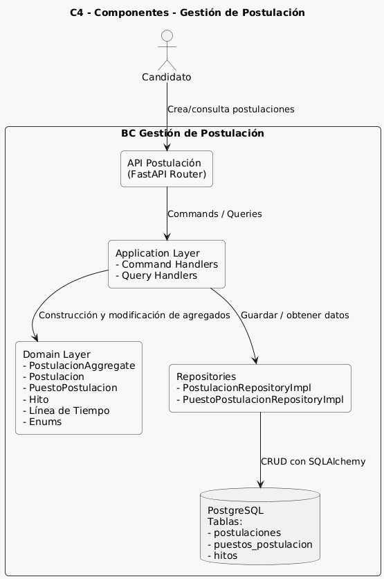

#### **2.6.1.6. Bounded Context Software Architecture Code Level Diagrams**

##### **2.6.1.6.1. Bounded Context Domain Layer Class Diagrams** 

  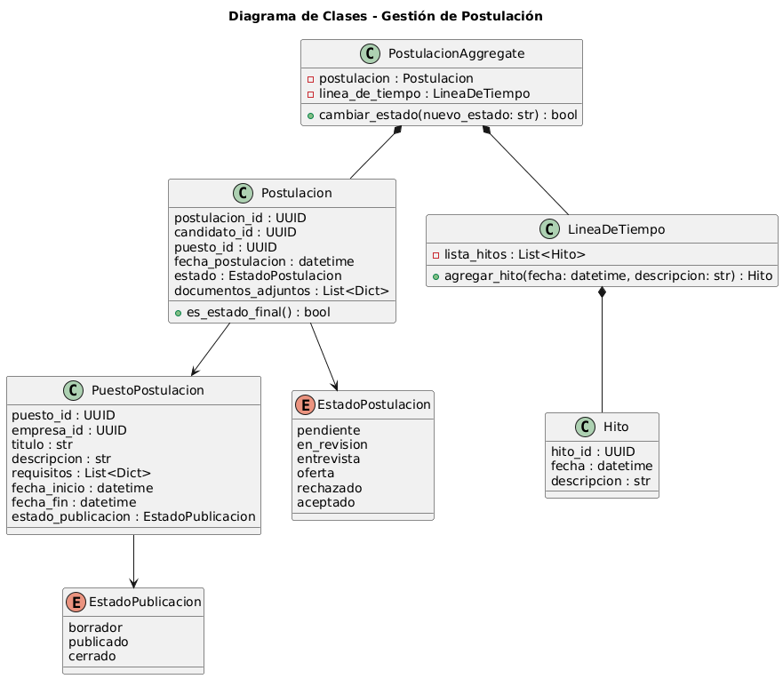

##### **2.6.1.6.2. Bounded Context Database Design Diagram** 

  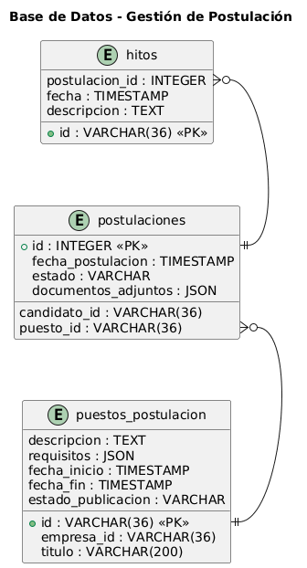

### **2.6.2. Bounded Context: Gestión de Contacto de Postulación** 

#### **2.6.2.1. Domain Layer** 

##### **Entity: ContactoPostulacion**

**Representación**  
Entidad que registra una interacción o comunicación enviada por la empresa hacia el postulante dentro del proceso de postulación.

**Atributos**  
- `contacto_id: UUID`  
- `postulacion_id: UUID`  
- `empresa_id: UUID`  
- `perfil_id: UUID`  
- `tipo_mensaje: TipoMensajeEnum`  
- `motivo_rechazo: str | None`  
- `fecha_hora: datetime`  

**Métodos**  
- `asociar_feedback(feedback)`: vincula un feedback validado al contacto.  
- `marcar_como_aceptado()`: ajusta el estado del contacto como aceptación.  
- `marcar_como_rechazado()`: registra un rechazo y su motivo.  

##### **ValueObject: Feedback**

**Atributos**  
- `tipo: TipoFeedbackEnum`  
- `mensaje_texto: str`  
- `motivo_rechazo: str | None`

**Métodos**  
- `validar_motivo()`: valida que el motivo exista cuando el tipo es rechazo.  
- `formatear_mensaje()`: construye un mensaje completo según el tipo de feedback.  

##### **ValueObject: TipoFeedbackEnum**

**Valores permitidos**  
- `ACEPTACION`  
- `RECHAZO`  
- `INFORMATIVO`  

##### **ValueObject: TipoMensajeEnum**

**Valores permitidos**  
- `SOLICITUD_INFO`  
- `FEEDBACK`  
- `ACTUALIZACION`  

##### **Aggregate: ContactoAggregate**

**Atributos Internos**  
- `contacto_postulacion: ContactoPostulacion`  
- `lista_feedback: List[Feedback]`  

**Reglas de consistencia**  
- Un feedback de tipo rechazo debe incluir un motivo válido.  
- El agregado debe mantener el orden temporal de los feedbacks enviados.  

**Métodos Orquestadores**  
- `procesar_feedback(feedback)`: asocia feedback y registra evento.  
- `actualizar_estado_postulacion()`: emite el evento que solicita cambio de estado en el BC de Postulación.  

##### **Domain Events**

- `FeedbackEnviado`  
- `SolicitudCambioEstadoPostulacion`  

#### **2.6.2.2. Interface Layer** 

##### **Controller: ContactoController (FastAPI Router)**

**POST /api/contacto/feedback**  
Envía un feedback asociado a una postulación.  

#### **2.6.2.3. Application Layer** 

##### **Commands**

- `EnviarFeedbackCommand`  

##### **Command Handler: EnviarFeedbackCommandHandler**

**handle(command)**  
Procesa el envío de feedback, actualiza el agregado, registra el mensaje y persiste el contacto.  

##### **Event Handlers**

- `OnFeedbackEnviadoHandler`  
- `OnSolicitudCambioEstadoPostulacionHandler`  

#### **2.6.2.4. Infrastructure Layer** 

##### **ORM Models (SQLAlchemy)**

**ContactoPostulacionModel**  
- Tabla que persiste mensajes de contacto.  
- Atributos: id, postulacion_id, empresa_id, perfil_id, tipo_mensaje, motivo_rechazo, fecha_hora.  

**FeedbackModel**  
- Tabla que persiste feedbacks asociados al contacto.  
- Atributos: id, contacto_id, tipo, mensaje_texto, motivo_rechazo.  

##### **Repository: ContactoRepositoryImpl**

**Métodos implementados**  
- `guardar(contacto_aggregate)`  
- `obtener_por_id(contacto_id)`  
- `obtener_por_postulacion(postulacion_id)`  

##### **Persistencia**

- Utiliza SQLAlchemy y `SessionLocal`.  
- Persiste contacto y feedbacks en tablas separadas con relación uno-a-muchos.  
- Los feedbacks se sobrescriben completamente al actualizar el agregado.
  

#### **2.6.2.5. Bounded Context Software Architecture Component Level Diagrams**

  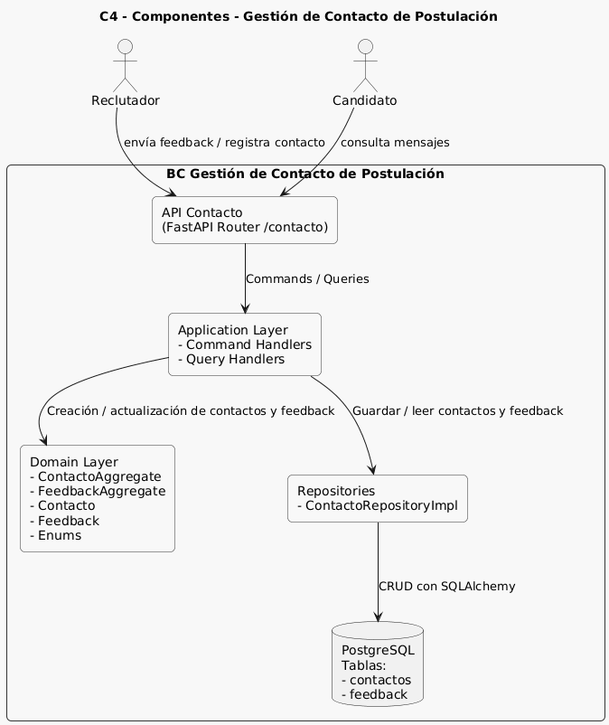

#### **2.6.2.6. Bounded Context Software Architecture Code Level Diagrams**

##### **2.6.2.6.1. Bounded Context Domain Layer Class Diagrams**

  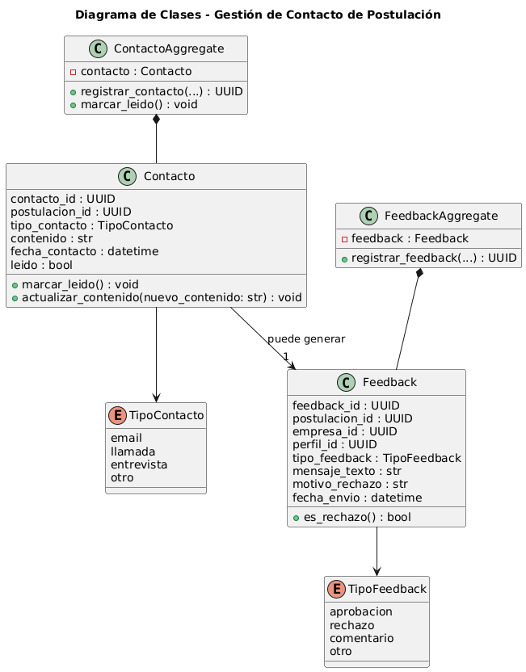

##### **2.6.2.6.2. Bounded Context Database Design Diagram**

  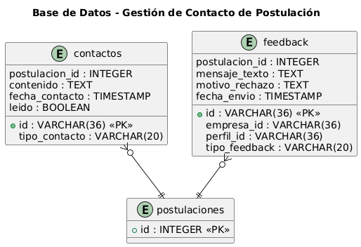

### **2.6.3. Bounded Context: Gestión de Métricas** 

#### **2.6.3.1. Domain Layer** 

##### **Entity: MetricaPerfil**

**Representación**  
Entidad que agrupa las métricas principales de un perfil/postulante a partir del estado actual de sus postulaciones.

**Atributos**  
- `perfil_id: UUID`  
- `total_postulaciones: int`  
- `total_entrevistas: int`  
- `total_exitos: int`  
- `total_rechazos: int`  
- `tasa_exito: float`  

**Métodos**  
- `calcular_tasa_exito()`:  
  - Calcula la tasa de éxito en función de `total_exitos` y `total_postulaciones`.  
  - Mantiene la invariante de no dividir entre cero.  
- `actualizar_totales(postulaciones)`:  
  - Recorre las postulaciones asociadas al perfil y recalcula los contadores.  

##### **Entity: Logro**

**Representación**  
Entidad que representa un logro gamificado alcanzado por un perfil/postulante según sus métricas.

**Atributos**  
- `id_logro: UUID`  
- `perfil_id: UUID`  
- `nombre_logro: str`  
- `umbral: int`  
- `fecha_obtencion: datetime`  

**Métodos**  
- `es_alcanzado(total_actual: int) -> bool`:  
  - Verifica si el valor actual de una métrica supera o iguala el umbral.  
- `registrar_obtencion(fecha: datetime)`:  
  - Registra la fecha de obtención del logro cuando se cumple el umbral.  

##### **ValueObject: ContadorMetrica**

**Representación**  
Objeto de valor que encapsula un contador entero de una métrica específica.

**Atributos**  
- `nombre: str`  
- `valor: int`  

**Métodos**  
- `incrementar(n: int = 1)`: aumenta el valor respetando que no sea negativo.  
- `decrementar(n: int = 1)`: disminuye el valor sin permitir valores menores a cero.  

##### **ValueObject: TipoLogroEnum**

**Valores**  
- `PRIMERA_POSTULACION`  
- `PRIMERA_ENTREVISTA`  
- `PRIMERA_OFERTA`  
- `DIEZ_POSTULACIONES`  
- `CINCO_ENTREVISTAS`  
- `TRES_OFERTAS`  

##### **Aggregate: MetricaAggregate**

**Atributos internos**  
- `metrica_perfil: MetricaPerfil`  
- `logros: List[Logro]`  

**Reglas de consistencia**  
- Los logros asociados deben corresponder siempre al mismo `perfil_id` que la métrica.  
- La `tasa_exito` debe ser coherente con los contadores internos (`total_exitos`, `total_postulaciones`).  

**Métodos orquestadores**  
- `recalcular_desde_postulaciones(postulaciones)`:  
  - Orquesta el recálculo de todos los contadores a partir del listado de postulaciones.  
  - Actualiza `metrica_perfil` y sincroniza los logros alcanzados.  
- `evaluar_logros()`:  
  - Recorre la configuración de logros y marca como alcanzados aquellos cuyo umbral se cumple.  

#### **2.6.3.2. Interface Layer** 

##### **Controller: MetricaController (FastAPI Router)**

**GET /api/metricas/resumen/{perfil_id}**  
- Devuelve un resumen de métricas agregadas para el perfil indicado.  
- Respuesta basada en `MetricaResumenResponse` (total postulaciones, entrevistas, éxitos, rechazos y tasa de éxito).  

**GET /api/metricas/logros/{perfil_id}**  
- Lista todos los logros alcanzados por el perfil.  
- Respuesta basada en `LogroResponse` (id de logro, nombre, umbral, fecha de obtención).  

**GET /api/metricas/recalcular/{perfil_id}**  
- Fuerza el recálculo completo de las métricas para el perfil indicado.  
- Ejecuta la lógica de recálculo y devuelve el nuevo `MetricaResumenResponse`.  

**GET /api/metricas/contadores/ofertas/{postulante_id}**  
- Devuelve el contador de ofertas alcanzadas para un postulante específico.  
- Respuesta basada en `ContadorResponse` (postulante_id, total).  

**GET /api/metricas/contadores/entrevistas/{postulante_id}**  
- Devuelve el contador de entrevistas para un postulante específico.  
- Respuesta basada en `ContadorResponse`.  

**GET /api/metricas/contadores/rechazos/{postulante_id}**  
- Devuelve el contador de rechazos acumulados para un postulante específico.  
- Respuesta basada en `ContadorResponse`.  

#### **2.6.3.3. Application Layer** 

##### **Commands**

- `RecalcularMetricasCommand`  
  - Datos: `perfil_id: UUID`.  
  - Intención: disparar el recálculo completo de las métricas de un perfil a partir de sus postulaciones actuales.  

##### **Command Handler: RecalcularMetricasHandler**

**handle(command: RecalcularMetricasCommand)**  
- Obtiene las postulaciones del perfil a través del repositorio de métricas.  
- Construye o actualiza el `MetricaAggregate` correspondiente.  
- Aplica las reglas de negocio para recalcular contadores, tasa de éxito y logros.  
- Devuelve una estructura de resumen (`MetricaResumenResponse`) actualizada.  

##### **Queries**

- `ConsultarResumenMetricasQuery`  
  - Datos: `perfil_id: UUID`.  
  - Intención: consultar el resumen de métricas calculado en tiempo real para un perfil.  

- `ListarLogrosQuery`  
  - Datos: `perfil_id: UUID`.  
  - Intención: obtener la lista de logros asociados al perfil.  

- `ContadorOfertasQuery`  
  - Datos: `postulante_id: UUID`.  
  - Intención: calcular la cantidad de postulaciones en estado oferta.  

- `ContadorEntrevistasQuery`  
  - Datos: `postulante_id: UUID`.  
  - Intención: calcular la cantidad de postulaciones en estado entrevista.  

- `ContadorRechazosQuery`  
  - Datos: `postulante_id: UUID`.  
  - Intención: calcular la cantidad de postulaciones en estado rechazo.  

##### **Query Handlers**

- `ConsultarResumenMetricasHandler`  
  - `handle(query: ConsultarResumenMetricasQuery)`  
  - Consulta el repositorio de métricas, consolida los contadores y devuelve el resumen de métricas.  

- `ListarLogrosHandler`  
  - `handle(query: ListarLogrosQuery)`  
  - Obtiene la configuración y el estado de logros para el perfil, filtrando solamente los logros ya alcanzados.  

- `ContadorOfertasQueryHandler`  
  - `handle(query: ContadorOfertasQuery)`  
  - Filtra las postulaciones del postulante por estado oferta y devuelve el total.  

- `ContadorEntrevistasQueryHandler`  
  - `handle(query: ContadorEntrevistasQuery)`  
  - Filtra las postulaciones del postulante por estado entrevista y devuelve el total.  

- `ContadorRechazosQueryHandler`  
  - `handle(query: ContadorRechazosQuery)`  
  - Filtra las postulaciones del postulante por estado rechazo y devuelve el total.  

#### **2.6.3.4. Infrastructure Layer** 

##### **Repository: MetricaRepositoryImpl**

**Responsabilidad**  
Implementación del contrato de repositorio de métricas utilizando SQLAlchemy y los modelos de postulación.

**Métodos implementados (conceptuales)**  
- `obtener_resumen_metricas(perfil_id: UUID) -> MetricaPerfil`  
  - Realiza consultas sobre las postulaciones asociadas al perfil para calcular los contadores y la tasa de éxito.  

- `obtener_logros(perfil_id: UUID) -> List[Logro]`  
  - Determina los logros alcanzados en función de las métricas actuales y la configuración de umbrales.  

- `contar_ofertas(postulante_id: UUID) -> int`  
- `contar_entrevistas(postulante_id: UUID) -> int`  
- `contar_rechazos(postulante_id: UUID) -> int`  

Todas las operaciones se realizan en modo de solo lectura sobre el estado actual de las postulaciones.  

##### **Persistencia**

- Uso de `SessionLocal` para la gestión de sesiones de base de datos.  
- Las métricas no se almacenan como tablas propias; se calculan en tiempo real a partir de las tablas de postulaciones.  
- No se generan snapshots persistidos de métricas; los resultados devueltos son agregados calculados en cada consulta.  

#### **2.6.3.5. Bounded Context Software Architecture Component Level Diagrams**

  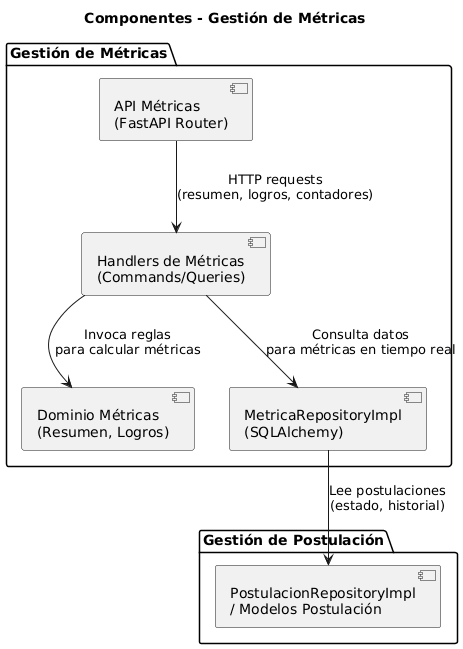

#### **2.6.3.6. Bounded Context Software Architecture Code Level Diagrams**

##### **2.6.3.6.1. Bounded Context Domain Layer Class Diagrams**

  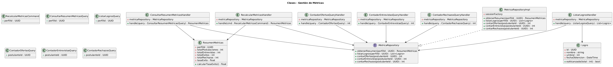

##### **2.6.3.6.2. Bounded Context Database Design Diagram**

  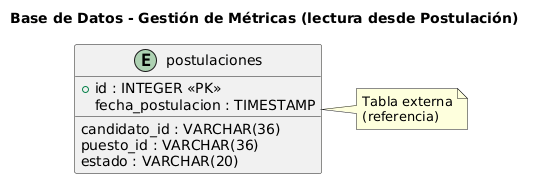

### **2.6.4. Bounded Context: Gestión de Perfil** 

#### **2.6.4.1. Domain Layer** 

##### **Entity: Perfil**

**Representación**  
Entidad que representa el perfil principal de un usuario dentro del sistema (con foco en el perfil de postulante/candidato).

**Atributos**  
- `perfil_id: UUID`  
- `tipo_perfil: TipoPerfilEnum`  
- `datos_personales: dict`  
  - `nombre: str`  
  - `email: str`  
  - `tipo_cuenta: str` (candidato, empresa, admin)  
  - `datos_contacto: dict` (teléfono, redes, etc.)  
  - `experiencias: List[ExperienciaLaboral]`  
  - `educacion: List[Educacion]`  
  - `habilidades: List[str]`  
  - `cv_url: Optional[str]`  
  - `documentos: List[dict]` (cuando se usan documentos asociados al perfil)  
- `estado: EstadoPerfilEnum`  
- `fecha_creacion: datetime`  
- `fecha_actualizacion: Optional[datetime]`  

**Métodos**  
- `actualizar_datos(datos_actualizados: dict)`  
  - Actualiza `datos_personales` con la información recibida.  
  - Mantiene la consistencia de claves (nombre, email, datos_contacto, etc.).  
  - Actualiza `fecha_actualizacion`.  
- `configurar_preferencias(preferencias: dict)`  
  - Aplica cambios de preferencia del postulante (por ejemplo, estado del perfil u otras banderas).  
  - Garantiza que el `estado` siempre sea un valor válido de `EstadoPerfilEnum`.  
- `marcar_como_completo()`  
  - Cambia el `estado` a `COMPLETO` cuando los datos mínimos requeridos están presentes.  
- `bloquear()`  
  - Cambia el `estado` a `BLOQUEADO` cuando se aplica alguna restricción.  

##### **ValueObject: ExperienciaLaboral**

**Representación**  
Experiencia profesional asociada al perfil de candidato.

**Atributos**  
- `empresa: str`  
- `puesto: str`  
- `fecha_inicio: datetime`  
- `fecha_fin: Optional[datetime]`  
- `descripcion: Optional[str]`  

**Métodos**  
- `es_actual() -> bool`  
  - Retorna `True` si `fecha_fin` es `None`.  

##### **ValueObject: Educacion**

**Representación**  
Formación académica del candidato.

**Atributos**  
- `institucion: str`  
- `titulo: str`  
- `fecha_inicio: datetime`  
- `fecha_fin: Optional[datetime]`  
- `descripcion: Optional[str]`  

**Métodos**  
- `esta_en_curso() -> bool`  
  - Retorna `True` si `fecha_fin` es `None`.  

##### **ValueObject: TipoPerfilEnum**

**Valores típicos**  
- `POSTULANTE`  
- `EMPRESA`  
- `ADMIN`  

##### **ValueObject: EstadoPerfilEnum**

**Valores**  
- `INCOMPLETO`  
- `COMPLETO`  
- `VERIFICADO`  
- `BLOQUEADO`  

##### **Aggregate: PerfilAggregate**

**Atributos internos**  
- `perfil: Perfil`  

**Reglas de consistencia**  
- Cada `PerfilAggregate` agrupa exactamente un `Perfil`.  
- El `estado` debe ser coherente con la información disponible (por ejemplo, un perfil verificado no puede estar incompleto).  
- Todas las estructuras internas (`experiencias`, `educacion`, `habilidades`) se almacenan bajo el mismo `perfil_id`.  

**Métodos orquestadores**  
- `crear_perfil(datos_personales_iniciales: dict) -> PerfilAggregate`  
  - Inicializa el perfil con datos básicos (nombre, email, tipo_cuenta, datos_contacto).  
  - Deja el estado en `INCOMPLETO` por defecto.  
- `actualizar_datos_postulante(datos: dict)`  
  - Orquesta la actualización de datos personales y detalle de candidato (experiencias, educación, habilidades, cv_url).  
  - Actualiza `fecha_actualizacion`.  
- `configurar_preferencias_postulante(preferencias: dict)`  
  - Orquesta cambios de estado o banderas de configuración relacionadas al uso del perfil.  

#### **2.6.4.2. Interface Layer** 

##### **Controller: PerfilController (FastAPI Router /api/perfil)**

**POST /api/perfil/**  
- Crea un nuevo perfil de usuario (principalmente perfil de postulante).  
- Entrada basada en `PerfilCreate` (nombre, email, tipo_cuenta, datos_contacto).  
- Retorna `PerfilResponse` con `perfil_id` generado, estado inicial `INCOMPLETO` y fechas de registro/actualización.  

**GET /api/perfil/{perfil_id}**  
- Obtiene el detalle de un perfil específico.  
- Utiliza el `perfil_id` como identificador.  
- Devuelve `PerfilResponse` con datos personales y estado del perfil.  

**GET /api/perfil/**  
- Lista perfiles disponibles (enfoque en perfiles de postulante).  
- Puede filtrar por `tipo_cuenta` y `estado` (según parámetros de consulta).  
- Devuelve una lista de `PerfilResponse`.  

**PUT /api/perfil/{perfil_id}**  
- Actualiza los datos principales de un perfil (nombre, email, datos_contacto).  
- Entrada basada en `PerfilUpdate`.  
- Devuelve el `PerfilResponse` con los datos ya actualizados.  

**PATCH /api/perfil/{perfil_id}/estado**  
- Cambia el estado del perfil (`INCOMPLETO`, `COMPLETO`, `VERIFICADO`, `BLOQUEADO`).  
- Recibe un `EstadoPerfilEnum`.  
- Devuelve el `PerfilResponse` con el nuevo estado y fecha de última actualización.  

##### **Controller: PerfilCandidatoController (FastAPI Router /api/perfil/candidato)**

**POST /api/perfil/candidato**  
- Crea o asocia el detalle de candidato a un `perfil_id` existente.  
- Entrada basada en `PerfilCandidatoCreate` (experiencias, educación, habilidades, cv_url).  
- Devuelve `PerfilCandidatoResponse` con el identificador del perfil candidato y su detalle.  

**GET /api/perfil/candidato/{perfil_id}**  
- Obtiene la información de candidato asociada a un `perfil_id`.  
- Devuelve `PerfilCandidatoResponse` (experiencias, educación, habilidades, cv_url).  

**PUT /api/perfil/candidato/{perfil_id}**  
- Actualiza la información de candidato (experiencias, educación, habilidades, cv_url).  
- Entrada basada en `PerfilCandidatoUpdate`.  
- Devuelve `PerfilCandidatoResponse` con los datos ya actualizados.  

#### **2.6.4.3. Application Layer** 

##### **Commands**

- `CrearPerfilPostulanteCommand`  
  - Datos: `datos_personales: dict` (nombre, email, tipo_cuenta, datos_contacto, etc.).  
  - Intención: crear un nuevo perfil de postulante.  

- `ActualizarDatosPostulanteCommand`  
  - Datos: `perfil_id: UUID`, `datos: dict`.  
  - Intención: actualizar los datos del perfil (nombre, email, datos_contacto, detalle de candidato, etc.).  

- `ConfigurarPreferenciasPostulanteCommand`  
  - Datos: `perfil_id: UUID`, `preferencias: dict`.  
  - Intención: configurar preferencias del postulante (por ejemplo, estado del perfil).  

##### **Command Handlers**

- `CrearPerfilPostulanteHandler`  
  - `handle(command: CrearPerfilPostulanteCommand)`  
  - Crea un nuevo `PerfilAggregate` a partir de los datos personales.  
  - Inicializa el estado del perfil como `INCOMPLETO`.  
  - Persiste el perfil mediante el repositorio de perfil y devuelve el `perfil_id`.  

- `ActualizarDatosPostulanteHandler`  
  - `handle(command: ActualizarDatosPostulanteCommand)`  
  - Recupera el `PerfilAggregate` existente.  
  - Aplica los cambios indicados en `datos` (nombre, email, datos_contacto, experiencias, educación, habilidades, cv_url).  
  - Actualiza la fecha de modificación y persiste los cambios.  

- `ConfigurarPreferenciasPostulanteHandler`  
  - `handle(command: ConfigurarPreferenciasPostulanteCommand)`  
  - Recupera el `PerfilAggregate` correspondiente.  
  - Aplica las preferencias (incluyendo cambios de estado).  
  - Persiste el nuevo estado y configuración.  

> En la capa de aplicación, estos mismos handlers son reutilizados para los endpoints de `/perfil` y `/perfil/candidato` mediante alias, sin duplicar la lógica de negocio.  

##### **Queries**

- `ObtenerPerfilQuery`  
  - Datos: `perfil_id: UUID`.  
  - Intención: recuperar el detalle de un perfil específico.  

- `ListarPerfilesPorTipoQuery`  
  - Datos: `tipo_perfil: TipoPerfilEnum`.  
  - Intención: listar todos los perfiles de un tipo determinado (por ejemplo, postulantes).  

##### **Query Handlers**

- `ObtenerPerfilQueryHandler`  
  - `handle(query: ObtenerPerfilQuery)`  
  - Consulta el repositorio de perfil.  
  - Devuelve los datos del perfil (datos_personales, estado, fechas) en una estructura serializable.  

- `ListarPerfilesPorTipoQueryHandler`  
  - `handle(query: ListarPerfilesPorTipoQuery)`  
  - Consulta el repositorio para obtener todos los perfiles de un tipo en particular.  
  - Devuelve una lista de estructuras con información básica de cada perfil.  

#### **2.6.4.4. Infrastructure Layer** 

##### **Repository: PerfilRepositoryImpl**

**Responsabilidad**  
Implementación del repositorio de perfiles usando SQLAlchemy y PostgreSQL.

**Métodos implementados (principales)**  
- `crear(perfil: Perfil) -> UUID`  
  - Persiste un nuevo perfil en la base de datos.  
- `actualizar_datos(perfil: Perfil) -> None`  
  - Actualiza los datos personales y de candidato de un perfil existente.  
- `configurar_preferencias(perfil: Perfil) -> None`  
  - Persiste los cambios de estado y preferencias.  
- `obtener_por_id(perfil_id: UUID) -> dict`  
  - Recupera los datos de un perfil y los mapea a la estructura utilizada por los query handlers.  
- `listar_por_tipo(tipo_perfil: TipoPerfilEnum) -> List[dict]`  
  - Devuelve todos los perfiles de un tipo específico (por ejemplo, postulantes).  

##### **ORM Models (PerfilModel)**

**Representación general**  
Modelo SQLAlchemy que mapea la tabla de perfiles:

- `id: String(36)` (PK, UUID)  
- `tipo_perfil: String`  
- `datos_personales: JSON`  
- `preferencias: JSON`  
- `estado: String`  
- `fecha_creacion: DateTime`  
- `fecha_actualizacion: DateTime`  

Este modelo se apoya en:  
- `Base` y `engine` definidos en `app.infrastructure.database.connection`.  
- `SessionLocal` para la gestión de sesiones.  

##### **Persistencia**

- Base de datos PostgreSQL.  
- Configuración de conexión centralizada en `app.config.Settings` (usuario, password, host, puerto, nombre de base de datos y `DATABASE_URL`).  
- Creación de tablas a través de `Base.metadata.create_all(bind=engine)` en `main.py`.  
- El router `/api/perfil` interactúa exclusivamente con el `PerfilRepositoryImpl` a través de los command/query handlers, manteniendo la separación entre capas.  

#### **2.6.4.5. Bounded Context Software Architecture Component Level Diagrams**

  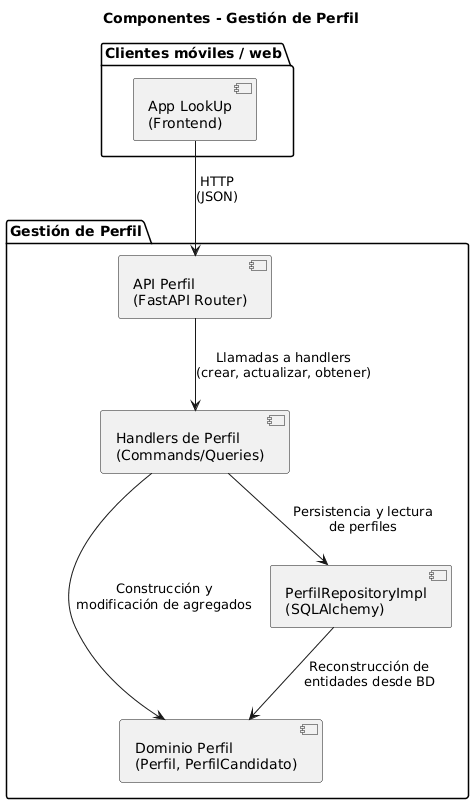

#### **2.6.4.6. Bounded Context Software Architecture Code Level Diagrams**

##### **2.6.4.6.1. Bounded Context Domain Layer Class Diagrams**

  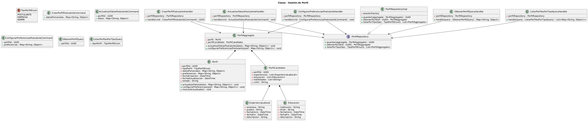

##### **2.6.4.6.2. Bounded Context Database Design Diagram**

  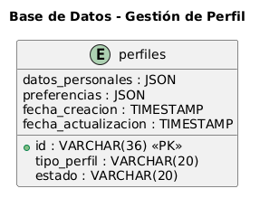

# **Capítulo III: Solution UI/UX Design**

## **3.1. Product Design**

### **3.1.1. Style Guidelines**

LookUp es una aplicación móvil diseñada para transformar la forma en que las personas gestionan su búsqueda de empleo. Su propósito es ayudar a estudiantes, egresados y profesionales en transición a organizar, seguir y mejorar sus procesos de postulación. La plataforma centraliza toda la información relevante en un entorno digital accesible, intuitivo y visualmente coherente con los hábitos de los usuarios actuales. Además, LookUp fomenta una experiencia motivadora a través de métricas simples y logros que impulsan la constancia en el proceso de búsqueda laboral.

Esta sección presenta una guía estructurada que reúne todos los elementos visuales y de diseño utilizados en la aplicación LookUp. Se incluyen recursos como tipografías, paleta de colores y componentes de interfaz que garantizan una identidad visual unificada y profesional. El objetivo es mantener coherencia en cada pantalla, facilitando la navegación y reforzando los valores de la marca: organización, claridad y apoyo al crecimiento profesional del usuario. Gracias a esta consistencia visual, la experiencia se percibe fluida, confiable y alineada con la misión de LookUp de acompañar a cada postulante en su camino hacia nuevas oportunidades laborales.

### **3.1.1.1. General Style Guidelines**

El branding de LookUp constituye la base de su identidad visual, creada para transmitir sus valores esenciales: organización, claridad y crecimiento profesional. A través de una estética moderna, confiable y accesible, la marca refleja su propósito de acompañar al usuario en cada etapa de su búsqueda laboral, brindando una experiencia visual coherente y motivadora.

El logotipo, la paleta de colores y la tipografía de LookUp proyectan profesionalismo y dinamismo, evocando confianza, enfoque y progreso. Estos elementos comunican la facilidad con la que los usuarios pueden registrar sus postulaciones, gestionar su información y seguir su evolución de manera ordenada. El branding está alineado con la misión de la plataforma: ayudar a cada postulante a alcanzar sus metas laborales mediante una herramienta intuitiva, optimista y centrada en el usuario.

#### **3.1.1.1.1. Tipografía**

La tipografía de LookUp cumple un papel clave en la construcción de su identidad visual, transmitiendo profesionalismo, claridad y cercanía en cada punto de interacción con el usuario. La elección de una fuente moderna y limpia garantiza una lectura fluida y cómoda tanto en dispositivos móviles como en pantallas de mayor tamaño, reforzando la coherencia y accesibilidad del diseño.

Toda la interfaz de LookUp utiliza la tipografía **Inter**, seleccionada por su legibilidad, neutralidad y versatilidad. Su diseño geométrico, equilibrado y contemporáneo proyecta orden y confianza, cualidades que reflejan el propósito de la plataforma: ayudar al usuario a organizar su proceso de búsqueda laboral de manera clara y eficiente.

Se emplean diferentes pesos tipográficos (*Light, Regular, Medium y Bold*) para establecer jerarquías visuales entre títulos, subtítulos y contenido informativo, manteniendo consistencia y armonía en toda la aplicación.

#### **3.1.1.1.2. Colores**

La paleta cromática de LookUp está inspirada en los tonos del logotipo, buscando transmitir serenidad, confianza y enfoque. Los colores elegidos refuerzan la identidad profesional de la marca sin perder accesibilidad ni frescura visual.

- **Azul Profundo:** Representa confianza, estabilidad y profesionalismo. Utilizado en botones, encabezados y elementos interactivos clave.  
- **Celeste:** Aporta equilibrio y frescura; se usa en fondos secundarios y detalles visuales.  
- **Blanco:** Garantiza limpieza y legibilidad; sirve como base para resaltar contenido.  
- **Gris Suave:** Utilizado en fondos neutros y secciones informativas; aporta modernidad y descanso visual.  

La combinación de estos tonos genera una interfaz ordenada y profesional que inspira confianza sin resultar monótona.

#### **3.1.1.1.3. Espaciado**

El sistema de espaciado en LookUp está diseñado para ofrecer una experiencia visual limpia y respirable, basada en múltiplos de **8 px (8, 16, 24, 32, 48)**. Esta escala se aplica consistentemente en márgenes, paddings y separación de componentes.

Este enfoque contribuye a la claridad visual y facilita que los usuarios se enfoquen en la información clave sin distracciones. También refuerza la coherencia entre pantallas y mejora la navegabilidad general.

#### **3.1.1.1.4. Iconografía**

Los íconos de LookUp funcionan como elementos visuales de apoyo, facilitando la comprensión inmediata de acciones y estados dentro de la aplicación. Su estilo simple, lineal y minimalista mantiene la coherencia visual de la plataforma y favorece una navegación intuitiva.

#### **3.1.1.1.5. Tono de comunicación y lenguaje aplicado**

El tono de comunicación de LookUp es **profesional, claro y motivador**, diseñado para transmitir confianza y acompañamiento al usuario. Se busca evitar tecnicismos innecesarios y mantener mensajes optimistas y organizados.

### **3.1.1.2. Web Style Guidelines**

El sistema visual de LookUp adopta una línea gráfica moderna, clara y coherente. El uso de tipografía Inter refuerza la armonía visual, mientras que la jerarquización de textos basada en pesos tipográficos y color otorga estructura sin saturar.

La paleta basada en azul profundo y celeste guía al usuario visualmente, especialmente en elementos interactivos. Los bordes suavizados y sombras ligeras aportan cercanía y profesionalismo. La iconografía lineal y minimalista completa una interfaz limpia y coherente.

## **3.1.2. Information Architecture**

La arquitectura de información permite que el usuario navegue e interactúe de forma clara y natural, facilitando una experiencia fluida que mantiene su interés.

### **3.1.2.1. Organization Systems**

Se plantea un sistema jerárquico dividido en dos partes: **Landing Page** y **Aplicación LookUp**.

#### **1. Landing Page**

Es el punto inicial de contacto, diseñada para atraer e informar antes del registro. Incluye:

- Sección hero  
- Funcionalidades principales  
- Explicación del flujo de uso  
- Reseñas  
- Formulario de contacto  

El flujo garantiza que el usuario reciba información esencial antes de registrarse.

#### **2. Aplicación LookUp**

Organiza sus funciones en una estructura basada en tareas:

- **Postulaciones:** lista completa con detalle.  
- **Estado de Postulación:** evolución del proceso.  
- **Métricas:** contadores simples.  
- **Notificaciones:** feedback y actualizaciones.  
- **Perfil:** datos personales y CV.  

La navegación es circular e intuitiva.

### **3.1.2.2. Labelling Systems**

El sistema de etiquetado usa nombres familiares y simples.

#### **Landing Page**

Menú principal:

- Inicio  
- Funciones  
- Cómo Funciona  
- Nosotros  
- Contáctanos  
- Descargar App  

#### **Aplicación móvil**

Etiquetas en la barra inferior:

- Inicio  
- Ofertas  
- Métricas  
- Notificaciones  
- Perfil  

### **3.1.2.3. SEO Tags and Meta Tags**

**Título:** “LookUp”

**Meta Tags principales:**  
Se utilizan los predeterminados, asegurando compatibilidad en dispositivos y navegadores.

**Descripción:**  
LookUp ayuda a gestionar postulaciones laborales, documentos y progreso de manera centralizada.

**Keywords:**  
empleo, prácticas, postulaciones, seguimiento, métricas, organización profesional.

### **3.1.2.4. Searching Systems**

El sistema de búsqueda permite encontrar vacantes o postulaciones rápidamente:

- Barra de búsqueda por empresa o puesto  
- Filtros por estado  
- Ordenamiento por fecha o relevancia  
- Lista de ofertas categorizadas  

La retroalimentación es inmediata y la experiencia ágil.

### **3.1.2.5. Navigation Systems**

Los sistemas de navegación buscan fluidez y simplicidad.

En la **app**, la barra inferior fija contiene:

- Inicio  
- Ofertas  
- Métricas  
- Feedback  
- Perfil  

También existen accesos directos dentro de cada vista.

En la **Landing Page**, un menú superior con:

- Inicio  
- Funciones  
- Cómo Funciona  
- Nosotros  
- Contáctanos  
- Descargar App  

El footer contiene enlaces secundarios como políticas y redes.

## **3.1.3. Landing Page UI Design**

La UI de la Landing Page representa visualmente la identidad moderna, profesional y accesible de LookUp. Combina ilustraciones simples, tipografía limpia y colores corporativos para generar confianza y guiar al usuario hacia la descarga o registro. Su jerarquía visual y componentes interactivos reflejan las decisiones estructurales del diseño centrado en el usuario.

### **3.1.3.1. Landing Page Wireframe**

El wireframe de la landing page de LookUp representa la estructura base de la página principal del proyecto, enfocada en comunicar de forma clara la propuesta de valor y guiar al usuario hacia la acción principal: registrarse o conocer más sobre la aplicación. En la parte superior se encuentra el encabezado con el menú de navegación y el botón de acceso, seguido de una sección hero amplia con un texto destacado y una llamada a la acción visible.

A continuación, se incluye un bloque informativo con imagen y descripción, diseñado para presentar brevemente los beneficios o el propósito del producto. Luego, se muestran secciones organizadas por funciones y características, distribuidas en tarjetas visuales que mantienen un equilibrio entre texto e íconos.

Más abajo, una sección de testimonios o reseñas aporta credibilidad y confianza, mientras que el bloque de contacto al final ofrece un formulario y un mapa de ubicación para la interacción directa con el usuario. Finalmente, el pie de página (footer) contiene enlaces legales y de soporte, manteniendo la coherencia visual del sitio. En conjunto, este wireframe define una navegación lineal, clara y centrada en la conversión, asegurando que cada sección cumpla un propósito informativo y orientado al usuario.

  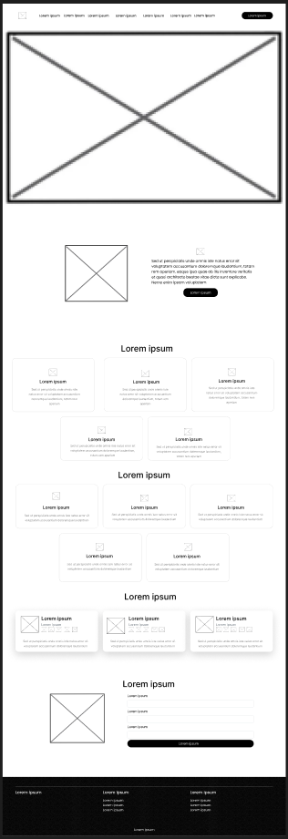

### **3.1.3.2. Landing Page Mock-up**

El mockup de la landing page de LookUp muestra la versión visual final del diseño, donde se consolidan los elementos estructurales definidos en el wireframe con la identidad gráfica de la marca. Desde el inicio, la página busca transmitir profesionalismo y confianza a través de su paleta de azules institucionales, tipografía Inter, y un uso equilibrado de imágenes e ilustraciones.

En la parte superior, el encabezado con menú de navegación facilita el acceso rápido a las secciones principales (Inicio, Funciones, Cómo funciona, Contacto, etc.), junto con un botón destacado para iniciar sesión. La sección principal (hero) presenta un mensaje central que resume el propósito de LookUp (ayudar a los usuarios a gestionar sus postulaciones) acompañado de un botón de acción que invita al registro inmediato.

Más abajo, la sección “Acerca de” combina una ilustración con un texto introductorio que explica la propuesta de valor de la aplicación. Luego, el apartado de “Funciones” organiza en tarjetas limpias y simétricas los principales beneficios del sistema (seguimiento de postulaciones, gestión de documentos, métricas, alertas y filtros). La sección “¿Cómo funciona?” continúa el flujo explicativo, guiando paso a paso al usuario en el proceso de uso de la app.

Posteriormente, la sección de “Reseñas” añade un componente humano y de confianza mediante testimonios visuales con nombre, ocupación y calificación. Finalmente, la sección “Contáctanos” ofrece un mapa integrado de ubicación y un formulario de contacto para facilitar la comunicación directa. El footer cierra la estructura con enlaces informativos y legales, manteniendo la coherencia estética y funcional.

En conjunto, este diseño logra una navegación intuitiva, una jerarquía clara y una presentación profesional, alineada con la misión de LookUp de conectar a los usuarios con oportunidades laborales de forma organizada y accesible.

  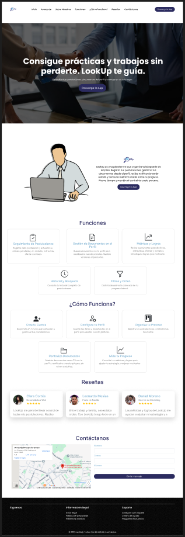

### **3.1.4. Mobile Applications UX/UI Design**

### **3.1.4.1. Mobile Applications Wireframes**

Los wireframes de la aplicación móvil de LookUp constituyen una primera representación estructural del diseño de la plataforma, centrada en la organización del contenido y la distribución de los elementos esenciales en cada pantalla. Esta fase inicial tiene como objetivo definir la manera en que los usuarios interactuarán con las principales funciones del sistema (como la gestión de postulaciones, métricas o perfil) sin involucrar todavía aspectos visuales o estéticos.

Al enfocarse en la usabilidad, jerarquía y claridad funcional, los wireframes permiten validar la lógica de navegación y asegurar que cada componente cumpla su propósito dentro del flujo general de la aplicación. De esta manera, sirven como base para el desarrollo posterior del diseño visual, garantizando una experiencia de usuario coherente, intuitiva y alineada con los objetivos de LookUp.

Los wireframes de la aplicación móvil de LookUp representan la estructura inicial del flujo de interacción del usuario con la plataforma, mostrando de forma clara y ordenada la disposición de los elementos clave en cada pantalla. Este conjunto abarca desde la pantalla de inicio de sesión y registro, donde se definen los campos principales para ingresar credenciales, hasta las vistas funcionales dedicadas a la gestión de postulaciones, métricas, feedbacks y perfil del usuario. Cada pantalla mantiene una composición limpia y jerarquizada, priorizando la legibilidad y la simplicidad visual sobre los aspectos estéticos, lo que permite concentrarse en la funcionalidad y navegación.

El flujo inicia con una pantalla de bienvenida, seguida de las secciones de autenticación (inicio de sesión, registro y recuperación de contraseña), diseñadas con campos alineados verticalmente y botones de acción bien diferenciados. Luego, se despliegan las vistas centrales de la aplicación: la pantalla principal, donde el usuario visualiza un resumen de sus postulaciones; la lista de vacantes, con un buscador y filtros que optimizan la exploración de ofertas; y la pantalla de estado de postulación, que detalla el progreso de cada aplicación mediante una línea temporal de etapas.

Además, se incluyen las secciones de métricas, donde se presentan contadores de desempeño; notificaciones y feedbacks, que muestran actualizaciones sobre el proceso de selección; y finalmente, el perfil del usuario, que reúne información personal y documentos como el CV. La barra inferior de navegación está presente en todas las pantallas, garantizando una experiencia coherente y accesible, con íconos representativos que guían al usuario entre las secciones principales: Inicio, Ofertas, Métricas, Feedback y Perfil.

En conjunto, estos wireframes establecen la base funcional y lógica del diseño de LookUp, asegurando una navegación fluida, una estructura bien definida y una experiencia centrada en la eficiencia del proceso de búsqueda y seguimiento laboral.

  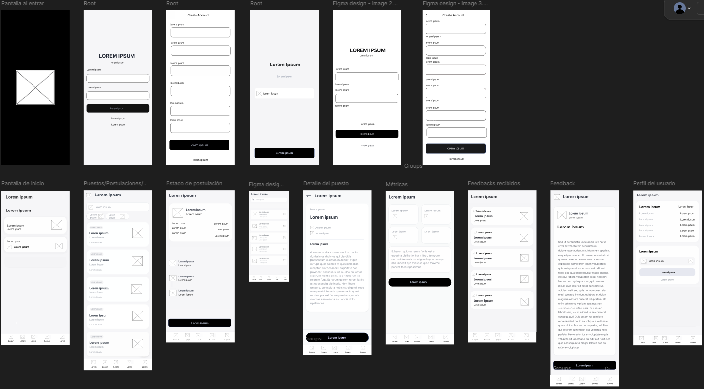

### **3.1.4.2. Mobile Applications Wireflow Diagrams**

### **3.1.4.3. Mobile Applications Mock-Ups**

Los mockups de la aplicación móvil de LookUp presentan una versión más completa y visualmente desarrollada del diseño, mostrando cómo las decisiones de estructura y usabilidad definidas en los wireframes se traducen en una interfaz final realista, moderna y funcional. En esta etapa, se integran los colores institucionales del proyecto, la tipografía Inter, los íconos de navegación y los estilos de botones e inputs, generando una experiencia visual coherente con la identidad de la marca. Cada pantalla fue construida para reflejar con precisión los flujos principales del usuario dentro de la aplicación, asegurando claridad, consistencia y jerarquía en todos los componentes.

El recorrido comienza con la pantalla de bienvenida, donde se muestra el logotipo de LookUp sobre un fondo en tonos azules que refuerzan la identidad profesional y tecnológica del producto. A continuación, las vistas de inicio de sesión, registro y recuperación de contraseña presentan formularios limpios y minimalistas, con validaciones visuales claras para guiar al usuario en el ingreso de datos.

Luego, la pantalla de inicio muestra un saludo personalizado y un resumen de las postulaciones activas, actuando como punto central del flujo principal. En la sección de Postulaciones, se observa una lista con tarjetas individuales que incluyen nombre de la empresa, puesto, estado del proceso y fecha, junto con un buscador y filtros de estado que facilitan la exploración.

La pantalla de Detalles de la Postulación destaca por su línea de tiempo visual que muestra el progreso de cada aplicación (creada, entrevista, revisión), mientras que la de Métricas permite al usuario conocer rápidamente sus estadísticas de postulaciones, entrevistas, ofertas y rechazos mediante contadores simples y actualizables.

Las secciones de Feedbacks y Notificaciones centralizan la comunicación entre empresas y postulantes, con mensajes organizados por estado y retroalimentaciones detalladas que aportan valor al proceso. Finalmente, el Perfil del Usuario reúne la información personal, datos de contacto y un apartado para la gestión del CV, fomentando la personalización y la actualización constante del perfil profesional.

En conjunto, estos mockups evidencian un diseño consistente, accesible y enfocado en la eficiencia del usuario, donde cada elemento (desde los colores hasta la disposición del contenido) contribuye a reforzar la misión de LookUp: ayudar a las personas a gestionar y optimizar su búsqueda laboral de forma clara, ordenada y efectiva.

  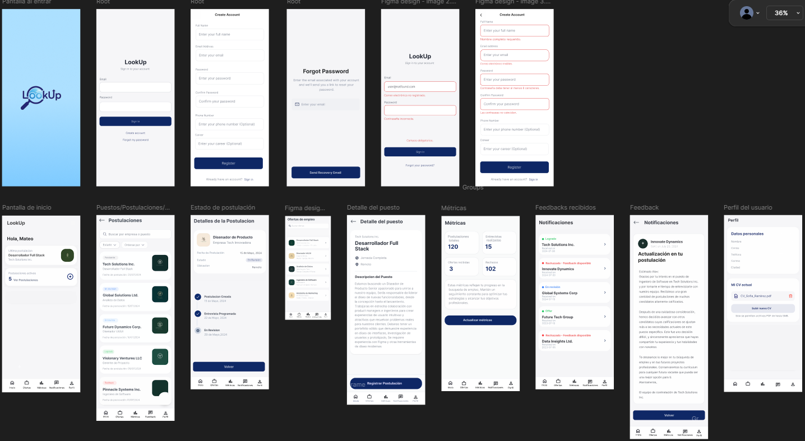

  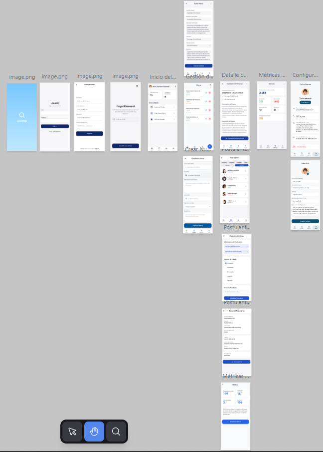

### **3.1.4.4. Mobile Applications User Flow Diagrams**

### **3.1.4.5. Mobile Applications Prototyping**

Con el propósito de evaluar y optimizar la experiencia de usuario y la accesibilidad antes del desarrollo definitivo, se elaboró un prototipo interactivo de la aplicación LookUp, centrado en la navegación móvil. Este modelo permite simular de manera realista el recorrido completo del usuario, reproduciendo la interacción con las diferentes secciones, pantallas y elementos de la interfaz tal como funcionarán en la versión final.

El prototipo fue construido siguiendo principios de arquitectura de información clara, jerarquía visual bien definida y diseño inclusivo, asegurando que cada acción sea comprensible y accesible. Se cuidaron aspectos como la legibilidad, el contraste de colores, la consistencia en los botones e íconos, y la retroalimentación visual de cada interacción, con el objetivo de ofrecer una navegación fluida, intuitiva y sin barreras.

Desarrollado a partir de mockups de alta fidelidad, este prototipo actúa como una representación precisa de la futura interfaz de LookUp. Su función es validar la lógica de navegación, comprobar la usabilidad de los flujos de registro, postulación, seguimiento y gestión de perfil, además de detectar posibles puntos de mejora antes del desarrollo final. De esta manera, se consolida como una herramienta clave para garantizar una experiencia coherente, eficiente y accesible en todo el entorno digital de LookUp.

Link del prototipo: [https://www.figma.com/design/XMEVuN6R9wh16bDPYJNE4m/LookUp?node-id=0-1&p=f](https://www.figma.com/design/XMEVuN6R9wh16bDPYJNE4m/LookUp?node-id=0-1&p=f)

### **Capítulo IV: Product Implementation & Validation**

### **4.1. Software Configuration Management**

La gestión de proyectos desempeña un papel esencial en el desarrollo de software, ya que facilita la planificación, organización y control de las actividades necesarias para alcanzar los objetivos del proyecto. Las herramientas de gestión permiten asignar responsabilidades, monitorear el progreso y coordinar esfuerzos, promoviendo una colaboración más eficiente entre los miembros del equipo y una comunicación fluida durante todo el proceso de desarrollo.

### **4.1.1. Software Development Environment Configuration**

El diseño de interfaces de usuario (UI) y experiencia de usuario (UX) resulta clave para desarrollar aplicaciones y sistemas que sean intuitivos, visualmente atractivos y fáciles de usar. Las herramientas de diseño UX/UI permiten elaborar prototipos, wireframes y maquetas interactivas que pueden evaluarse con los usuarios antes de su desarrollo final, garantizando así una mejor experiencia de uso.

**Figma:**  
Figma es una herramienta de diseño colaborativo en la nube que facilita la creación de interfaces y prototipos interactivos. Su funcionamiento en línea permite que varios miembros del equipo trabajen simultáneamente en un mismo proyecto, realizando ediciones y revisiones en tiempo real. Gracias a esta colaboración dinámica, Figma se adapta perfectamente a entornos de trabajo ágiles, donde el diseño y el desarrollo avanzan de manera paralela.

El desarrollo de software necesita entornos especializados donde los programadores puedan escribir, probar y depurar código de manera eficiente. Los entornos de desarrollo integrados (IDE) y los editores avanzados proporcionan funciones como resaltado de sintaxis, control de versiones, autocompletado y herramientas de depuración, incrementando la productividad y facilitando el trabajo colaborativo dentro del equipo.

**Android Studio:**  
Android Studio es el entorno de desarrollo oficial para aplicaciones Android, creado por Google. Ofrece herramientas para programar, compilar, probar y optimizar aplicaciones móviles. Sus principales características incluyen el emulador integrado, depurador avanzado e integración con Git, lo que permite un flujo de trabajo ágil y organizado. Gracias a su compatibilidad con Kotlin y Java, se convierte en una herramienta esencial para desarrolladores que construyen aplicaciones modernas y eficientes.

**Visual Studio Code:**  
Visual Studio Code es un editor de código ligero y multiplataforma desarrollado por Microsoft. Destaca por su versatilidad, facilidad de uso y alto nivel de personalización. Soporta una gran variedad de lenguajes de programación y permite instalar extensiones que añaden soporte para depuración, Git, testing y colaboración en tiempo real mediante Live Share. Su interfaz intuitiva y rendimiento optimizado lo convierten en una excelente opción para el desarrollo web y multiplataforma.

**Flutter:**  
Flutter es un framework de desarrollo multiplataforma creado por Google, utilizado para construir aplicaciones móviles, web y de escritorio con un solo código base. En el proyecto LookUp, Flutter se emplea para desarrollar la versión dirigida a empresas (empleadores), permitiendo una interfaz moderna, responsiva y coherente con los lineamientos del producto. Su motor gráfico integrado y widgets personalizados hacen posible crear interfaces fluidas y de alto rendimiento, manteniendo la consistencia visual entre plataformas.

El control de versiones es una parte esencial del proceso de desarrollo de software, ya que permite registrar, gestionar y rastrear los cambios realizados en el código fuente. Esta práctica fomenta la colaboración entre los miembros del equipo, permitiendo que cada desarrollador trabaje en su propia copia del proyecto sin afectar el código principal. Luego, los cambios pueden integrarse de forma controlada, evitando conflictos y manteniendo un historial detallado de todas las modificaciones.

**Git (CLI/GUI):**  
Git es un sistema de control de versiones distribuido ampliamente utilizado en la industria. Facilita la gestión local y remota de código, permitiendo crear ramas para nuevas características, realizar pruebas y fusionar cambios de forma controlada. Puede usarse tanto desde la línea de comandos como desde interfaces gráficas, adaptándose a distintos estilos de desarrollo.

**GitHub:**  
GitHub es una plataforma basada en Git que centraliza la gestión de repositorios y la colaboración en proyectos de software. Ofrece herramientas como pull requests, issues, boards de proyecto e integración continua (CI/CD). Permite mantener la calidad, organización y trazabilidad del desarrollo, además de facilitar la colaboración entre los miembros del equipo.

### **4.1.2. Source Code Management**

Para garantizar una organización clara, control de versiones eficiente y colaboración fluida durante el desarrollo de LookUp, se crearon repositorios específicos en GitHub, cada uno con un propósito definido dentro del ciclo de desarrollo y documentación del proyecto. Esta estructura permite mantener orden, trazabilidad y autonomía en el trabajo colaborativo.

**Landing Page (LANDING-PAGE):**  
Repositorio dedicado al desarrollo de la landing page de LookUp. Contiene archivos HTML, CSS, JavaScript, imágenes y recursos visuales que presentan la propuesta de valor de la aplicación. Su propósito es ofrecer una presentación profesional y funcional que invite a los usuarios a conocer la plataforma e iniciar el registro.  
**Enlace:** https://github.com/1ACC0238-2520-14650-GRUPO-1/LANDING-PAGE

**Informe del Proyecto (REPORT):**  
Este repositorio almacena y gestiona el informe completo del proyecto LookUp. Contiene PDFs, documentos Markdown, presentaciones y materiales asociados a la planificación, documentación, análisis y sustentación. Garantiza la consistencia y trazabilidad del contenido académico y técnico.  
**Enlace:** https://github.com/1ACC0238-2520-14650-GRUPO-1/REPORT

**Front-End (FRONTEND):**  
Aquí se desarrolla todo el entorno visual e interactivo de LookUp. Incluye el código fuente organizado en componentes, vistas y servicios, encargándose de la UI y la lógica de interacción del usuario postulante. Permite gestionar postulaciones, ver métricas, acceder a documentos personales y navegar por todas las funciones de la app.  
**Enlace:** https://github.com/1ACC0238-2520-14650-GRUPO-1/FRONTEND

**Back-End (BACKEND):**  
Repositorio que contiene toda la lógica central del sistema, basado en arquitectura DDD. Incluye bounded contexts (Gestión de Postulación, Contacto, Métricas y Perfil), controladores, servicios de aplicación, entidades, agregados, repositorios y configuraciones de base de datos. Actúa como núcleo de negocio y punto central de integración con el Front-End.  
**Enlace:** https://github.com/1ACC0238-2520-14650-GRUPO-1/BACKEND

### **4.1.4. Software Deployment Configuration**

Esta sección presenta el entorno donde fue desplegado el backend de LookUp, mostrando el hosting utilizado y la apariencia visual del despliegue dentro de la plataforma correspondiente. El despliegue garantiza que los servicios del sistema estén disponibles, accesibles y funcionando correctamente para su integración con el Front-End y la aplicación móvil. Se desplegó con ayuda de vercel y documentación en swagger.

### **4.2. Landing Page & Mobile Applications Implementation**

Esta sección describe la implementación técnica y visual tanto de la landing page como de las aplicaciones móviles de LookUp. Se detalla la organización del código, componentes clave, funcionamiento de la interfaz, integración con el backend y aspectos relevantes del desarrollo, garantizando una experiencia coherente entre todos los entornos digitales del proyecto.

### 4.2.1 Sprint 1 {#421-sprint-1}

El Sprint 1 del proyecto LookUp se centró en la construcción de la base visual y funcional del producto: la landing page pública, la primera versión navegable de la aplicación móvil para postulantes y el avance inicial del backend (aproximadamente el 70 % de su alcance final). Este sprint permitió validar la propuesta de valor, definir la experiencia de usuario básica y habilitar un entorno técnico mínimo viable para seguir iterando en sprints posteriores.

---

#### 4.2.1.1 Sprint Planning 1 {#4211-sprint-planning-1}

La reunión de planificación de Sprint 1 permitió al equipo alinear objetivos, priorizar historias de usuario y descomponerlas en tareas concretas para la landing page, la app móvil y el backend inicial. Se definió un Sprint Goal orientado a entregar una primera versión funcional y visible de LookUp, que permitiera demostrar su valor tanto a usuarios finales como a docentes y stakeholders.

A continuación, se muestra la tabla de planificación del sprint:

| Sprint # | Sprint 1 |
| :------- | :------- |
| **Sprint Planning Background** |  |
| Date | 2025-10-01 |
| Time | 9:30 PM |
| Location | Reunión virtual |
| Prepared By | Luis Rodríguez, Gustavo Román |
| Attendees (to planning meeting) | Luis Rodríguez / Gustavo Román / Santiago Suárez / Santiago Cárdenas / Elvia Rodríguez |
| **Sprint Goal & User Stories** |  |
| Sprint 1 Goal | **Nuestro enfoque está en** entregar la primera versión funcional de la landing page y de la aplicación móvil de LookUp (versión postulante), junto con el avance inicial del backend necesario para soportar las historias críticas relacionadas con la gestión de postulaciones. **Creemos que esto aporta valor porque** permite a los usuarios conocer la propuesta de LookUp, registrarse, explorar la interfaz principal y empezar a organizar sus postulaciones en un entorno consistente y usable. **Lo confirmaremos cuando** la landing page sea completamente navegable y responsive, la app móvil permita recorrer las pantallas principales (inicio, postulaciones, métricas, feedback y perfil), y el backend exponga los primeros servicios de creación y consulta de postulaciones en un entorno desplegado. |
| Sprint 1 Velocity | 28 |
| Sum of Story Points | 34 |

En este sprint se priorizaron principalmente las historias de los épicos:

- **EP01 – Landing Page / Marketing (US01–US08)**
- **EP02 – Registro, Login y Perfil básico (US09–US13)** – UI completa, backend parcial.
- **EP03 – Gestión de Postulaciones (US14–US17)** – UI completa, endpoints iniciales de creación/listado en backend.
- **EP05 – Métricas simples (US21–US24)** – UI de panel de métricas y lógica básica ligada a postulaciones.
- **EP08 – Calidad de UX y UI (US31–US34)** – Aplicadas de forma transversal a landing page y app móvil.

Las historias de **EP04 (Documentos), EP06 (Historial, búsqueda, filtros y ordenamiento), EP07 (Contactabilidad)** y parte de **EP02 (Perfil detallado) y autenticación completa** quedaron **no iniciadas o parcialmente implementadas** en el backend, y se planificaron para sprints posteriores.

#### 4.2.1.2 Sprint Backlog 1 {#4212-sprint-backlog-1}

En este sprint se definieron y ejecutaron las tareas necesarias para entregar:

- La **primera versión completa y responsive de la landing page**.
- La **primera versión navegable de la aplicación móvil** (pantallas principales y navegación).
- El **núcleo inicial del backend**, centrado en postulaciones y métricas básicas.

A continuación, se detalla el Sprint Backlog 1:

| Sprint # 1 |  |  |  |  |  |
| :--------- | :---- | :---- | :---- | :---- | :---- |
| Work-Item / Task | User Story ID | Description | Estimation (Hours) | Estimation (Hours) | Assigned To / Status |
| Diseñar y maquetar sección principal (hero) de la landing page | US01 | Implementar el mensaje central y subtítulo que explican la propuesta de LookUp en la parte superior de la landing page. | 2 | 2 | Santiago Cárdenas / Done |
| Implementar menú de navegación responsive (desktop) | US02 | Desarrollar barra de navegación fija para escritorio con acceso a Inicio, Funciones, Cómo funciona, Nosotros, Contáctanos y Descargar App. | 3 | 3 | Gustavo Román / Done |
| Implementar menú hamburguesa para móvil y tablet | US02 | Añadir menú colapsable para dispositivos móviles y tablets, asegurando una correcta visualización de las opciones. | 3 | 3 | Elvia Rodríguez / Done |
| Crear sección de beneficios principales | US03 | Diseñar y maquetar la sección que presenta al menos cuatro beneficios clave de LookUp con iconos y descripciones. | 2 | 2 | Luis Rodríguez / Done |
| Configurar enlaces de navegación interna a secciones clave | US04 | Implementar scroll y redirección hacia secciones Funciones, Nosotros, Contáctanos y Descargar App desde la barra de navegación. | 2 | 2 | Santiago Suárez / Done |
| Diseñar sección “Sobre Nosotros” en la landing | US05 | Crear el contenido y la estructura visual que presenta la historia, misión y propósito de LookUp. | 2 | 2 | Elvia Rodríguez / Done |
| Implementar enlaces a políticas de privacidad y términos de servicio (estructura base) | US06 | Añadir enlaces en el footer a las páginas legales (contenido placeholder) para su futura ampliación. | 1 | 1 | Gustavo Román / In Progress |
| Añadir enlaces a redes sociales en el pie de página | US07 | Integrar enlaces a redes sociales (YouTube, Instagram, X) en el footer de la landing. | 1 | 1 | Santiago Cárdenas / In Progress |
| Implementar galería / swiper de contenido destacado | US08 | Agregar carrusel interactivo de tarjetas con información visual de las principales funciones de LookUp. | 3 | 3 | Luis Rodríguez / Done |
| Diseñar pantallas de registro e inicio de sesión en la app móvil | US09, US10 | Crear en Android Studio las pantallas de login y registro con validación básica en la interfaz. | 4 | 4 | Gustavo Román / Done |
| Implementar pantalla de perfil básico del postulante (UI) | US12 | Diseñar la vista de perfil con datos personales y descripción del usuario. | 3 | 3 | Santiago Suárez / Done |
| Implementar pantalla de creación de postulaciones | US14 | Diseñar la vista para registrar una nueva postulación (empresa, puesto, fecha automática en UI). | 3 | 3 | Gustavo Román / Done |
| Implementar lista de postulaciones del usuario | US14, US15 | Mostrar listado de postulaciones con información básica y estado actual. | 3 | 3 | Santiago Suárez / Done |
| Implementar endpoint backend para crear postulación | US14 | Crear en FastAPI el endpoint para registrar postulaciones con estado “pendiente”. | 3 | 3 | Luis Rodríguez / Done |
| Implementar endpoint backend para listar postulaciones por usuario | US25 | Crear endpoint que devuelva el historial de postulaciones de un usuario (versión inicial). | 3 | 3 | Luis Rodríguez / Done |
| Implementar lógica de registro automático de fecha/hora en backend | US15 | Configurar modelo y servicio para almacenar fecha y hora de creación de cada postulación. | 2 | 2 | Santiago Cárdenas / Done |
| Diseñar panel de métricas en la app móvil | US21, US22, US23, US24 | Crear pantalla que muestra contadores de postulaciones, entrevistas, ofertas y rechazos (valores basados en datos de backend). | 3 | 3 | Elvia Rodríguez / Done |
| Implementar consulta de métricas en backend (versión simplificada) | US21–US24 | Calcular métricas en tiempo real a partir de las postulaciones almacenadas. | 4 | 4 | Luis Rodríguez / Done |
| Diseñar barra de navegación inferior en la app móvil | US31–US34 | Implementar la navegación entre Inicio, Ofertas/Postulaciones, Métricas, Feedback y Perfil. | 3 | 3 | Santiago Suárez / Done |
| Implementar comportamiento básico de feedback/notifications (UI) | US30, US34 | Crear vistas de feedback y notificaciones (sin lógica completa de contacto en backend). | 2 | 2 | Gustavo Román / In Progress |
| Implementar endpoints de autenticación (login/registro) en backend | US09, US10 | Servicios de registro e inicio de sesión con validación y persistencia de usuarios. | 5 | 5 | Luis Rodríguez / In Progress |
| Implementar endpoints de perfil (lectura/actualización básica) | US12 | Servicios de backend para obtener y actualizar el perfil del postulante. | 4 | 4 | Santiago Cárdenas / In Progress |
| Implementar endpoints de documentos asociados al perfil | US18–US20 | Servicios CRUD para documentos del postulante (subir, listar, eliminar). | 5 | 5 | Elvia Rodríguez / To-Do |
| Implementar endpoints de búsqueda, filtros y ordenamiento de postulaciones | US26–US28 | Servicios para buscar por empresa/puesto, filtrar por estado y ordenar por fecha o resultado. | 5 | 5 | Gustavo Román / To-Do |
| Implementar endpoints de contactabilidad (datos de contacto y uso por reclutador) | US29, US30 | Servicios para almacenar datos de contacto y exponerlos a reclutadores. | 4 | 4 | Santiago Suárez / To-Do |

#### 4.2.1.3 Development Evidence for Sprint Review {#4213-development-evidence-for-sprint-review}

Durante el Sprint 1 se realizaron commits en los repositorios principales del proyecto: landing page, frontend móvil y backend. A continuación, se presenta una selección representativa de las evidencias de desarrollo:

| Repository | Branch | Commit Id | Commit Message | Commit Message Body | Commited on (Date) |
| :--------- | :----- | :-------- | :------------- | :------------------ | :----------------- |
| 1ACC0238-2520-14650-GRUPO-1/LANDING-PAGE | main | a1b2c3d | Implementar estructura base y hero de la landing page | Se creó la estructura HTML principal, se añadió la sección hero con el mensaje central y se configuró la hoja de estilos principal para el diseño responsive inicial. | 2025-10-03 |
| 1ACC0238-2520-14650-GRUPO-1/LANDING-PAGE | main | e4f5g6h | Agregar menú responsive y sección de beneficios | Se añadió el menú de navegación responsive (desktop y móvil), se implementó la sección de beneficios con tarjetas informativas y se ajustaron estilos para mejorar la legibilidad. | 2025-10-03 |
| 1ACC0238-2520-14650-GRUPO-1/LANDING-PAGE | main | i7j8k9l | Integrar galería Swiper y footer con enlaces | Se integró un carrusel informativo con Swiper.js, se añadió el footer con enlaces a redes sociales y páginas legales, y se realizaron pruebas de visualización en distintos tamaños de pantalla. | 2025-10-04 |
| 1ACC0238-2520-14650-GRUPO-1/FRONTEND | main | m1n2o3p | Crear pantallas iniciales de Login, Registro y Home en Android | Se generaron las pantallas de login, registro y la pantalla principal usando Android Studio y Jetpack Compose, con validaciones de UI y navegación básica entre vistas. | 2025-10-04 |
| 1ACC0238-2520-14650-GRUPO-1/FRONTEND | main | q4r5s6t | Implementar navegación inferior y vistas de Postulaciones y Métricas | Se implementó la barra de navegación inferior, se crearon las vistas de lista de postulaciones y panel de métricas, y se conectaron con datos simulados para pruebas iniciales. | 2025-10-05 |
| 1ACC0238-2520-14650-GRUPO-1/BACKEND | main | u7v8w9x | Definir modelos de Postulación y endpoints básicos | Se definieron los modelos de Postulación y Puesto, se implementaron los endpoints para crear y listar postulaciones y se configuró la documentación automática de FastAPI. | 2025-10-06 |
| 1ACC0238-2520-14650-GRUPO-1/BACKEND | main | y1z2a3b | Añadir cálculo de métricas en tiempo real basado en postulaciones | Se implementaron consultas para obtener el conteo de postulaciones, entrevistas, ofertas y rechazos a partir del estado de las postulaciones registradas. | 2025-10-07 |
| 1ACC0238-2520-14650-GRUPO-1/BACKEND | main | c4d5e6f | Iniciar implementación de autenticación y perfil | Se creó la estructura inicial de endpoints de autenticación (login/registro) y perfil básico, quedando pendiente la integración completa con el frontend. | 2025-10-08 |

Estas evidencias muestran el avance coordinado entre la landing page, la app móvil y el backend, logrando una primera integración básica entre las capas del sistema.

#### 4.2.1.4 Testing Suite Evidence for Sprint Review {#4214-testing-suite-evidence-for-sprint-review}

En el Sprint 1 no se definió aún una batería formal de pruebas automatizadas; sin embargo, se ejecutó una serie de **pruebas manuales** orientadas a validar el comportamiento funcional mínimo del sistema en los tres frentes: landing page, app móvil y backend.

Las principales validaciones realizadas fueron:

- **Landing Page (HTML/CSS/JS)**  
  - Verificación de carga correcta en navegadores modernos (Chrome, Edge).  
  - Pruebas de **diseño responsive**, comprobando que el menú de navegación, la sección hero, los beneficios, el swiper y el footer se visualizaran correctamente en resoluciones de escritorio, tablet y móvil.  
  - Pruebas de enlaces de navegación interna (scroll a secciones Inicio, Funciones, Cómo Funciona, Nosotros, Contáctanos).  
  - Verificación de funcionamiento básico del carrusel (Swiper) y enlaces a redes sociales (placeholder).

- **Aplicación móvil (Android Studio – APK)**  
  - Instalación de la APK en dispositivos Android físicos y emuladores.  
  - Pruebas de navegación entre pantallas: Login, Registro, Recuperar contraseña, Inicio, Postulaciones, Métricas, Feedback y Perfil.  
  - Pruebas de interacción con formularios (validaciones de campos obligatorios en login/registro y creación de postulaciones).  
  - Verificación de la barra de navegación inferior y coherencia de estilos en todas las secciones.  

- **Backend (FastAPI)**  
  - Pruebas manuales a través de la documentación interactiva generada por FastAPI (`/docs`).  
  - Validación de creación de postulaciones (POST) y consulta del listado de postulaciones (GET).  
  - Pruebas de cálculo de métricas básicas (contadores de postulaciones por estado).  

#### 4.2.1.5 Execution Evidence for Sprint Review {#4215-execution-evidence-for-sprint-review}

Durante el Sprint 1 se priorizaron 34 historias de usuario asociadas a la landing page, la app móvil y el backend inicial. El equipo logró completar la mayor parte del alcance planificado, especialmente en la capa de presentación (landing + app móvil) y en el núcleo de postulaciones y métricas del backend.

**Logros principales del sprint:**

- **Landing Page (EP01 – US01–US08)**  
  - Se completaron todas las historias relacionadas con el mensaje principal, navegación, beneficios, galería de contenidos, secciones de información (“Sobre Nosotros”) y estructura de enlaces legales y redes sociales (algunas con contenido placeholder para ser refinado posteriormente).  
  - La landing page quedó lista, responsive y desplegada públicamente.

- **App móvil – Versión postulante (EP02, EP03, EP05, EP08)**  
  - Se implementaron las pantallas de **Login, Registro, Recuperación de contraseña, Inicio, Postulaciones, Métricas, Feedback y Perfil**, además de la barra de navegación inferior.  
  - Se logró una **experiencia de navegación fluida y coherente**, cumpliendo con las historias de interfaz y experiencia de usuario (US31–US34).  
  - El flujo de creación y visualización de postulaciones quedó operativo desde la app, apoyado en los endpoints iniciales del backend.

- **Backend LookUp (Gestión de Postulación y Métricas)**  
  - Se desarrollaron los modelos y endpoints para **crear y listar postulaciones**, incluyendo el registro automático de fecha y hora.  
  - Se implementó un primer conjunto de consultas para **calcular métricas** en tiempo real, basadas en el estado de las postulaciones (postulaciones enviadas, ofertas, entrevistas, rechazos).  
  - Se definió la estructura base para autenticación, perfil, documentos, búsqueda/filtros e integración de feedback/contacto, aunque estos módulos quedaron **incompletos o en estado inicial**.

**Actividades pendientes o parciales:**

- La **autenticación completa** (login/registro) en backend quedó iniciada, pero no se integró totalmente con la app móvil (flujo de sesión aún en desarrollo).
- El **perfil detallado**, la gestión de **documentos**, las funcionalidades de **búsqueda, filtros y ordenamiento** y la **contactabilidad (EP07)** no quedaron terminadas en el backend; su UI existe en la app, pero la lógica servidor aún se completará en sprints posteriores.
- La documentación de servicios (OpenAPI detallado para el informe) aún no se generó de forma formal, pese a que FastAPI expone documentación técnica automática.

En resumen, el Sprint 1 permitió disponer de una versión navegable y mostrable de LookUp (landing + app móvil + backend inicial), cumpliendo el objetivo principal del sprint y dejando bases sólidas para profundizar funcionalidades en el Sprint 2.

#### 4.2.1.6 Services Documentation Evidence for Sprint Review {#4216-services-documentation-evidence-for-sprint-review}

En este sprint, el foco principal estuvo en **construir la base funcional** del sistema y en asegurar que la landing page, la app móvil y el backend inicial pudieran integrarse de forma básica. Por ello, la documentación de servicios se limitó a la exposición automática generada por FastAPI y no se elaboraron aún documentos detallados de APIs para el informe (por ejemplo, tablas de endpoints en formato OpenAPI exportado).

Los puntos clave de esta evidencia son:

- Se implementó un backend en **FastAPI** que expone los primeros endpoints relacionados con la **Gestión de Postulación** y **Métricas**, accesibles a través de la interfaz interactiva de documentación generada automáticamente.
- Los servicios disponibles en este sprint incluyen, principalmente:
  - **POST /postulaciones** – Registrar una nueva postulación con estado inicial “pendiente”.
  - **GET /postulaciones** – Listar las postulaciones de un usuario (en este sprint, pruebas con usuarios de prueba).
  - **GET /metricas** (o ruta equivalente) – Devolver los contadores de postulaciones por estado (postulaciones enviadas, ofertas, entrevistas, rechazos) en tiempo real.
- La documentación de estos servicios puede visualizarse en el endpoint de documentación de FastAPI desplegado en el backend:
  - `https://backend-ufl2-git-main-glitter22s-projects.vercel.app/docs`

Aún no se documentaron ni estabilizaron los endpoints relacionados con:

- **Autenticación** (login, registro de usuarios).
- **Perfil detallado** del postulante.
- **Gestión de documentos**.
- **Búsqueda, filtros y ordenamiento de postulaciones**.
- **Contactabilidad/feedback para reclutadores**.

La generación de documentación ampliada (tablas de endpoints, ejemplos de request/response, códigos de estado HTTP, etc.) se planificó para los próximos sprints, cuando la superficie funcional del backend esté más completa y estable.

#### 4.2.1.7 Software Deployment Evidence for Sprint Review {#4217-software-deployment-configuration-for-sprint-review}

Durante el Sprint 1 se realizaron despliegues en entornos accesibles para el equipo y los docentes, con el objetivo de validar el comportamiento de LookUp de extremo a extremo (landing page, app móvil y backend).

Las evidencias de despliegue son las siguientes:

1. **Landing Page de LookUp**

   - Se creó el repositorio público para la landing page:  
     `https://github.com/1ACC0238-2520-14650-GRUPO-1/LANDING-PAGE`
   - La landing page se desplegó utilizando **GitHub Pages**, quedando accesible en:  
     `https://1acc0238-2520-14650-grupo-1.github.io/LANDING-PAGE/`
   - Se verificó:
     - Carga correcta de estilos y scripts.
     - Funcionamiento del menú responsive.
     - Visualización adecuada de secciones (Inicio, Funciones, Cómo Funciona, Nosotros, Reseñas, Contáctanos).
     - Redirección y navegación interna fluida.

2. **Backend de LookUp**

   - El backend se implementó con **FastAPI** siguiendo la arquitectura por Bounded Contexts descrita en el capítulo de diseño.
   - Se desplegó en un entorno accesible mediante la siguiente URL de pruebas:  
     `https://backend-ufl2-git-main-glitter22s-projects.vercel.app/docs`
   - Durante el sprint se configuró el despliegue para que el servicio backend quedara disponible como API REST, permitiendo:
     - Probar endpoints mediante la interfaz `/docs`.
     - Verificar la creación y consulta de postulaciones.
     - Validar las métricas iniciales del postulante.
   - El despliegue se gestionó utilizando un flujo automatizado con herramientas de integración y despliegue basadas en Git y Vercel, permitiendo actualizar el entorno de pruebas a partir de los cambios en el repositorio del backend.

3. **Aplicación móvil (APK de LookUp)**

   - La aplicación móvil de LookUp (versión postulante) se desarrolló en **Android Studio**, utilizando **Kotlin** y **Jetpack Compose**.
   - Se generó un **APK de pruebas internas**, que fue instalado en dispositivos Android físicos y en emuladores para realizar las pruebas manuales descritas en la sección de Testing.
   - El despliegue del APK permitió:
     - Probar la navegación general de la app.
     - Verificar la integración básica con el backend para la creación y visualización de postulaciones.
     - Validar la experiencia de usuario en dispositivos reales, incluyendo rendimiento y tiempos de carga.

Gracias a estos despliegues, el equipo pudo presentar una versión funcional y navegable de LookUp al finalizar el Sprint 1, tanto desde el punto de vista visual (landing page y app móvil) como desde el punto de vista técnico (backend inicial en funcionamiento).

#### 4.2.1.8 Team Collaboration Insights during Sprint {#4218-team-collaboration-insights-during-sprint}

A lo largo del Sprint 1, el equipo trabajó de forma coordinada para abordar simultáneamente la landing page, la aplicación móvil y el backend. La colaboración se organizó combinando reuniones de sincronización, trabajo individual y apoyos puntuales entre miembros.

### 4.2.2 Sprint 2 {#422-sprint-2}

El Sprint 2 de LookUp se enfocó en **consolidar la capa backend**, completar la **autenticación y seguridad (IAM)**, mejorar la integración con la **aplicación móvil de postulantes (Android/Kotlin)** y **iniciar el desarrollo de la aplicación para empresas (empleadores) en Flutter**, reutilizando y ampliando el backend existente. 

En este sprint se cerraron funcionalidades pendientes del Sprint 1 (autenticación completa, perfil, documentos, búsqueda/filtros y contactabilidad básica), y se habilitaron las primeras capacidades para que las empresas gestionen ofertas, postulantes y métricas desde una interfaz propia.

#### 4.2.2.1 Sprint Planning 2 {#4221-sprint-planning-2}

La planificación del Sprint 2 tuvo como objetivo principal completar el núcleo funcional del backend y asegurar que la app móvil de postulantes trabajara contra un entorno seguro y estable, al mismo tiempo que se levantaba la primera versión navegable de la app para empresas en Flutter.

A continuación, se muestra la tabla de planificación del sprint:

| Sprint # | Sprint 2 |
| :------- | :------- |
| **Sprint Planning Background** |  |
| Date | 2025-11-07 |
| Time | 9:00 PM |
| Location | Reunión virtual |
| Prepared By | Luis Rodríguez, Gustavo Román |
| Attendees (to planning meeting) | Luis Rodríguez / Gustavo Román / Santiago Suárez / Santiago Cárdenas / Elvia Rodríguez |
| **Sprint Goal & User Stories** |  |
| Sprint 2 Goal | **Nuestro enfoque está en** consolidar el backend de LookUp con autenticación y autorización completas (IAM), terminar las funcionalidades clave para postulantes (perfil, documentos, búsqueda, filtros, contactabilidad) e iniciar la versión empleador en Flutter reutilizando el mismo backend. **Creemos que esto aporta valor porque** permite que los postulantes interactúen con un sistema seguro y funcional de punta a punta, mientras que las empresas empiezan a contar con una herramienta para gestionar ofertas, ver postulantes, actualizar estados y consultar métricas. **Lo confirmaremos cuando** la app de postulantes funcione integrada con autenticación real, el backend exponga endpoints seguros para las funcionalidades completadas y la app de empresas permita, al menos, iniciar sesión, listar ofertas, ver postulantes asociados y consultar métricas básicas. |
| Sprint 2 Velocity | 26 |
| Sum of Story Points | 32 |

En este sprint se priorizaron:

- **Cierre de historias pendientes del Sprint 1 para postulantes:**
  - Autenticación completa (login/registro) en backend (US09, US10, US11).
  - Perfil básico y datos de contacto (US12, US29, US30).
  - Documentos (US18, US19, US20).
  - Historial, búsqueda, filtros y ordenamiento de postulaciones (US25, US26, US27, US28).
- **Ajustes y mejoras del panel de métricas (US21–US24).**
- **Historias técnicas para IAM y versiones empleador (no listadas en 2.4.2 pero alineadas con el dominio de LookUp):**
  - Seguridad con roles (POSTULANTE / EMPRESA).
  - Gestión de ofertas desde empresa (creación, edición, cierre).
  - Visualización de postulantes por oferta y cambio de estados.
  - Métricas para empresas.

#### 4.2.2.2 Sprint Backlog 2 {#4222-sprint-backlog-2}

En este sprint se agruparon tareas orientadas a:

- Completar el **backend** (autenticación, perfil, documentos, búsqueda y filtros).
- Ajustar e integrar la **app móvil de postulantes** con el backend seguro.
- Iniciar la **app para empresas en Flutter**, conectada al mismo backend.

El Sprint Backlog 2 se resume en la siguiente tabla:

| Sprint # 2 |  |  |  |  |  |
| :--------- | :---- | :---- | :---- | :---- | :---- |
| Work-Item / Task | User Story ID | Description | Estimation (Hours) | Estimation (Hours) | Assigned To / Status |
| Completar IAM | US09, US10, US11 | Implementar autenticación con validación en backend. | 5 | 5 | Elvia Rodríguez / Done |
| Completar endpoints de perfil básico del postulante | US12 | Implementar lectura y actualización del perfil del postulante (datos personales y descripción), conectados a la base de datos. | 3 | 3 | Santiago Cárdenas / Done |
| Implementar endpoints de documentos (subir, listar, eliminar) | US18, US19, US20 | Añadir servicios para gestionar documentos asociados al perfil, con validaciones de formato y tamaño. | 4 | 4 | Elvia Rodríguez / Done |
| Ajustar cálculo de métricas para incluir nuevas transiciones de estado | US21–US24 | Actualizar la lógica de métricas para reflejar correctamente cambios de estado en postulaciones (entrevista, oferta, rechazo). | 2 | 2 | Santiago Cárdenas / Done |
| Integrar app Android (postulantes) con autenticación real del backend | US09–US13 | Conectar las pantallas de login/registro/recuperación de contraseña con los endpoints del backend e incluir manejo de tokens. | 4 | 4 | Gustavo Román / Done |
| Conectar app Android con endpoints de perfil, documentos y métricas | US12, US18–US24 | Consumir desde la app los servicios de perfil, documentos y métricas, actualizando la UI con datos reales. | 4 | 4 | Santiago Suárez / In Progress |
| Ajustar UI/UX de la app de postulantes tras integración backend | US31–US34 | Refinar mensajes, estados de carga, manejo de errores y diseño general para mantener una experiencia fluida. | 3 | 3 | Elvia Rodríguez / In Progress |
| Crear proyecto Flutter para app de empresas (estructura base) | Historia técnica | Inicializar proyecto Flutter, configurar navegación principal y tema visual acorde a la identidad de LookUp. | 3 | 3 | Santiago Suárez / Done |
| Implementar pantalla de login para empresas (Flutter) integrada al backend | Historia técnica | Crear pantalla de login para empresas, conectada al endpoint de autenticación con rol EMPRESA. | 3 | 3 | Gustavo Román / Done |
| Implementar listado de ofertas laborales para empresas (Flutter) | Historia técnica | Mostrar en Flutter la lista de ofertas creadas por la empresa, consumiendo el backend de Gestión de Puesto. | 3 | 3 | Santiago Suárez / In Progress |
| Implementar detalle de oferta con listado de postulantes | Historia técnica | Crear pantalla en Flutter que muestra postulantes asociados a una oferta, incluyendo estado de cada postulación. | 3 | 3 | Elvia Rodríguez / In Progress |
| Extender backend para crear/editar/cerrar ofertas desde empresas | Historia técnica | Ampliar endpoints de Gestión de Puesto para permitir a empresas crear, actualizar y cerrar ofertas laborales. | 4 | 4 | Santiago Cárdenas / Done |
| Implementar endpoints de métricas para empresas (ofertas activas, postulaciones recibidas) | Historia técnica | Exponer métricas agregadas por empresa (número de ofertas activas, postulaciones por oferta, candidatos pendientes). | 3 | 3 | Luis Rodríguez / Done |
| Implementar feedback desde empresa hacia postulantes (backend) | US30 + Historia técnica | Añadir endpoints para registrar feedback y actualizar estado de postulaciones desde el rol EMPRESA. | 3 | 3 | Gustavo Román / In Progress |
| Implementar pantalla de métricas empresariales en Flutter | Historia técnica | Crear vista con tarjetas y gráficos simples que muestren métricas claves de reclutamiento para la empresa. | 3 | 3 | Santiago Suárez / To-Do |
| Implementar pantalla de perfil empresarial editable en Flutter | Historia técnica | Permitir a la empresa ver y editar información de perfil (nombre, descripción, datos de contacto). | 3 | 3 | Elvia Rodríguez / To-Do |

#### 4.2.2.3 Development Evidence for Sprint Review {#4223-development-evidence-for-sprint-review}

Durante el Sprint 2 se registraron múltiples commits en los repositorios de backend, frontend móvil y app de empresas en Flutter. A continuación, se presenta una selección representativa de los cambios realizados entre el **7 y el 12 de noviembre de 2025**:

| Repository | Branch | Commit Id | Commit Message | Commit Message Body | Commited on (Date) |
| :--------- | :----- | :-------- | :------------- | :------------------ | :----------------- |
| 1ACC0238-2520-14650-GRUPO-1/BACKEND | main | sec7a1b | Implementar autenticación con tokens e IAM básico | Se añadieron endpoints de login/registro, se integró la emisión de tokens y se definieron decoradores para proteger rutas según autenticación. | 2025-11-07 |
| 1ACC0238-2520-14650-GRUPO-1/BACKEND | main | prof9e3f | Completar endpoints de perfil, contacto y documentos | Se finalizaron servicios de perfil de postulante, datos de contacto y CRUD de documentos, incluyendo validaciones y actualización de modelos. | 2025-11-09 |
| 1ACC0238-2520-14650-GRUPO-1/BACKEND | main | hist0g4h | Implementar historial, búsqueda, filtros y ordenamiento de postulaciones | Se añadieron consultas para listar historial completo, buscar por empresa/puesto, filtrar por estado y ordenar por fecha/resultado. | 2025-11-09 |
| 1ACC0238-2520-14650-GRUPO-1/BACKEND | main | emp1i5j | Ampliar Gestión de Puesto para empresas (CRUD de ofertas) | Se extendieron los endpoints de Puesto para permitir a empresas crear, editar, cerrar y listar ofertas por empresa. | 2025-11-10 |
| 1ACC0238-2520-14650-GRUPO-1/BACKEND | main | met2k6l | Añadir métricas empresariales y feedback a postulantes | Se implementaron consultas de métricas por empresa y endpoints para actualizar estado de postulaciones y registrar feedback desde el rol empresa. | 2025-11-11 |
| 1ACC0238-2520-14650-GRUPO-1/FRONTEND | main | and3m7n | Integrar app Android con login/registro del backend | Se conectaron las pantallas de login, registro y recuperación de contraseña al backend, manejando tokens y mensajes de error. | 2025-11-08 |
| 1ACC0238-2520-14650-GRUPO-1/FRONTEND | main | and4o8p | Conectar vistas de postulaciones, perfil y métricas a datos reales | Se actualizaron las vistas de lista de postulaciones, detalle y métricas para consumir endpoints protegidos del backend. | 2025-11-10 |
| 1ACC0238-2520-14650-GRUPO-1/FRONTEND | main | and5q9r | Mejorar UX: loaders, mensajes de error y estados vacíos | Se añadieron indicadores de carga, mensajes de error claros y pantallas para estados sin información en la app de postulantes. | 2025-11-11 |
| 1ACC0238-2520-14650-GRUPO-1/FRONTEND | main | fl1u2t | Inicializar proyecto Flutter y estructura de navegación | Se creó el proyecto base en Flutter, configurando rutas principales y tema visual alineado con la identidad de LookUp. | 2025-11-08 |
| 1ACC0238-2520-14650-GRUPO-1/FRONTEND | main | fl2v3w | Implementar login empresa y listado de ofertas | Se desarrolló la pantalla de login para empresas y el listado de ofertas conectados al backend. | 2025-11-10 |
| 1ACC0238-2520-14650-GRUPO-1/FRONTEND | main | fl3x4y | Añadir detalle de oferta con postulantes | Se creó la vista de detalle de oferta, mostrando postulantes asociados y su estado actual. | 2025-11-12 |

Estos commits evidencian el avance coordinado en las tres capas principales: **backend con IAM y funcionalidades ampliadas**, **app móvil de postulantes integrada al backend** y **app de empresas en Flutter en su primera versión navegable**.

#### 4.2.2.4 Testing Suite Evidence for Sprint Review {#4224-testing-suite-evidence-for-sprint-review}

En el Sprint 2 se fortaleció la validación del sistema mediante pruebas manuales más estructuradas y se incorporaron algunas pruebas automatizadas básicas en backend.

Las principales evidencias de testing son:

- **Backend (FastAPI + IAM):**
  - Pruebas manuales de autenticación:
    - Login y registro para usuarios.
    - Verificación de errores ante credenciales inválidas.
  - Pruebas funcionales de nuevos endpoints:
    - Perfil, datos de contacto y documentos de postulante.
    - Historial, búsqueda, filtros y ordenamiento de postulaciones.
    - Gestión de ofertas y métricas empresariales.

- **App móvil de postulantes (Android/Kotlin):**
  - Pruebas en APK de desarrollo sobre dispositivos físicos y emuladores:
    - Flujo completo: registro → login → creación de postulación → visualización en historial → actualización de estado (vía backend) → visualización de métricas actualizadas.
    - Validación de mensajes de error cuando el backend devuelve errores de autenticación o validación.
    - Verificación de comportamiento en escenarios sin conexión (mensajes y manejo de fallos).

- **App de empresas (Flutter):**
  - Pruebas iniciales sobre build de desarrollo:
    - Login con rol EMPRESA usando el backend.
    - Visualización de ofertas existentes en la cuenta de prueba.
    - Navegación entre la pantalla de listado de ofertas y el detalle de una oferta con postulantes asociados.

#### 4.2.2.5 Execution Evidence for Sprint Review {#4225-execution-evidence-for-sprint-review}

El Sprint 2 tuvo como objetivo madurar la solución técnica y avanzar en la visión de LookUp como plataforma de dos lados (postulantes y empresas). A nivel de ejecución se lograron los siguientes puntos:

**Logros principales:**

- **Backend consolidado con IAM:**
  - La autenticación (login/registro) quedó implementada y funcionando con emisión de tokens.
  - Se configuró autorización basada en roles para separar claramente las capacidades de POSTULANTE y EMPRESA.
  - Se completaron los endpoints de:
    - Perfil de postulante.
    - Datos de contacto.
    - Gestión de documentos.
    - Historial, búsqueda, filtrado y ordenamiento de postulaciones.
  - Se ampliaron los endpoints de Gestión de Puesto y Métricas para soportar la vista de empresas (ofertas por empresa, métricas de reclutamiento).

- **App de postulantes integrada de punta a punta:**
  - El flujo de autenticación dejó de usar datos simulados y comenzó a trabajar contra el backend real.
  - La app empezó a consumir datos reales de postulaciones, métricas, perfil, contacto y documentos.
  - Se mejoró la UX incluyendo loaders, manejo de errores y mensajes claros para casos sin datos o fallos de red.

- **Inicio de la app de empresas en Flutter:**
  - Se creó el proyecto Flutter con una estructura de navegación coherente con LookUp.
  - Se implementó el login de empresas contra el mismo backend.
  - Se desarrolló el listado de ofertas y el detalle de oferta con postulantes asociados.
  - Se iniciaron las pantallas de métricas y perfil empresarial (en progreso).

**Trabajos en progreso o pendientes al cierre del sprint:**

- En la **app de postulantes**, algunos detalles de UX y la integración completa de documentos seguían en ajuste (sin impactar el flujo principal).
- En la **app de empresas**, las pantallas de métricas empresariales y perfil editable se encontraban en desarrollo, con lógica parcial implementada en backend.
- La definición de un conjunto más completo de **tests automatizados** quedó para sprints posteriores, aunque se avanzó en pruebas unitarias iniciales.

En conjunto, el sprint cumplió con el objetivo de dejar el backend en un estado mucho más robusto y seguro, con una integración real con la app de postulantes, y de empezar a materializar la experiencia para empresas, lo que acerca a LookUp a su visión de plataforma integral de gestión de reclutamiento.

#### 4.2.2.6 Services Documentation Evidence for Sprint Review {#4226-services-documentation-evidence-for-sprint-review}

En este Sprint 2, la superficie de servicios del backend se amplió y consolidó. Si bien la documentación formal en el informe aún se encuentra en construcción, el backend ya expone una **documentación generada automáticamente** a través de FastAPI, donde se pueden visualizar los endpoints, sus parámetros y modelos de request/response.

Los grupos de servicios más relevantes que quedaron disponibles al cierre del sprint son:

- **Autenticación e IAM:**
  - `POST /auth/register` – Registro de usuario (postulante o empresa).
  - `POST /auth/login` – Inicio de sesión, emisión de token.
  - `POST /auth/recover-password` – Flujo básico de recuperación de contraseña.
- **Perfil de postulante y contacto:**
  - `GET /perfil` – Obtener perfil del postulante autenticado.
  - `PUT /perfil` – Actualizar datos del perfil.
  - `GET /perfil/contacto` – Obtener datos de contacto.
  - `PUT /perfil/contacto` – Actualizar correo y teléfono.
- **Gestión de documentos:**
  - `POST /documentos` – Subir documento asociado al perfil.
  - `GET /documentos` – Listar documentos del postulante.
  - `DELETE /documentos/{id}` – Eliminar documento.
- **Gestión de postulaciones (postulante):**
  - `POST /postulaciones` – Registrar nueva postulación.
  - `GET /postulaciones` – Listar postulaciones del postulante.
  - `GET /postulaciones/historial` – Ver historial completo.
  - `GET /postulaciones/search` – Buscar por empresa/puesto.
  - `GET /postulaciones/filter` – Filtrar por estado.
  - `GET /postulaciones/order` – Ordenar por fecha o estado.
- **Métricas:**
  - `GET /metricas/postulante` – Métricas por postulante (postulaciones, entrevistas, ofertas, rechazos).
  - `GET /metricas/empresa` – Métricas por empresa (ofertas activas, postulaciones recibidas, candidatos pendientes, etc.).

Toda esta información puede visualizarse, probarse y explorarse en la interfaz de documentación del backend desplegado:

- `https://backend-ufl2-git-main-glitter22s-projects.vercel.app/docs`

En sprints posteriores se elaborará una sección formal de documentación de servicios en el informe (tablas de endpoints, ejemplos de peticiones/respuestas y códigos de estado), reutilizando esta definición técnica generada por FastAPI como fuente principal.

#### 4.2.2.7 Software Deployment Evidence for Sprint Review {#4227-software-deployment-evidence-for-sprint-review}

Durante el Sprint 2 se actualizaron y/o añadieron despliegues en los distintos componentes del sistema:

1. **Backend de LookUp**

   - El backend se mantuvo desplegado en el mismo servidor:
     - URL de documentación y pruebas: `https://backend-ufl2-git-main-glitter22s-projects.vercel.app/docs`
   - Se desplegó una **nueva versión** que incluye:
     - Autenticación completa con IAM.
     - Endpoints de perfil, documentos, búsqueda/filtros, ofertas para empresas y métricas ampliadas.
   - Se verificó que la nueva versión fuera compatible con la app de postulantes y la app de empresas.

2. **Aplicación móvil de postulantes (Android/Kotlin)**

   - Se generó una nueva APK con:
     - Integración real de login/registro contra el backend.
     - Flujo de postulaciones.
     - Panel de métricas consumiendo datos reales.

4. **Landing Page**

   - La landing page de LookUp se mantuvo desplegada en:
     - `https://1acc0238-2520-14650-grupo-1.github.io/LANDING-PAGE/`
   - No se realizaron cambios de gran impacto en este sprint, pero se comprobó que:
     - Sigue comunicando correctamente la propuesta de valor.
     - Enlaza a las aplicaciones y canales de contacto definidos para el proyecto.

Gracias a estos despliegues, al cierre del Sprint 2 es posible **navegar el flujo completo de postulantes** (landing → app Android → backend) y comenzar a **probar el flujo de empresas** (app Flutter → backend), lo que constituye un avance significativo frente al Sprint 1.

#### 4.2.2.8 Team Collaboration Insights during Sprint {#4228-team-collaboration-insights-during-sprint}

En el Sprint 2, la colaboración del equipo se orientó a coordinar cambios simultáneos en backend, app de postulantes y app de empresas, lo que exigió una comunicación constante y una mayor sincronización técnica.

### 4.2.3 Sprint 3 {#423-sprint-3}

El Sprint 3 fue el cierre del desarrollo de LookUp. En esta iteración se terminó de conectar el backend con las dos aplicaciones móviles (postulantes en Kotlin y empresas en Flutter), se corrigieron errores, se simplificaron algunos flujos y se hicieron mejoras visuales y de uso. El resultado fue una versión completa y utilizable del sistema: landing page, app de postulantes y app de empresas trabajando sobre el mismo backend.

#### 4.2.3.1 Sprint Planning 3 {#4231-sprint-planning-3}

La planificación del Sprint 3 se orientó a “cerrar todo lo pendiente”, dejando la aplicación lista para ser presentada y utilizada. El foco estuvo en pulir detalles, conectar las últimas pantallas al backend mejorado y hacer pruebas básicas de punta a punta.

| Sprint # | Sprint 3 |
| :------- | :------- |
| **Sprint Planning Background** |  |
| Date | 2025-11-24 |
| Time | 8:30 PM |
| Location | Reunión virtual |
| Prepared By | Luis Rodríguez, Elvia Rodríguez |
| Attendees (to planning meeting) | Luis Rodríguez / Gustavo Román / Santiago Suárez / Santiago Cárdenas / Elvia Rodríguez |
| **Sprint Goal & User Stories** |  |
| Sprint 3 Goal | **Nuestro enfoque está en** terminar de integrar el backend con ambas aplicaciones móviles (postulantes y empresas), corregir errores detectados en los sprints anteriores y mejorar la experiencia de uso para que LookUp sea una aplicación sencilla pero completa. **Creemos que esto aporta valor porque** permite que tanto postulantes como empresas usen el sistema sin depender de datos de prueba ni pasos manuales, desde el registro hasta la consulta de postulaciones y ofertas. **Lo confirmaremos cuando** ambas apps se conecten al backend desplegado en producción, todos los flujos principales funcionen sin errores críticos, y podamos instalar las APKs y probar los recorridos completos de manera fluida. |
| Sprint 3 Velocity | 22 |
| Sum of Story Points | 24 |

En este sprint se priorizaron:

- Ajustes finales de **backend** y despliegue en un entorno estable.
- Conexión definitiva del **frontend móvil** (Kotlin y Flutter) al backend.
- Mejoras visuales simples y mensajes más claros para el usuario.
- Pruebas básicas para asegurarse de que los recorridos principales funcionan de principio a fin.

#### 4.2.3.2 Sprint Backlog 3 {#4232-sprint-backlog-3}

El Sprint Backlog 3 se concentró en tareas de integración, corrección y pulido general, evitando agregar funcionalidades complejas nuevas.

| Sprint # 3 |  |  |  |  |  |
| :--------- | :---- | :---- | :---- | :---- | :---- |
| Work-Item / Task | User Story ID / Epic | Description | Estimation (Hours) | Estimation (Hours) | Assigned To / Status |
| Ajustar respuestas del backend para simplificar consumo desde las apps | EP03, EP05 | Unificar formatos de respuestas (mensajes, códigos y estructuras) para que las apps puedan usar los datos sin transformaciones complicadas. | 3 | 3 | Luis Rodríguez / Done |
| Desplegar versión estable del backend en Vercel | EP02–EP08 | Configurar y publicar el backend en Vercel como entorno principal de consumo para las apps. | 2 | 2 | Luis Rodríguez / Done |
| Actualizar configuración de las apps móviles para usar el nuevo backend en Vercel | EP02–EP08 | Cambiar las URLs y variables de entorno en Kotlin y Flutter para apuntar al backend final. | 2 | 2 | Gustavo Román / Done |
| Corregir pequeños errores en la app de postulantes (pantallas de login, registro y perfil) | US09–US13, US12 | Ajustar textos, validar mejor los campos y mejorar los mensajes de error en las pantallas básicas. | 3 | 3 | Gustavo Román / Done |
| Simplificar la vista de postulaciones y estados para postulantes | US14–US17, US25–US28 | Ordenar mejor la lista de postulaciones, mostrar estados de forma clara y reducir información innecesaria. | 2 | 2 | Santiago Suárez / Done |
| Pulir la pantalla de métricas para postulantes (números claros y mensajes simples) | US21–US24, US33 | Ajustar textos y presentación de las métricas para que se entiendan rápido sin lenguaje técnico. | 2 | 2 | Elvia Rodríguez / Done |
| Ajustar navegación y diseño básico de la app de empresas en Flutter | EP07, Métricas empresa | Mejorar la barra de navegación, íconos y textos para que la app de empresas sea fácil de leer y usar. | 3 | 3 | Santiago Suárez / Done |
| Conectar la pantalla de detalle de oferta (Flutter) con el backend final | EP03, EP07 | Asegurar que la empresa pueda ver sus postulantes asociados a cada oferta usando el backend en Vercel. | 3 | 3 | Elvia Rodríguez / Done |
| Conectar la pantalla de métricas de empresa a los datos reales del backend | Métricas empresa | Mostrar los números principales (ofertas activas, postulaciones recibidas, etc.) de forma simple. | 2 | 2 | Santiago Cárdenas / Done |
| Probar flujo completo de postulante: registro → login → crear postulación → ver métricas | EP02, EP03, EP05 | Hacer pruebas manuales de todo el recorrido principal del postulante con la APK conectada al backend final. | 2 | 2 | Equipo / Done |
| Probar flujo completo de empresa: login → ver ofertas → ver postulantes | EP03, EP07 | Probar el recorrido base de la empresa con la app de Flutter, usando datos reales del backend. | 2 | 2 | Equipo / Done |

#### 4.2.3.3 Development Evidence for Sprint Review {#4233-development-evidence-for-sprint-review}

En el Sprint 3 los cambios se centraron en ajustes, limpieza de código y actualizaciones de configuración. A continuación, se listan algunos commits representativos:

| Repository | Branch | Commit Id | Commit Message | Commit Message Body | Commited on (Date) |
| :--------- | :----- | :-------- | :------------- | :------------------ | :----------------- |
| 1ACC0238-2520-14650-GRUPO-1/BACKEND | main | fin1a2b | Simplificar respuestas de API y mensajes de error | Se ordenaron los formatos de respuesta, se agregaron mensajes más claros y se revisaron códigos de estado básicos. | 2025-11-25 |
| 1ACC0238-2520-14650-GRUPO-1/BACKEND | main | fin2c3d | Configurar despliegue del backend en Vercel | Se añadió configuración para Vercel y se actualizó la URL base para consumo externo. | 2025-11-26 |
| 1ACC0238-2520-14650-GRUPO-1/BACKEND | main | fin3e4f | Ajustes finales en endpoints de métricas y postulaciones | Se hicieron correcciones ligeras en las consultas y en la forma de devolver los datos. | 2025-11-26 |
| 1ACC0238-2520-14650-GRUPO-1/FRONTEND | main | app1g5h | Actualizar URLs de backend a Vercel en app de postulantes | Se cambiaron las rutas del backend a la nueva URL de producción y se probó el login básico. | 2025-11-27 |
| 1ACC0238-2520-14650-GRUPO-1/FRONTEND | main | app2i6j | Pulir vistas de postulaciones y métricas (textos y estilo) | Se simplificaron textos, se ajustaron tamaños y se mejoró la lectura de las tarjetas. | 2025-11-29 |
| 1ACC0238-2520-14650-GRUPO-1/FRONTEND | main | empfin1k7l | Conectar app de empresas al backend en Vercel | Se actualizaron las URLs y se probó el login de empresas con datos reales. | 2025-11-30 |
| 1ACC0238-2520-14650-GRUPO-1/FRONTEND | main | empfin2m8n | Mejorar vistas de ofertas y detalle de postulantes | Se ordenó mejor la información de cada oferta y se mostraron los postulantes asociados de forma más clara. | 2025-11-30 |

Estos commits muestran cómo en este sprint el énfasis estuvo en “terminar bien” lo que ya estaba construido: conectar todo al backend final, mejorar los mensajes y hacer que la aplicación sea más práctica y entendible.

#### 4.2.3.4 Testing Suite Evidence for Sprint Review {#4234-testing-suite-evidence-for-sprint-review}

En el Sprint 3 se realizaron principalmente **pruebas manuales completas de los flujos principales**, usando las APKs y el backend desplegado en Vercel. El objetivo fue comprobar que lo que se había desarrollado en los sprints anteriores funcionara de forma sencilla y sin pasos rotos.

Algunos tipos de pruebas realizadas:

- **Backend:**
  - Probar las rutas más usadas desde las dos apps (login, registro, perfil, postulaciones, ofertas, métricas).
  - Verificar que las respuestas fueran claras (mensajes sencillos, sin información innecesaria).
  - Comprobar que las acciones básicas (crear postulación, ver postulaciones, ver ofertas, ver postulantes) devolvieran resultados consistentes.

- **App de postulantes (Kotlin/Android Studio):**
  - Probar el flujo de registro y login con el backend final.
  - Crear varias postulaciones, revisarlas en la lista y comprobar que las métricas se actualizan.
  - Navegar entre pantallas (Inicio, Postulaciones, Métricas, Perfil) y asegurar que la navegación sea fluida.

- **App de empresas (Flutter):**
  - Probar el login con una cuenta de empresa de prueba.
  - Ver la lista de ofertas, entrar al detalle de una oferta y ver sus postulantes.
  - Revisar la pantalla de métricas básicas para empresas.

Ejemplos de casos probados:

| Test Case | Scope | Expected Result | Result |
| :-------- | :---- | :-------------- | :----- |
| T13 – Registro y login de postulante usando backend en Vercel | Backend + App postulantes | El usuario se registra, recibe confirmación y luego puede iniciar sesión sin errores. | Passed |
| T14 – Crear postulación y verla en la lista | Backend + App postulantes | La nueva postulación aparece en el listado y en las métricas del postulante. | Passed |
| T15 – Login de empresa y visualización de ofertas | Backend + App empresas | La empresa ve sus ofertas asociadas después de iniciar sesión correctamente. | Passed |
| T16 – Ver postulantes de una oferta desde app empresas | Backend + App empresas | Se muestra la lista de postulantes asociados con sus datos básicos. | Passed |
| T17 – Navegación entre pantallas en la app de postulantes | App postulantes | El usuario cambia de pantalla (Inicio, Postulaciones, Métricas, Perfil) sin cierres inesperados ni errores visibles. | Passed |

El énfasis no estuvo en tener una batería de pruebas automatizadas muy grande, sino en asegurarse de que la aplicación se comporte de forma estable y comprensible para un usuario real.

#### 4.2.3.5 Execution Evidence for Sprint Review {#4235-execution-evidence-for-sprint-review}

La ejecución del Sprint 3 se puede resumir en tres ideas sencillas:

1. **Todo quedó conectado al backend final.**  
   Las dos aplicaciones móviles dejaron de depender de entornos intermedios y pasaron a usar el backend desplegado en Vercel. Esto permitió probar recorridos reales de principio a fin.

2. **La app se volvió más clara de usar.**  
   Se ajustaron mensajes, textos y diseño básico para que la interfaz fuera más fácil de entender. No se buscó hacer algo muy complejo, sino que las pantallas fueran directas y ordenadas.

3. **Se cerraron detalles pendientes.**  
   Varias pequeñas tareas que estaban a medias (pequeños errores, ajustes visuales, navegación) se completaron, de modo que la experiencia sea continua y sin “huecos”.

Al final del sprint, LookUp quedó en un estado en el que:

- Un postulante puede registrarse, iniciar sesión, registrar postulaciones, ver su lista y ver sus métricas principales.
- Una empresa puede iniciar sesión, ver sus ofertas, revisar postulantes y consultar información básica de su proceso.
- La landing page sigue siendo el punto de entrada que presenta la idea del proyecto.

#### 4.2.3.6 Services Documentation Evidence for Sprint Review {#4236-services-documentation-evidence-for-sprint-review}

En el Sprint 3 no se añadieron grandes grupos nuevos de servicios, sino que se terminaron de ajustar y ordenar los que ya existían. El cambio más importante fue el **backend desplegado en Vercel**, que expone la documentación de las rutas de forma automática.

La documentación técnica de los servicios se puede revisar en:

- `https://backend-ufl2-git-main-glitter22s-projects.vercel.app?_vercel_share=ftUuvznhF4g7HGoDoezQEhLb2sUl6UNi`

#### 4.2.3.7 Software Deployment Evidence for Sprint Review {#4237-software-deployment-evidence-for-sprint-review}

Al cierre del Sprint 3, la situación de despliegues fue la siguiente:

1. **Backend LookUp (versión final)**  
   - Desplegado en Vercel como entorno principal de consumo.  
   - URL de referencia:  
     `https://backend-ufl2-git-main-glitter22s-projects.vercel.app?_vercel_share=ftUuvznhF4g7HGoDoezQEhLb2sUl6UNi`  
   - Este backend es el que utilizan tanto la app de postulantes como la app de empresas.

2. **Aplicación móvil de postulantes (Kotlin/Android)**  
   - Está configurada para conectarse directamente al backend desplegado en Vercel.  
   - Se verificó que el flujo principal (registro, login, postulaciones y métricas) funciona contra este entorno.

3. **Aplicación móvil de empresas (Flutter)**  
   - Conexión al mismo backend usado por la app de postulantes.  
   - Permite revisar ofertas y postulantes de forma sencilla.

4. **Landing Page**  
   - Continúa desplegada en GitHub Pages:  
     `https://1acc0238-2520-14650-grupo-1.github.io/LANDING-PAGE/`  
   - Se verificó que siga siendo coherente con el producto actual, como puerta de entrada y presentación del proyecto.

Con estos despliegues, el ecosistema de LookUp queda completo: un backend único, una landing page informativa y las dos aplicaciones móviles conectadas a la misma fuente de datos.

#### 4.2.3.8 Team Collaboration Insights during Sprint {#4238-team-collaboration-insights-during-sprint}

El Sprint 3 sirvió para cerrar el proyecto de manera ordenada: se conectaron todas las piezas, se limpiaron detalles y se dejó una versión de LookUp que, sin ser exageradamente compleja, cumple con su objetivo principal de ayudar a gestionar postulaciones desde el lado del postulante y del empleador.

# **CONCLUSIONES Y RECOMENDACIONES** {conclusiones-y-recomendaciones}

## **Conclusiones:** {conclusiones}

- En general, el proyecto permitió darnos cuenta de que sí existe un problema real entre los estudiantes y personas que buscan trabajo: nadie tiene un control claro de sus postulaciones, y todo termina perdido entre correos, notas o Excel. LookUp, aunque sea un proyecto académico, demostró que una app que centraliza todo eso realmente ayudaría bastante a organizarse mejor.

- El uso de Lean UX nos sirvió para entender mejor a los usuarios y no diseñar “a ciegas”. Las entrevistas, los perfiles y el análisis de necesidades mostraron que la mayoría quiere algo simple, rápido y desde el celular, así que el enfoque de la app va alineado con lo que ellos buscan sin complicarnos con funciones innecesarias.

- Trabajar con DDD, arquitectura por capas y la división por bounded contexts ayudó a ordenar el backend y pensar en módulos más claros. Aunque sea un trabajo de curso, esto nos permitió tener una base más sólida y entender cómo se construyen sistemas más escalables en proyectos reales.

- El análisis de competidores mostró que, aunque existen plataformas enormes como LinkedIn o Computrabajo, no hay ninguna enfocada específicamente en ayudar al usuario a organizarse de manera personal con sus postulaciones. Eso nos confirmó que nuestra idea tiene un espacio donde encaja bien, al menos conceptualmente.

- A nivel de equipo, los sprints ayudaron bastante a organizar el trabajo y avanzar de forma ordenada. El primer sprint sirvió para armar la base y el segundo para mejorar seguridad, unir frontend y backend, y hasta empezar la parte para empresas. Aunque hubo retos, se nota un avance claro entre cada etapa.

## **Recomendaciones:** {recomendaciones}

- Sería bueno incluir un pequeño tutorial dentro de la app para que los usuarios nuevos no se pierdan. Mucha gente está acostumbrada a usar notas o Excel, así que algo que les explique en segundos cómo registrar una postulación o adjuntar documentos haría que adopten la app más rápido.

- Más adelante, si se sigue desarrollando el proyecto, sería útil mejorar el sistema de métricas. No solo contar entrevistas u ofertas, sino quizá mostrar patrones, promedios o recomendaciones; básicamente, hacer las métricas un poquito más inteligentes sin complicar la experiencia.

- También sería recomendable que el proyecto considere alianzas con universidades o bolsas laborales si alguna vez se quisiera llevar más lejos. Ellos manejan grandes grupos de estudiantes que podrían usar algo así, y eso ayudaría bastante a validar la app con más usuarios reales.

- Sería bueno seguir refinando la experiencia de usuario con pruebas simples, como A/B o tests rápidos con compañeros. A veces pequeños cambios en botones, textos o el flujo de registro pueden hacer la app mucho más cómoda y fácil de usar.

- Finalmente, ya que se empezó la aplicación para empresas, sería recomendable seguir expandiendo ese lado del sistema. Si LookUp tiene ambas caras —candidatos y empleadores— se convierte en un ecosistema más completo, y eso le daría más valor incluso siendo un proyecto académico.

## Video App Validation {video-app-validation}
## Video About the product {video-about-the-product}
## Video About the team {video-about-the-team}

# **BIBLIOGRAFÍA**

* Alvarez, A. (2020, 5 de agosto). 5W2H: Qué significa, para qué sirve, cómo aplicarla y algunos ejemplos. *LeanConstructionMexico.* [https://www.leanconstructionmexico.com.mx/post/5w2h-qu%C3%A9-significapara-qu%C3%A9-sirve-c%C3%B3mo-aplicarla-y-algunos-ejemplos](https://www.leanconstructionmexico.com.mx/post/5w2h-qu%C3%A9-significapara-qu%C3%A9-sirve-c%C3%B3mo-aplicarla-y-algunos-ejemplos)  
* Brothwell, P. (2023, 12 de enero). 2023 job application statistics. *HiringThing.* [https://blog.hiringthing.com/job-application-statistics](https://blog.hiringthing.com/job-application-statistics)  
* ComexPerú. (2025, 21 de febrero). Más peruanos desisten de buscar empleo. *ComexPerú.* [https://www.comexperu.org.pe/articulo/mas-peruanos-desisten-de-buscar-empleo](https://www.comexperu.org.pe/articulo/mas-peruanos-desisten-de-buscar-empleo)  
* Eckhardt, F. (2024, 12 de marzo). Mobile vs. desktop: Trends in job search. *Appcast.* [https://www.appcast.io/mobile-versus-desktop-trends-in-job-search/](https://www.appcast.io/mobile-versus-desktop-trends-in-job-search/)  
* Lean UX y Lean Startup: potencia experiencia y diseño de producto. (2023, 28 de septiembre). *Pragma.* [https://www.pragma.co/es/blog/lean-ux-y-lean-startuppotencia-experiencia-y-diseno-de-producto](https://www.pragma.co/es/blog/lean-ux-y-lean-startuppotencia-experiencia-y-diseno-de-producto)  
* New report says over half of candidates are abandoning job applications mid-way. (2025, 3 de septiembre). *BambooHR News.* [https://newsroom.bamboohr.com/livecareer-survey-job-seekers-abandon-applications/](https://newsroom.bamboohr.com/livecareer-survey-job-seekers-abandon-applications/)  
* Ongresso. (2023, 27 de septiembre). Labor market in Peru 2023–2024. *Ongresso.* [https://blog.ongresso.com/labor-market-in-peru-2023-2024](https://blog.ongresso.com/labor-market-in-peru-2023-2024)  
* Redacción Gestión. (2024, 16 de abril). Ocho de cada 10 peruanos confían en las plataformas digitales para conseguir empleo. *Gestión.* [https://gestion.pe/economia/management-empleo/ocho-de-cada-10-peruanos-confian-en-las-plataformas-digitales-para-conseguir-empleo-procesos-de-seleccion-bumeran-noticia/](https://gestion.pe/economia/management-empleo/ocho-de-cada-10-peruanos-confian-en-las-plataformas-digitales-para-conseguir-empleo-procesos-de-seleccion-bumeran-noticia/)  
* Why candidate abandonment is your job board’s biggest challenge in 2025\. (2024, 18 de diciembre). *UBIO.* [https://ub.io/blog-posts/why-candidate-abandonment-is-your-job-boards-biggest-challenge-in-2025](https://ub.io/blog-posts/why-candidate-abandonment-is-your-job-boards-biggest-challenge-in-2025)
